# Mesh 201 Tutorial Chapter 2: Load a local non-shared HTML file into a WebSlate

Now that you're all set up and have had a chance to try out the project, let's move on to scripting web content in WebSlates! A WebSlate is basically a big interactive screen. You can use it to view dashboards, web pages, photos and videos or interact with maps, diagrams, and data. At Station 2, we'll load a local non-shared HTML file into a WebSlate.

## Add the WebSlate to the scene

1. Open the **StartingPoint** scene.
1. In the **Scene** window, ensure that you're positioned so you're in front of and looking at Station 2, pictured below.

    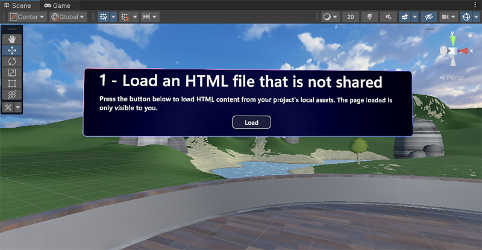

    The Station already has an object in place that has some descriptive text and a **Load** button. We'll complete the Station by adding a WebSlate below the button and then updating a script graph attached to the **Load** button so that when the user clicks the button, a non-shared HTML file loads into the WebSlate.

    All the WebSlates that we'll be adding and/or working with are contained within the hierarchy of the **MeshWebSlates** GameObject. 

    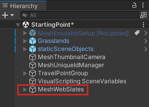

1. In the **Hierarchy**, collapse the **staticSceneObjects** object, if needed.
1. Expand **MeshWebSlates** and then expand its child object named **2 - LocalWebslate**.

    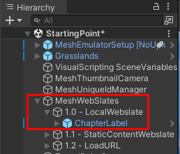

1. In the **Project** window, search for the **WebSlateFramed** prefab. Make sure you choose **All** or **In packages** for the Search filter.

    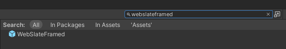

1. Drag **WebSlateFramed** from the **Project** window and then, in the **Hierarchy**, drop it in the space between **2 - LocalWebslate** and **ChapterLabel** so that it's the first child object of **2 - LocalWebSlate**.  
 
    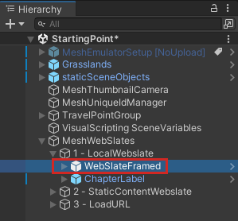

    **Note**: You have two options when choosing a WebSlate prefab: **WebSlate**, which is a simple design with no extra components, and **WebSlateFramed**, which has a stylized frame and extra features.

    Our WebSlate is now in the scene, but it doesn't have the size, position or rotation we want. (**Tip**: If your WebSlate looks dark blue, you're looking at its back, not its screen!)

    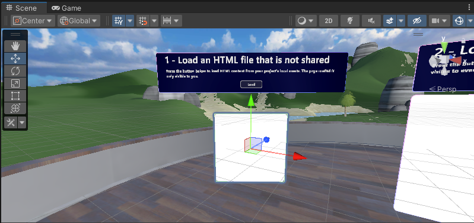

    Let's change that.

1. In the **Hierarchy**, ensure that **WebSlateFramed** is selected, and then, in the **Inspector**, update the values in the **Transform** component to the following:

    **Position**: X = 2, Y = 1.3, Z = 2.5  
    **Rotation**: X = 0, Y = -180, Z = 0  
    **Scale**: X = 2.5, Y = 1.5, Z = 1

    This is much better!

    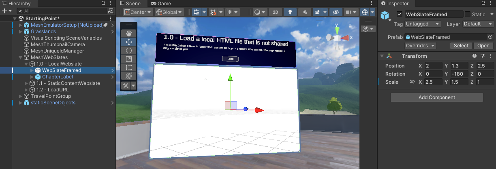

## Change the URL of the WebSlate

In the WebSlate prefab's **WebSlate** component, the **Current URL** property is set to the home page for all of Microsoft.

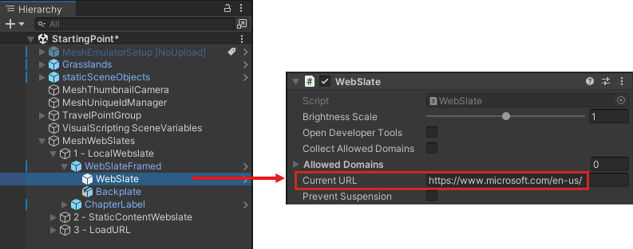

Let's change the URL so it points to the home page for Microsoft Mesh.

- In the **Inspector**, navigate to the **WebSlate** component and then add "mesh" to the end of the URL.

    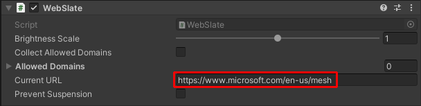

## Open the button script

The button object is named *LoadButton*.

1. In the **Hierarchy**, expand **ChapterLabel**, then expand **Actions**, and then select **LoadButton**.

    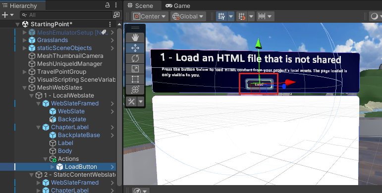

    In the **Inspector**, you can see that that **LoadButton** has a **Script Machine** component containing an embedded script named **Load HTML**, and a variable that we'll be using in the script.

    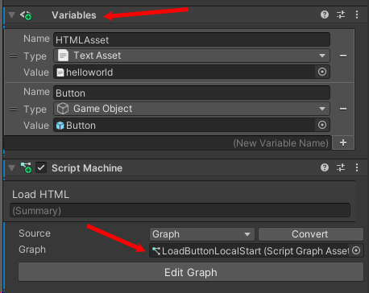

    > [!TIP]
    > The **Source** property for the script has two options: *Graph* and *Embed*. Each have advantages and disadvantages; you can learn more about them in the [Unity Script Machine article](https://docs.unity3d.com/Packages/com.unity.visualscripting@1.8/manual/vs-graph-machine-types.html). We use the *Embed* option here because, among other things, you can directly reference your scene nodes without making intermediate Object variables.

1. The **Script Graph** window should already be open and placed next to the **Project** and **Console** tabs. Click its tab to see its contents.

    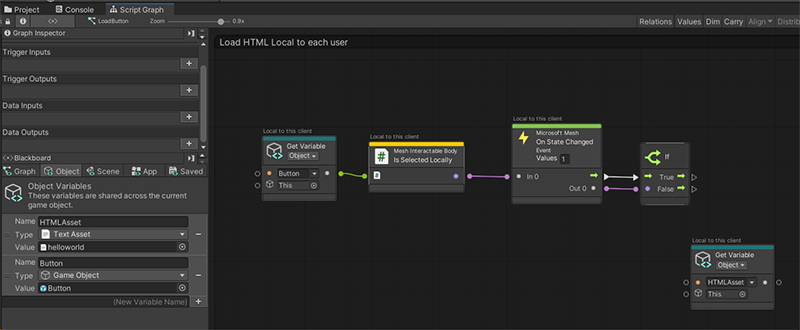

**Tip**: If you want more space in the **Script Graph** window, you can click its three-dot button and then select **Maximize**, or click the **Full Screen** button in the upper right corner of the window.

**Important**: Note that the second node in the script is named **Mesh Interactable Body: Is Selected Locally**. There are two available "Mesh Interactable Body" nodes. If you want only the person triggering an event to experience it, use the node that says "Is Selected *Locally*". If you want *all* attendees in the event to experience it, select the node that simply says "Is Selected." See the differences in the image below. The text above each node can help you to confirm the behavior.

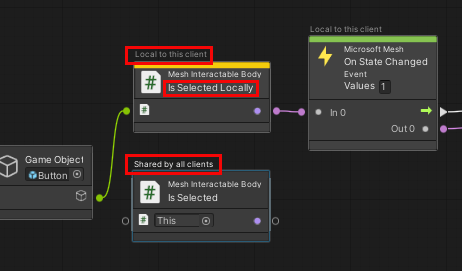.

In our current script, we use "Is Selected Locally".

## Get the HTML page

As you probably noticed, the script graph has already been started for you. We'll complete the tasks needed to enable the **Load** button at Station 2 to load the HTML page.

The first thing we need to do is get access to the **WebSlate** component that's attached to the **WebSlate** object. This object is a child to the **WebSlateFramed** prefab we added earlier. To see it, in the **Hierarchy**, expand **WebSlateFramed**.

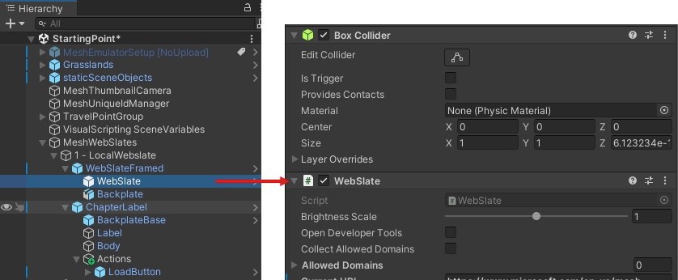

We have a node in the script graph set up for this--**Get Component in Children**--so ...

1. Drag the **WebSlateFramed** object from the **Hierarchy** and then drop it in the first field in the **Get Component in Children** node.

    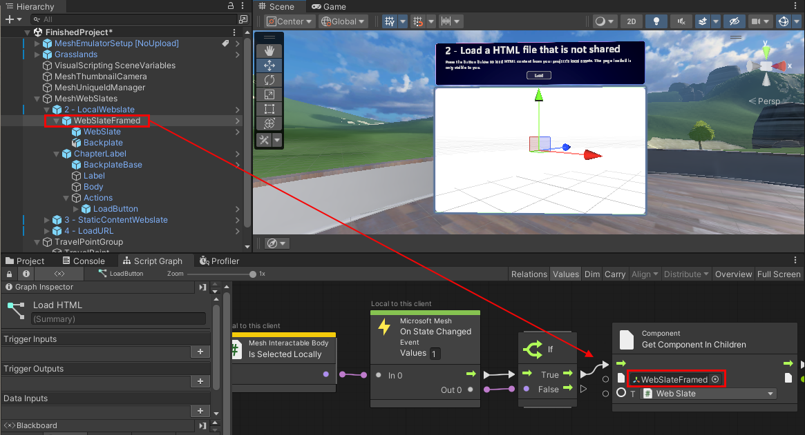

1. Click and hold on the Control Output port of the **Get Component in Children** node, and then release the mouse button. This opens the Fuzzy Finder. **WARNING**: Once you open the Fuzzy Finder, don't click anywhere outside of the Unity interface. This closes the Fuzzy Finder and causes unpredictable behavior in the Script Graph.
1. In the Fuzzy Finder, search for "Web Slate: Load HTML Content (Html Asset)" and then select it. **Note** that there are two nodes with very similar names. 

    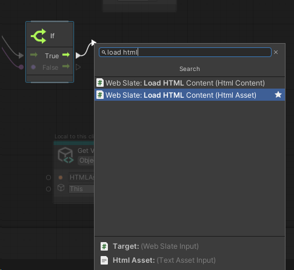

    You want the one that says **Html Asset**, not **Html Content**.

    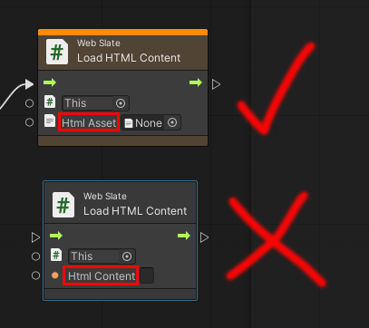

1. Drag a connector from the Data Output port of the **Get Component in Children** node and then connect it to the Data Input port of the **Load HTML Content** node.

    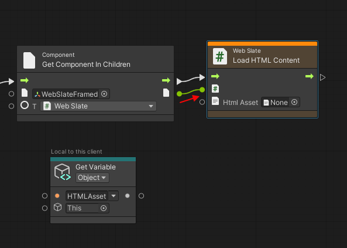

1. We already have the web page we want to load in a **Get Variable** node in the script graph. Drag a connector from the Data Output port of the **Get Variable** node and then connect it to the Data Input port of the **Load HTML Content** node.

    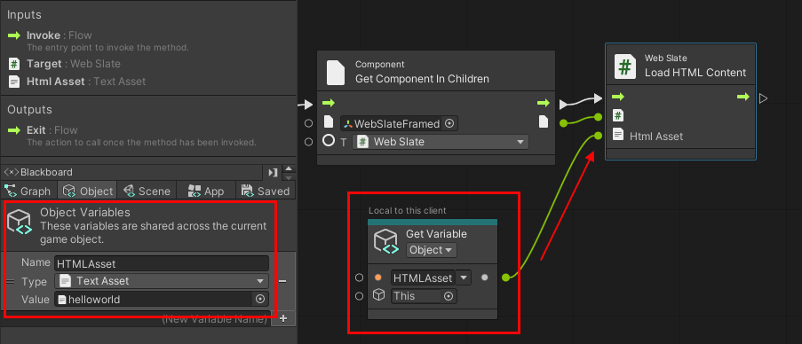

## Test your work

1. In Unity, save the project and then press the Unity Editor Play button.

1. Position yourself in front of Station 2, and notice that the WebSlate is displaying the Microsoft Mesh home page.

    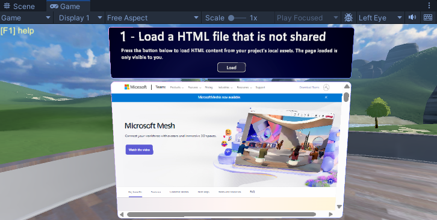

1. Click the **Load** button. The WebSlate loads and displays a page that says "Hello World."

    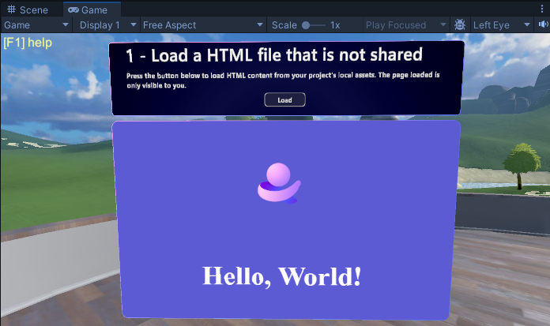

    This page comes from the **HTMLAsset** variable in the button's script graph.

    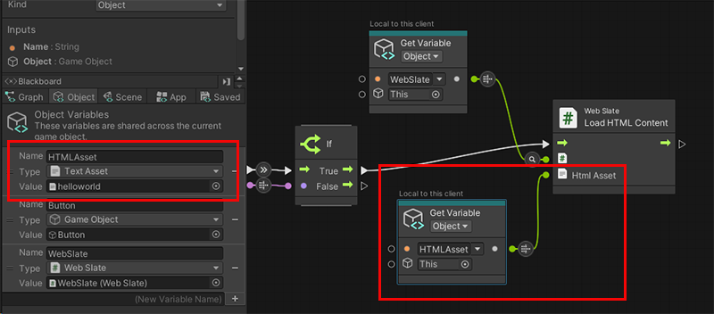

1. When you're finished, click the Unity Editor Play button to exit Play mode.

## Next steps

> [!div class="nextstepaction"]
> [Chapter 3: Load a local shared HTML file into a WebSlate.](./mesh-201-03-webslate-2.md)

