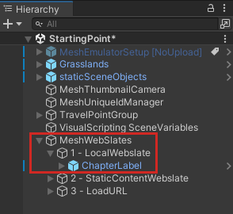
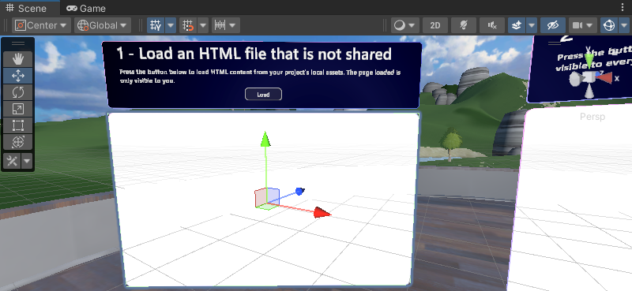
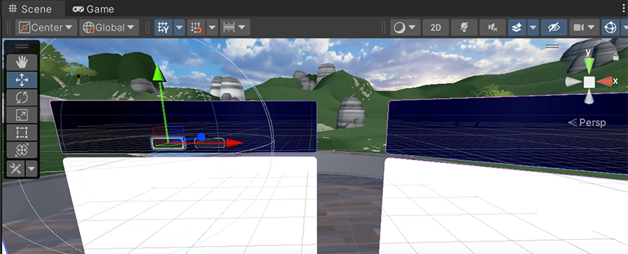

# Mesh 201 Tutorial Chapter 2: Load a local non-shared HTML file into a WebSlate

Now that you're all set up and have had a chance to try out the project, let's move on to scripting web content in WebSlates! A WebSlate is basically a big interactive screen. You can use it to view dashboards, web pages, photos and videos or interact with maps, diagrams, and data. At Station 1, we'll load a local non-shared HTML file into a WebSlate.

## Add the WebSlate to the scene

1. Open the **StartingPoint** scene.
1. In the **Scene** window, ensure that you're positioned so you're in front of and looking at Station 1, pictured below.

    

    The Station already has an object in place that has some descriptive text and a **Load** button. We'll complete the station by adding a WebSlate below the button and then updating a script graph attached to the **Load** button so that when the user clicks the button, a non-shared HTML file loads into the WebSlate.

    All the WebSlates that we'll be adding and/or working with are contained within the hierarchy of the **MeshWebSlates** GameObject. 

    

1. In the **Hierarchy**, collapse the **staticSceneObjects** object, if needed.
1. Expand **MeshWebSlates** and then expand its child object named **1 - LocalWebslate**.

    

1. In the **Project** window, search for the **WebSlateFramed** prefab. Make sure you choose **All** or **In Packages** for the Search filter.

    

1. Drag **WebSlateFramed** from the **Project** window and then, in the **Hierarchy**, drop it in the space between **2 - LocalWebslate** and **ChapterLabel** so that it's the first child object of **2 - LocalWebSlate**.  
 
    

    Our WebSlate is now in the scene, but it doesn't have the size or position we want.

    

    Let's change that.

1. In the **Hierarchy**, ensure that **WebSlateFramed** is selected, and then, in the **Inspector**, update the **Scale** values in the **Transform** component to the following:

    **Scale**: X = 2.5, Y = 1.5, Z = 1

    This is much better!

    

## Change the URL of the WebSlate

1. In the **Hierarchy**, expand the **WebSlateFramed** prefab.
1. Select the child object of **WebSlateFramed** named **WebSlate**.
1. In the **Inspector**, navigate to the **WebSlate** component and note that the **Current URL** property (the default URL for the WebSlate) is set to the home page for all of Microsoft.

    

    Let's change the URL so it points to the home page for Microsoft Mesh.

1. Add "mesh" to the end of the URL in the **Current URL** text box.

    

## Open the button script

1. In the **Hierarchy**, expand **ChapterLabel**, then expand **Actions**, and then select **LoadButton**.

    

    In the **Inspector**, you can see that **LoadButton** with the name "Load HTML". The component has its **Source** property set to **Graph**, and it connects to a script asset file named "LoadButtonLocalStart". The **LoadButton** GameObject also has variables that we'll be using in the script.

    

    > [!TIP]
    > The **Source** property for the script has two options: *Graph* and *Embed*. Each have advantages and disadvantages; you can learn more about them in the [Unity Script Machine article](https://docs.unity3d.com/Packages/com.unity.visualscripting@1.8/manual/vs-graph-machine-types.html). We use the *Graph* option here because this "Source" type has greater flexibility when connecting to Mesh Cloud Scripting.

1. In the **Script Machine** component, click the **Edit Graph** button.
1. Park the **Script Graph** window next to the **Project** and **Console** tabs. Click its tab to see its contents.

    

**Tip**: If you want more space in the **Script Graph** window, you can click its three-dot button and then select **Maximize**, or click the **Full Screen** button in the upper right corner of the window.

**Important**: Note that the second node in the script is named **Mesh Interactable Body: Is Selected Locally**. There are two available "Mesh Interactable Body" nodes; these nodes let you use [*Mesh interactables*](../../enhance-your-environment/avatar-and-object-interactions/interactables.md) with Visual Scripting, such as with interaction events or to modify the manipulable target transform through the visual script. If you want only the person triggering an event to experience it, use the node that says "Is Selected *Locally*". If you want *all* attendees in the event to experience it, select the node that simply says "Is Selected." See the differences in the image below. The text above each node can help you to confirm the behavior.

.

In our current script, we use the node with "Is Selected Locally". This means that when the attendee clicks the Load button, only they will see the new HTML page that loads into the attached WebSlate.

## Create a WebSlate object variable

The script graph has already been started for you. We'll complete the tasks needed to enable the **Load** button at Station 1 to load the HTML page.

The first thing we need to do is create an Object Variable that has the value of the **WebSlate** GameObject that's a child to the **WebSlateFramed** GameObject.

1. In the **New Variable Name** field, type in the name "WebSlate" and then press the Enter key.

.

1. Click the **Type** drop-down and then search and select "WebSlate".

.

1. Drag the **WebSlate** GameObject from the **Hierarchy** and then drop it in the **Value** field for the new variable.

.

## Get the HTML Page

1. Click the Control Output port of the **If** node, and then drag to the right. This opens the Fuzzy Finder. **WARNING**: Once you open the Fuzzy Finder, don't click anywhere outside of the Unity interface. This closes the Fuzzy Finder and causes unpredictable behavior in the Script Graph.
1. In the Fuzzy Finder, search for "Web Slate: Load HTML Content (Html Asset)" and then select it. **Note** that there are two nodes with very similar names. 

    

    You want the one that says **Html Asset**, not **Html Content**.

    

1. Drag the newly-created **WebSlate** Object Variable and then place the node it generates above and to the left of the **Load HTML Content** node.  
1. Connect the data output port of the **Get Object Variable** node to the first data input port of the **Load HTML Content** node.

    

1. We already have the web page we want to load in a **Get Variable** node in the script graph. Drag a connector from the Data Output port of the **Get Variable** node and then connect it to the Data Input port of the **Load HTML Content** node.

    

## Test your work

1. In Unity, save the project.

    **WARNING**: There's a currently a bug in the project where saving it may cause the text in the information text boxes to disappear.

    

    The text reappears when you enter Play mode. Keep this in mind as you work through the other stations.

1. Press the Unity Editor Play button.
1. Position yourself in front of Station 1, and notice that the WebSlate is displaying the Microsoft Mesh home page.

    

1. Click the **Load** button. The WebSlate loads and displays a page from the variable you connected in the Script Graph that says "Hello World."

    

    This page comes from the **HTMLAsset** variable in the button's script graph.

    

    **TIP**: To get some extra insights into how the script works, watch it in the **Script Graph** as you click the **Load** button. The connectors between the nodes display informational tips and animations.

1. When you're finished, click the Unity Editor Play button to exit Play mode.

## Next steps

> [!div class="nextstepaction"]
> [Chapter 3: Load a local shared HTML file into a WebSlate.](./mesh-201-03-webslate-2.md)

