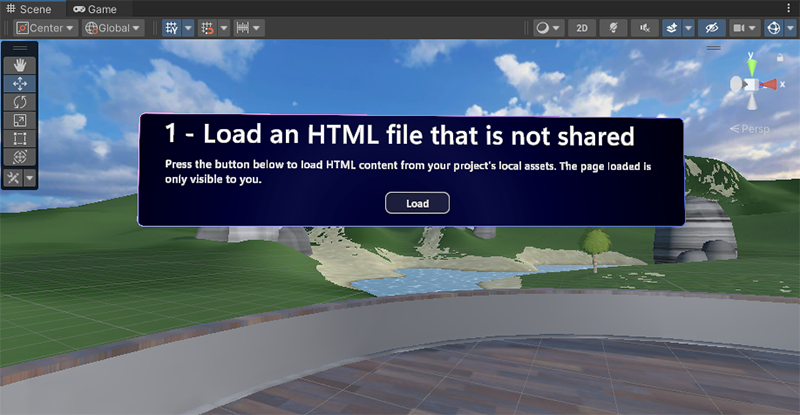
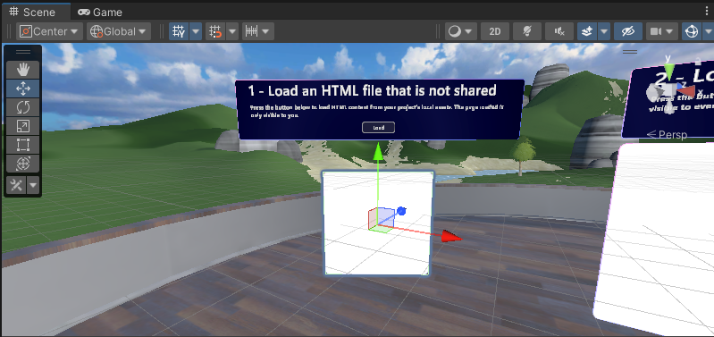
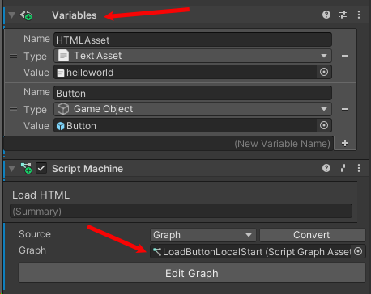
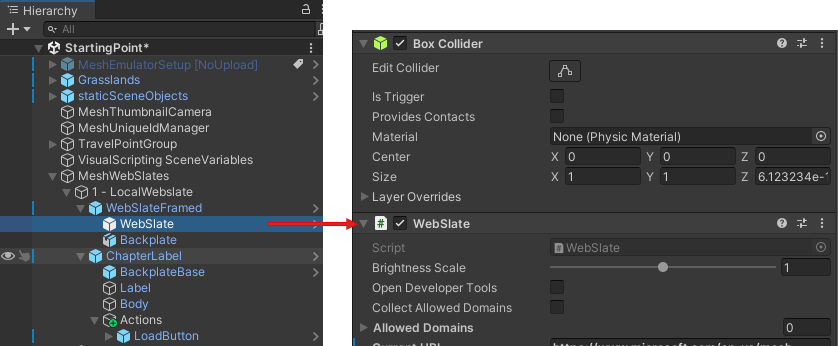

# Mesh 201 Tutorial Chapter 3: Load a local non-shared HTML file into a WebSlate

Now that we've completed the setup phase, let's move on to web content in WebSlates! 

## Add the WebSlate to the scene

1. In the **Scene** window, change your view so that you're looking at Station 1.0, pictured below.

The station already has an object in place that has some descriptive text and a **Load** button. We'll complete the station by adding a WebSlate below the button, and then updating a script graph so that when the user clicks the **Load** button, a non-shared HTML file loads into the WebSlate.

All the WebSlates that we'll be adding and/or working with are contained within the hierarchy of the **MeshWebSlates** GameObject. 

    

1. In the **Hierarchy**, expand **MeshWebSlates** and then expand its child GameObject named **1.0 - LocalWebslate**.

    

1. In the **Project** window, search for the **WebSlateFramed** prefab. Make sure you choose **All* or **In packages** for the Search filter.

    

1. Drag **WebSlateFramed** from the **Project** window and then, in the **Hierarchy**, drop it in the space between **1.0 - LocalWebslate** and **ChapterLabel** so that it's the first child object to **1.0 - LocalWebSlate**.  
 
    

**Note**: You have two options when choosing a WebSlate prefab: **WebSlate**, which is a simple design with no extra components, and **WebSlateFramed**, which has a stylized frame and extra features.

Our WebSlate is now in the scene, but it doesn't have the size, position or rotation we want.

    

Let's change that.

1. In the **Hierarchy**, ensure that that **WebSlateFramed** is selected, and then, in the **Inspector**, update the values in the **Transform** component to the following:

**Position**: X = 2, Y = 1.3, Z = 2.5
**Rotation**: X = 0, Y = -180, Z = 0
**Scale**: X = 2.5, Y = 1.5, Z = 1

This is much better!

    

## Open the button script

The button object is named *LoadButton*.

1. In the **Hierarchy**, expand **ChapterLabel**, then expand **Actions**, and then select **LoadButton**.

    

    In the **Inspector**, you can see that that **LoadButton** has a **Script Machine** component containing an embedded script named **Load HTML**, and a variable that we'll be using in the script.

    

    > [!TIP]
    > The *Source** for a script can be set to *Graph* or *Embed*. Each have advantages and disadvantages; you can learn more about them in the [Unity Script Machine article](https://docs.unity3d.com/Packages/com.unity.visualscripting@1.8/manual/vs-graph-machine-types.html). We used the *Embed* option here because, among other things, you can directly reference your scene nodes without making intermediate Object variables.

1. In the **Script Machine** component, click the **Edit Graph** button. This opens the **Script Graph** window. Its tab should already be placed next to the **Project** and **Console** tabs; if not, drag it there so that we can see the script graph and **Scene** window at the same time.

    

    **Tip**: If you want more space in the window, you can click the three-dot button and then select **Maximize**, or click the **Full Screen** button in the upper right corner of the window.

    **Important**: You have a choice of *two* "Mesh Interactable Body: Is Selected" nodes. If you only want the person triggering an event to experience it, use the node that says "Is Selected *Locally*. If you want *all* attendees to experience it, select the node that simply says "Is Selected." See the differences in the image below. The text above each node can help you to confirm the behavior.

    .

    In our current script, we use "Is Selected Locally".

## Get the HTML page

As you can see in the image above, the script graph has already been started for you. We'll complete the tasks needed to enable the Load button to load the HTML page.

The first thing we need to do is get access to the **WebSlate** component that's attached to the **WebSlate** object. This object is a child to the **WebSlateFramed** prefab we added earlier.

We have a node in the script graph set up for this--**Get Component in Children**--so ...

1. Drag the **WebSlateFramed** object from the **Hierarchy** and then drop it in the first field in the **Get Component in Children** node.

    

1. Drag a connector from the output control port of the **Get Component in Children** node and create a new **Web Slate: Load HTML Asset** node. In the Fuzzy Finder, search for "Web Slate: Load HTML Content (Html Content). **Note** that there are two nodes with very similar names. 

    

    You want the one that says "HTML **Asset**", not "HTML **Content**.

    

1. Drag a connector from the data output port of the **Get Component in Children** node and then connect it to the data input port of the **Load HTML Content** node.

    

1. We already have the web page we want to load in a **Get Variable** node. Drag a connector from the data output port of the **Get Variable** node and then connect it to the data input port of the **Load HTML Content** node.

    

## Test your work

1. In Unity, save the project and then press the Unity Editor Play button.

1. Position yourself in front of Station 1.0, and notice that the WebSlate is displaying some information about Microsoft.

    

    This is because the default URL in the **WebSlate** component of the prefab you added is set to the Microsoft home page.

    

1. Click the **Load** button. The WebSlate loads and displays a page that says "Hello World."

    

    This page comes from the **HTMLAsset** variable in the button's script graph.

    

## Next steps

> [!div class="nextstepaction"]
> [Chapter 4: Load a local shared HTML file into a WebSlate.](mesh-101-04-webslate-2.md)

