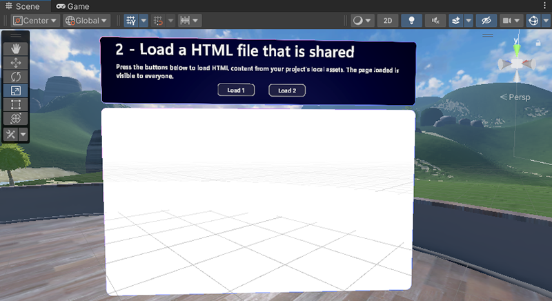

# Mesh 201 Tutorial Chapter 4: Load a local shared HTML file into a WebSlate

In the previous chapter of this tutorial, you enabled a button to load a local non-shared HTML file into a WebSlate. In this chapter, we'll also set up an HTML page load, but this time it will have the capability to be shared among all attendees in the experience.

## Add the WebSlate to the scene

1. In the **Scene** window, change your view so that you're looking at Station 1.1, pictured below.

Just as in the previous chapter, there's already a GameObject in place with some descriptive text but this time there are two buttons: **Load1** and **Load2**.  a **Load** button. We'll complete the station by adding a WebSlate below the buttons and then updating script graphs attached to the buttons. When an attendee clicks a button, a web page is loaded and is *shared* among all other attendees in the experience. Each button loads a slightly different type of content.

1. In the **Hierarchy**, collapse the GameObject named **1.0 - LocalWebslate**.
1. Expand **1.1 - StaticContentWebslate**. In the previous chapter, you were required to add a WebSlate prefab, but in this chapter we've already done it for you.

1. Expand **ChapterLabel** and its child object **Actions**. The buttons we'll be working with are located here.

1. In the **Hierarchy**, then select **LoadButton1**.

    In the **Inspector**, you can see that that **LoadButton** has a **Script Machine** component containing an embedded script named **Load HTML**, and a variable that we'll be using in the script.

    

## Next steps

> [!div class="nextstepaction"]

> [________________________________](TBD)

