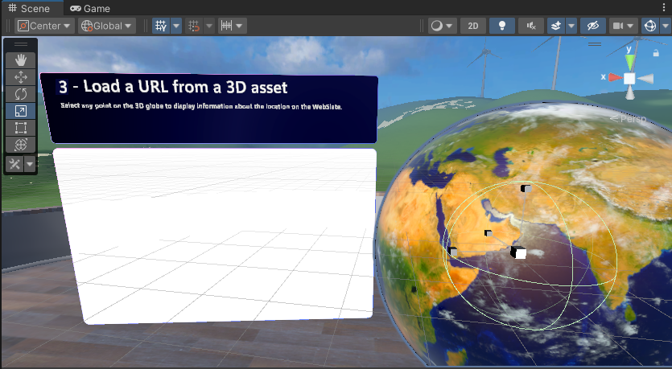

# Mesh 201 Tutorial Chapter 4: Load a URL from a 3D asset

In this chapter, we move forward to Station 4 and explore a way to load data from the web into a WebSlate. There's a 3D GameObject in the scene that represents the planet Earth. We'll update a script so that when an attendee in your experience clicks on the globe, the latitude and longitude of the clicked location are captured and these coordinates are incorporated into a Bing Maps URL as parameters. An HTTP request is executed using this URL; Bing Maps provides a map of the chosen area and sends it to a nearby WebSlate.

## Try out the project

1. In the **Scene** window, navigate to Station 4. It's on the opposite side of the sphere terrace from the first two Stations.

    

1. Adjust your view so that you're directly in front of and looking at Station 4.

    

    As you can see, there's already a WebSlate in the scene with some informational text above it, as well as the **Earth** object. Let's run the project and see what happens.

1. Click the Unity editor Play button. You're initially placed on the other side of the Sphere Terrace, so you'll have to navigate back to Station 4. The WebSlate displays the Bing Maps website.

    

1. Click several different spots on the **Earth** object--you can rotate it by left-clicking on it and then dragging. Note that no matter where you click, the WebSlate keeps displaying the same Bing Maps page. We want to change this so that when you click the **Earth** object, the geographical area you clicked appears on the WebSlate. We'll be adding a node to a script that accomplishes this in a moment, but before that, we'll take a brief look at the scripts.

1. Click the Unity editor Play button to exit Play mode.

## Explore the Earth script

1. In the **Hierarchy**, collapse the GameObject named **3 - StaticContentWebslate**.
1. Expand **4 - LoadURL** and note that it has child objects named **EarthActions** and **Earth**. Each of these objects has a Script Machine attached. 
1. Select **Earth**. Its script graph appears in the **Script Graph** window. 

The script graph, named *Globe location on Webslate*, is designed to detect a click on the **Earth** object and to know the precise geographical location of that click (latitude and longitude) so that a map of that area can be displayed on the WebSlate. 

As you can see, there's a lot going on in this script graph. We don't need to make any changes to it, but if you're curious, you can take a moment here to study the graph and get a better understanding of how the **Earth** object works.

## Explore the EarthActions script

This script is where we need to make our update.

1. In the **Hierarchy**, select the **EarthActions** GameObject. Its script graph appears in the **Script Graph** window. 

    This script graph is named *Load Webslate from Globe click* and has two groups: **Custom Default Webslate Behavior** and **URL Builder.**

    

1. The first group contains a node called **Web Slate: Load** with a value of the Bing Maps URL. 

    

    Right now, things are set up so that every time you click the **Earth** object, this URL loads into the WebSlate.

1. In the **URL Builder** group, the first node, **Get Variable: Object**, loads the variable that contains the coordinate that was clicked on the **Earth** object.

    

1. The next few nodes after the **Microsoft Mesh: On State Changed** node take that coordinate, convert it to a string, and attach it as a parameter to the end of the Bing Maps URL in the **String: Concat** node.

    

1. The **Set Variable** node intitializes the **WebSlateURL** variable with the URL.

    

Now we just need to ensure that this URL (which, naturally, changes every time **Earth** is clicked) loads into the WebSlate.

## Update the EarthActions script

1. Drag a connector from the Control Output port of the **Set Variable: Object** node and then create a new **Web Slate: Load** node. (In the Fuzzy Finder, search for **Web Slate: Load (URL)**.)

    

1. Drag a connector from the Data Output port of the **Set Variable: Object** node and then attach it to the **Url** Data Input port of the **Web Slate: Load** node.

    

1. In the **Hierarchy**, expand the **WebSlateFramed** object.

    

1. Drag the **WebSlateFramed** child object named **WebSlate** from the **Hierarchy** and then drop it in the field that displays **This** in the **Web Slate: Load** node.

    

## Test your work

1. Save the project and then press the Unity Editor Play button.

1. Navigate to Station 4 and then position yourself in front of it. 

1. Click various places on the **Earth** object. As noted earlier, each time you click, the latitude and longitude of the clicked location are captured and these coordinates are incorporated into a Bing Maps URL as parameters. An HTTP request is executed using this URL; Bing Maps provides a map of the chosen area and sends it to a nearby WebSlate.

    

**Notes**
- The WebSlate is *interactive* inside an event. An attendee can click the +/- buttons to zoom in or out, or drag the map to adjust its position, or click links. Note, however, that other attendees in the experience won't see these changes; they'll only see an update when the globe is clicked again.
- A good way to get further insights into your scripts is to watch them in the **Script Graph** window as you try out features in Play mode. For example, in this project, you can see the latitude and longitude of the location clicked on the **Earth** object flowing out of the connectors from the **Microsoft Mesh: On State Changed** node.

    

## Conclusion

Congratulations! In this Mesh 201 tutorial, you learned about loading local shared and non-shared HTML files into a WebSlate. You also learned about using a 3D asset to call a Web API and download data into a WebSlate. Now you can put your new WebSlate skills to work and build collaborative Mesh experiences that are even more useful and exciting!

## Next Steps

- **Build and Publish**

    If you want to build and publish this tutorial project and need some guidance, you can continue on from here with this article from our Mesh 101 tutorial named [Mesh 101 Chapter 5: Making your environment available for testing](../mesh-101-tutorial/mesh-101-05-make-environment-available.md). The process of using the Mesh Uploader to build and publish is the same for both the Mesh 101 and Mesh 201 tutorial--you'll just have to use an internal name and description that applies to this tutorial, not the Wind Turbines scene featured in Mesh 101. 

- **Learn more about WebSlates**

    [Visit the WebSlates article on the Mesh Help site](../../enhance-your-environment/webcontent.md).

    [Read a blog post written by the WebSlates product manager](https://devblogs.microsoft.com/microsoft365dev/web-content-in-microsoft-mesh-powered-by-webview/).

- **Challenge**

    Try creating your own Station with a WebSlate and a button that loads an HTML file. Be sure to share your efforts in our [Mesh Developer Forum](https://techcommunity.microsoft.com/t5/mesh-creators/welcome-to-the-microsoft-mesh-creator-discussion-space-a-hub-for/m-p/3938730)!

