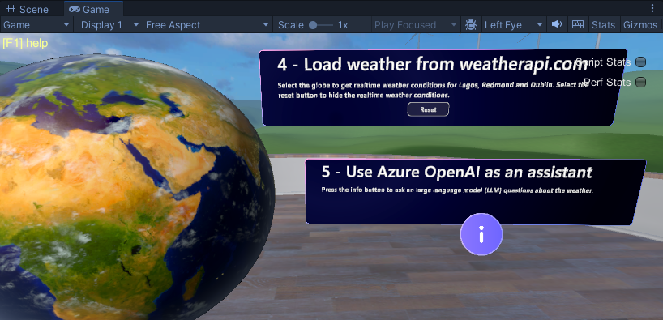

# Mesh 201 Tutorial Chapter 5: Get live weather data

In this chapter, we move forward to Station 4 where you'll learn how to use Mesh Cloud Scripting to get data from internal or public sources and then visualize it in a 3D context in your scene. An attendee in the event will be able to click an interactive globe to view live weather data from three cities located around the world.

Stations 4 and 5 are located on the other end of the Sphere Terrace from the previous stations.

===TBD leave the "try out" section out, possibly

## Trying out the finished project

Let's run the project to get an idea of what the finished version of Station 5 will look like.

1. If needed, save your work in the *StartingPoint* scene, and then open the *FinishedProject* scene.
1. Click the Unity Editor Play button.
1. Navigate to Station 4 and position yourself in front of it.

1. Click anywhere on the globe. As the information text box explains, this sends a call to weatherapi.com and displays the current weather (temperature, average wind speed and peak wind speed) in several cities.
1. To refresh the weather information, click the **Reset** button in the information text box and then click the globe again.

======================

1. Open the *StartingPoint* scene.
1. In the **Hierarchy**, right-click in an empty space and then, in the context menu, select **Mesh Toolkit** > **Set up Cloud Scripting**.

    

This adds a GameObject named **Mesh Cloud Scripting** which has a component with the same name attached.

    

    Any GameObject that you intend to be under the control of cloud scripting must be added as a child to **Mesh Cloud Scripting**.

## Add the prefabs for stations 4 and 5

1. In the **Project** folder, navigate to **Assets** > **MeshCloudScripting** and then drag **4 - GlobeWithCloudScripting** and **5 - AIAssistant** to the **Hierarchy** an place them as child objects to **Mesh Cloud Scripting**.

    

## Get a key from weatherapi.com

## Set up private access keys for weatherapi.com

This sets things up for Stations 4 *and* 5.

1. In the **Hierarchy**, select the **Mesh Cloud Scripting** GameObject.
1. In the **Inspector**, navigate to the **Mesh Cloud Scripting** component and then click **Open application folder**. This opens the project folder that contains the files for Mesh Cloud Scripting in the Windows File Explorer.

    

1. Open the file named *appsettings.UnityLocalDev.json* in your code editor. The last four lines of code in the file contain configuration settings. Let's take a look at each line.

    `"WEATHER_API_URI": "http://api.weatherapi.com/v1/current.json?key="`

    This is where the weather data comes from.

    `"WEATHER_API_KEY": "Paste Weather API key here"`

    This is where you need to paste the API weather key.

  "AZURE_OPENAI_API_URI": "Paste Azure OpenAI URI here",
  "AZURE_OPENAI_API_KEY": "Paste Azure OpenAI key here"

