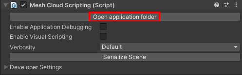
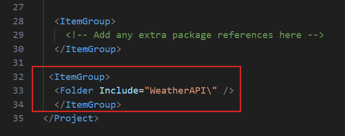
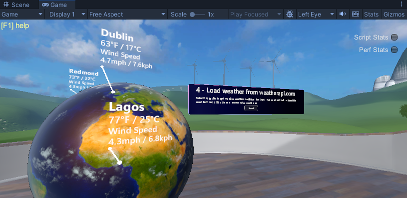

# Mesh 201 Tutorial Chapter 5: Get live weather data

In this chapter, we move forward to Station 4 where you'll learn how to use Mesh Cloud Scripting to get data from internal or public sources and then visualize it in a 3D context in your scene. As we discussed in Chapter 1, the premise here is that attendees in your experience can use this station to learn about weather conditions in three locations where they're considering building a wind farm. The attendees will be able to click an interactive globe and view live weather data from the three locations.

Stations 4 and 5 are located on the other end of the Sphere Terrace from the previous stations.


## Setting up for this station

In order to complete this station, you'll need to insert a *key* into some code that'll enable you to access the weather data API. Let's get this key now so that you don't have to interrupt your workflow later on.

1. Navigate to the [weatherapi.com sign-up page](https://www.weatherapi.com/signup.aspx).
1. On that page, follow the instructions to sign up for the trial plan.

    

    You'll need to open the email they send you, activate your account, and then log in on their site.

1. On the **Welcome Back** page, click "Pro Plus Plan".

    

1. For this tutorial, it's not necessary to have a paid plan. Click the **Downgrade** button under "Free", and then in the dialog that pops up, click **Close**.

    

1. In the left-side menu under **Dashboard**, select **API**.

    

1. Select the **Copy** button next to the **API Key** field, then paste the key into a text editor, and then save the text file.

    

    If the copy operation is successful, the text on the *Copy* button changes to **Copied**.

## Add the Mesh Cloud Scripting prefab

1. Open the *StartingPoint* scene.
1. In the **Hierarchy**, right-click in an empty space and then, in the context menu, select **Mesh Toolkit** > **Set up Cloud Scripting**.

    

    This adds a GameObject named **Mesh Cloud Scripting** which has a component with the same name attached.

    

    Any GameObject that you intend to have under the control of cloud scripting must be added as a child to the **Mesh Cloud Scripting** GameObject.

## Add the prefab for Station 4

1. In the **Project** folder, navigate to **Assets** > **MeshCloudScripting** and then drag **4 - GlobeWithCloudScripting** to the **Hierarchy** and place it as a child object to **Mesh Cloud Scripting**.

    

    This prefab provides the text information box and a nested prefab named **Earth** that contains the model for the globe.

    

1. Adjust your view so that you're directly in front of and looking at Station 4.

    

## Insert the API key for weatherapi.com

1. In the **Hierarchy**, select the **Mesh Cloud Scripting** GameObject.
1. In the **Inspector**, navigate to the **Mesh Cloud Scripting** component and then click **Open application folder**.

    

    This opens the folder that contains the files for Mesh Cloud Scripting in the Windows File Explorer.

1. Open the file named *appsettings.UnityLocalDev.json* in your code editor. The last four lines of code in the file contain configuration settings.

    

    You don't need to do anything for this first line ...

    `"WEATHER_API_URI": "http://api.weatherapi.com/v1/current.json?key="`

    ... but in the next line, replace the "Paste Weather API key here" text with the API key you copied earlier.

    

    You can ignore the last two lines--we'll be working with those in the next chapter.

1. Save and close the JSON file.

## Update the csproj file

1. In the File Explorer window that displays the Mesh Cloud Scripting files, open the file named *StartingPoint.csproj* in your code editor.

    

1. Copy the following text: 

    `<ItemGroup>  
   	<Folder Include="WeatherAPI\" />  
   </ItemGroup>`

    ... and then paste it into the file just above `</Project>` at the end of the file.

    

   This ensures that we include some scripts from the local *WeatherAPI* folder.

    

1. Save and close the file.

## Add code that makes the globe interactive

1. In the File Explorer window that displays the Mesh Cloud Scripting files, open the file named *App.cs* in your code editor.

    

    The first thing we'll do is ensure that when an attendee clicks on the globe, the displays of the weather data are refreshed.

1. In the App.cs file, find the first "Paste code here" comment located inside the `StartAsync()` method.

    

1. Copy the code below.

    ```
        var refreshButton = _app.Scene.FindFirstChild("Earth", true) as TransformNode;
        var refreshButtonNode = refreshButton?.FindFirstChild<InteractableNode>(true);

        if (refreshButtonNode != null)
        {
            refreshButtonNode.Selected += async (_, _) =>
            {
                await GetCurrentWeather(_latlong);
            };
        }
    ```

1. Replace the "Paste code here" comment you just found with the code you copied.

    

    The code does the following:
    
    - Initializes the *refreshButton* variable with the *Earth* GameObject in the scene.
    - Initializes the *refreshButtonNode* variable with the *InteractableNode* attached to the *Earth* GameObject. (If a GameObject in the scene hAs a *Mesh Interactable Setup* component attached, which *Earth* does, the component adds a Mesh Cloud Scripting [InteractableNode](../../script-your-scene-logic/cloud-scripting/cloud-scripting-programmers-guide.md#interactablenode)).
    - When an attendee clicks on the globe, it fires the InteractableNode's *Selected* event and calls the *GetCurrentWeather* method. This generates an [HTTP request](https://learn.microsoft.com/dotnet/fundamentals/networking/http/httpclient) to get the weather data.

1. Save the file.

## Test your work

1. In the Unity Editor, save the project and then press the Play button.

1. Your avatar is spawned on the side of the Sphere Terrace that contains the first three stations. Navigate to the opposite side of the Sphere Terrace and then position yourself in front of Station 4.

    


1. To see the weather data, click anywhere on the globe. The temperature, average wind speed, and peak wind speed are shown for three cities: 1) Lagos, Nigeria, 2) Dublin, Ireland, and 3) Redmond, WA.

    

1. When you're finished, press the Play button again to exit Play mode.

## Next Steps

> [!div class="nextstepaction"]
> [Chapter 6: Get answers to questions using Azure OpenAI](./mesh-201-06-open-ai.md)
