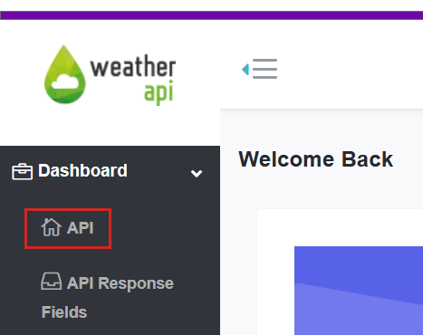
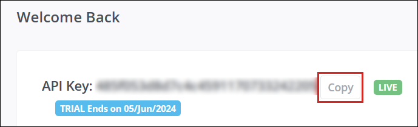
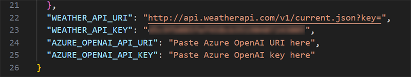
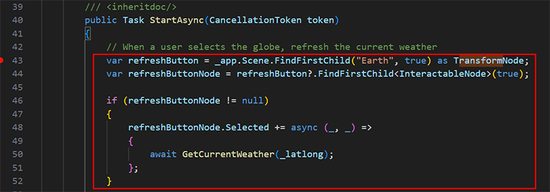

# Mesh 201 Tutorial Chapter 5: Get live weather data

In this chapter, we move forward to Station 4 where you'll learn how to use Mesh Cloud Scripting to get data from internal or public sources and then visualize it in a 3D context in your scene. An attendee in the event will be able to click an interactive globe to view live weather data from three cities located around the world.

Stations 4 and 5 are located on the other end of the Sphere Terrace from the previous stations.

===============
TBD leave the "try out" section out, possibly

## Trying out the finished project

Let's run the project to get an idea of what the finished version of Station 5 will look like.

1. If needed, save your work in the *StartingPoint* scene, and then open the *FinishedProject* scene.
1. Click the Unity Editor Play button.
1. Navigate to Station 4 and position yourself in front of it.

1. Click anywhere on the globe. As the information text box explains, this sends a call to weatherapi.com and displays the current weather (temperature, average wind speed and peak wind speed) in several cities.
1. To refresh the weather information, click the **Reset** button in the information text box and then click the globe again.

======================

## Setting up for this station

In order to complete this station, you'll need to insert a *key* into some code that'll enable you to access the weather data API. Let's do this step first so that you don't have to interrupt your workflow later on.

1. Navigate to the [weatherapi.com sign-up page](https://www.weatherapi.com/signup.aspx).
1. On that page, follow the instructions to sign up for the trial plan.

    You'll need to open the email they send you, activate your account, and then log in on their site.

1. On the **Welcome Back** page, click "Pro Plus Plan".

1. For this tutorial, it's not necessary to have a paid plan. Click the **Downgrade** button under "Free", and then in the dialog that pops up, click **Close**.

1. In the left-side menu under **Dashboard**, select **API**.

1. Select the **Copy** button next to the **API Key** field, then paste the key into a text editor, and then save the text file.

    If the copy operation is successful, the text on the *Copy* button changes to **Copied**.

## Add the Mesh Cloud Scripting prefab

1. Open the *StartingPoint* scene.
1. In the **Hierarchy**, right-click in an empty space and then, in the context menu, select **Mesh Toolkit** > **Set up Cloud Scripting**.

    

    This adds a GameObject named **Mesh Cloud Scripting** which has a component with the same name attached.

    

    Any GameObject that you intend to be under the control of cloud scripting must be added as a child to **Mesh Cloud Scripting**.

## Add the prefabs for stations 4 and 5

1. In the **Project** folder, navigate to **Assets** > **MeshCloudScripting** and then drag **4 - GlobeWithCloudScripting** and **5 - AIAssistant** to the **Hierarchy** an place them as child objects to **Mesh Cloud Scripting**.

    

This sets things up for this station *and* the next one.

## Insert the API key for weatherapi.com

1. In the **Hierarchy**, select the **Mesh Cloud Scripting** GameObject.
1. In the **Inspector**, navigate to the **Mesh Cloud Scripting** component and then click **Open application folder**. This opens the project folder that contains the files for Mesh Cloud Scripting in the Windows File Explorer.

    

1. Open the file named *appsettings.UnityLocalDev.json* in your code editor. The last four lines of code in the file contain configuration settings.

    

    You don't need to do anything for this first line ...

    `"WEATHER_API_URI": "http://api.weatherapi.com/v1/current.json?key="`

    ... but in the next line, replace the "Paste Weather API key here" text with the API key you copied earlier.

    

    You can ignore the next two lines--we'll we working with those in the next chapter.

1. Save and close the JSON file.

## Update the csproj file

1. In the File Explorer window that displays the Mesh Cloud Scripting files, open the file named *StartingPoint.csproj* in your code editor.

    

1. Note that at the bottom of the file, there's a comment with a placeholder for a package reference.

    

1. Delete the placeholder *PackageReference* element and replace it with the line below:

   	`<PackageReference Include="Azure.AI.OpenAI" Version="1.0.0-beta.15" />`

1. Copy the following the text below and then paste it into the file as the final *ItemGroup* element.

    `<ItemGroup>
   	<Folder Include="WeatherAPI\" />
   </ItemGroup>`

   This ensures that we include some scripts in the local *WeatherAPI* folder.

   <TBD image of contents of WeatherAPI folder.>

    The file should now look like this:

    <TBD image>

1. Save the file.

## TBD title

1. In the File Explorer window that displays the Mesh Cloud Scripting files, open the file named *App.cs* in your code editor.

    

    The first thing we'll do is ensure that when an attendee clicks the globe, the displays of the weather data are refreshed.

1. In the App.cs file, navigate to line 47, where'll you see a comment telling you to paste some code there.

    

1. Copy the code below:

    `var refreshButton = _app.Scene.FindFirstChild("Earth", true) as TransformNode ?? throw new NullReferenceException("Could not find Earth");
    var refreshButtonNode = refreshButton.FindFirstChild<InteractableNode>(true);

    if (refreshButtonNode != null)
    {
        refreshButtonNode.Selected += async (_, _) =>
        {
            await GetCurrentWeather(_latlong);
        };
    }`

    ... and then paste it into the App.cs file, replacing the "Paste code here" comment on line 47.

    

    The code does the following:
    
    - Initializes the *refreshButton* variable with the *Earth* GameObject in the scene.
    - Initializes the *refreshButtonNode* variable with the *InteractableNode* attached to the *Earth* GameObject. (If a GameObject in the scene has a *Mesh Interactable Setup* component attached, which *Earth* does, the component adds a Mesh Cloud Scripting [InteractableNode](../../script-your-scene-logic/cloud-scripting/cloud-scripting-programmers-guide.md#interactablenode)).
    - When an attendee clicks on *Earth*, it fires the InteractableNode's *Selected* event and calls the *GetCurrentWeather* method. This generates an [HTTP request](https://learn.microsoft.com/en-us/dotnet/fundamentals/networking/http/httpclient) to get the weather data.

1. Save the file.

## Test your work

1. In the Unity Editor, save the project and then press the Play button.

1. Your avatar is spawned on the side of the Sphere Terrace that contains the first three stations. Navigate to the opposite side of the Sphere Terrace and then position yourself in front of Station 4.

    

1. Click various places on the **Earth** object. TBD

