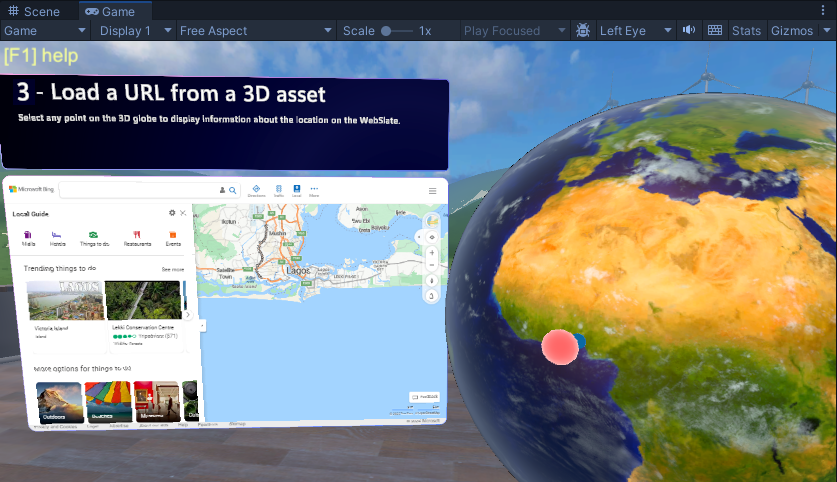
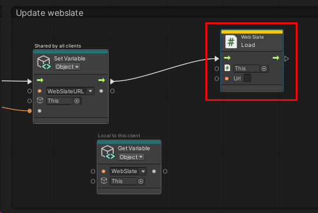
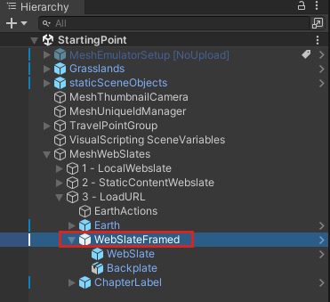
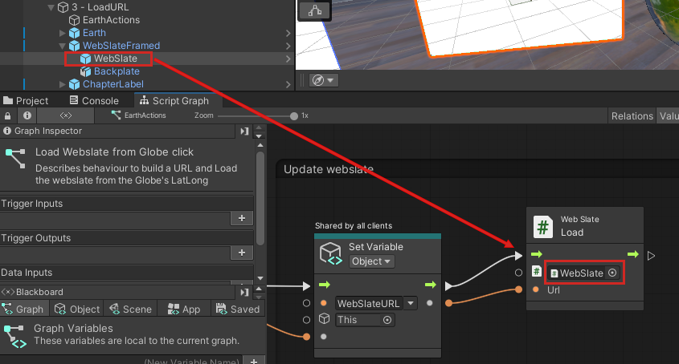
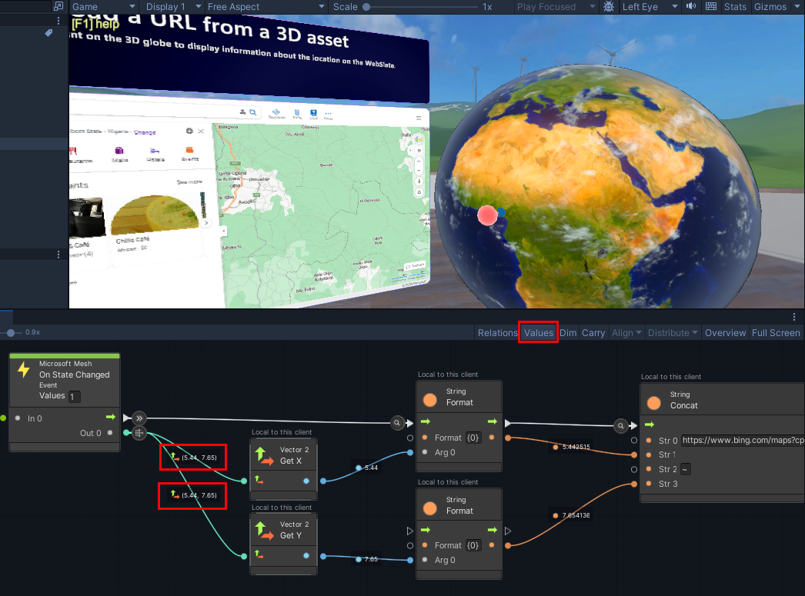

# Mesh 201 Tutorial Chapter 5: Load a URL from a 3D asset

In this chapter, we move forward to Station 1.2 and explore a way to load data from the Web into a WebSlate. There's a 3D GameObject that represents the planet Earth in the scene. We'll update a script so that when you click anywhere on **Earth**, the coordinates of the location you clicked are saved, a call is made to the Bing Maps API, and the geographical area related to the coordinates appears on a WebSlate located close by.

## Understanding the scripts

1. In the **Scene** window, navigate to station 1.2. It's on the opposite side of the sphere terrace from the first two stations.

    

1. Adjust your view so that you're directly in front of and looking at Station 1.2.

    

    As you can see, there's already a WebSlate object in the scene. Let's run the project and see what happens.

1. Click the Unity editor Play button, and then navigate to Station 1.2. The WebSlate displays the Bings map website.

    

1. Click in several different spots on **Earth**--you can rotate it by clicking on it and then dragging. Note that no matter where you click, the WebSlate keeps loading the same Bing Maps page. We want to change this so that when you click **Earth**, the geographical area you clicked appears on the WebSlate. We'll be adding a node to a script that accomplishes this, but first, let's get an overview of the scripts.

## Exploring the Earth script

1. In the **Hierarchy**, collapse the GameObject named **1.1 - StaticContentWebslate**.
1. Expand **1.2 - LoadURL** and note that it has child objects named **EarthActions** and **Earth**. Each of these two objects have Script Machines attached. 
1. Select **Earth**, and then, in the **Inspector**, navigate to the **Script Machine** component and click its **Edit Graph** button.

    

    The script graph, named *Globe location on Webslate*, is designed to detect a click on the **Earth** GameObject in the scene and to know the precise geographical location of that click so that a map of that location can be displayed on the WebSlate. 
    
    
    
    We don't need to make any changes to this graph, but you may want to take a moment to analyze it for a better understanding of how **Earth** works.

## Exploring the EarthActions script

This is where we need to make our update.

1. In the **Hierarchy**, select the **EarthActions** GameObject.
1. In the **Inspector**, navigate to the **Script Machine** component and click its **Edit Graph** button.
1. This script graph is named *Load Webslate from Globe click* and has two groups: **Custom Default Webslate Behavior** and **URL Builder.**

    

1. The first groups contains a node called **Web Slate: Load** with a value of the Bing maps URL. 

    

Right now, the default behavior is that every time you click **Earth**, this URL loads into the WebSlate.

1. In the **URL Builder** group, the first node, **Get Variable: Object**, loads the variable that contains the coordinate that was clicked on the **Earth** object.

    

1. The next few nodes take that coordinate, convert it to a string, and attach it to the end of the Bing Maps URL in the **String: Concat** node.

    

1. The **Set Variable** Object** node intitializes the **WebSlateURL** variable with the URL.

    

Now we just need to ensure that this URL (which, naturally, changes every **Earth** is clicked) loads into the WebSlate.

## Updating the EarthActions script

1. Drag a connector from the Control Output port of the **Set Variable: Object** node and then create a new **Web Slate: Load** node . (In the Fuzzy Finder, search for **Web Slate: Load (URL)**.)

    

1. Drag a connector from the Data Output port of the **Set Variable: Object** node and then attach it to the **Url** Data Input port of the **Web Slate: Load** node.

    

1. In the **Hierarchy**, expand the **WebSlateFramed** object.

    

1. Drag the **WebSlateFramed** child object named **WebSlate** from the **Hierarchy** and then drop it in the field that displays **This** in the **Web Slate: Load** node.

    

## Test your work

1. In Unity, save the project and then press the Unity Editor Play button.

1. Navigate to Station 1.2 and position yourself in front of it. As mentioned earlier, the WebSlate is displaying some information about Microsoft because the default URL in the **WebSlate** component is set to the Microsoft home page.

1. Click various places on the **Earth** object. The WebSlate loads and displays a map of the area you clicked.

    

**Tip**: A good way to get further insights into your scripts is to watch them in the **Script Graph** window as you try out features in Play mode. For example, in this project, you can see the latitude and longitude of the location clicked on the **Earth** object flowing out the connectors from the **Microsoft Mesh: On State Changed** node.

## Conclusion

Congratulations! 

Congratulations! In this Mesh 201 tutorial, you learned about loading local HTML files and data from the Web into a WebSlate. Now you can put your new WebSlate skills to work and build collaborative Mesh experiences that are even more useful and exciting!