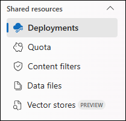
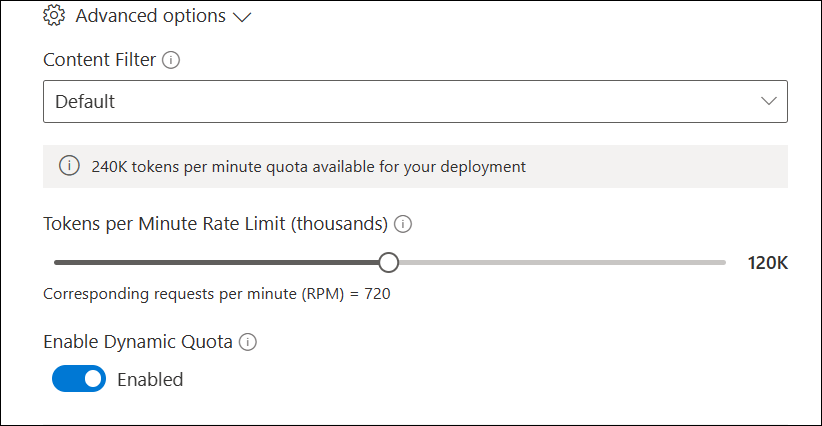
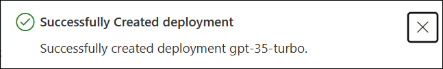
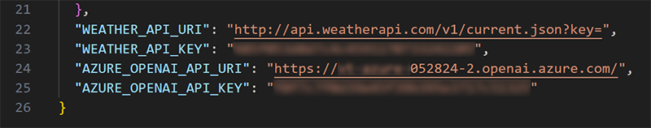
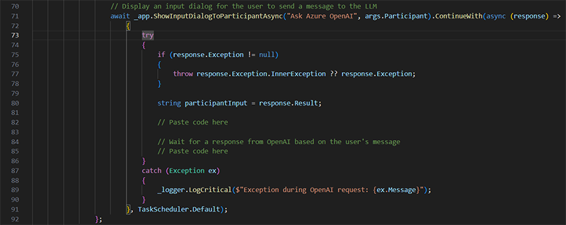
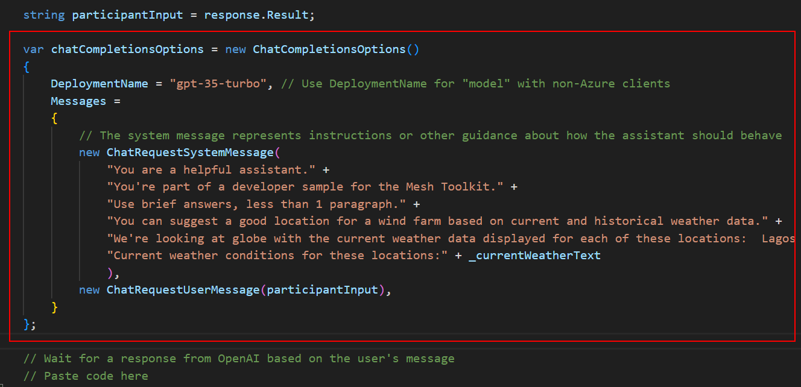
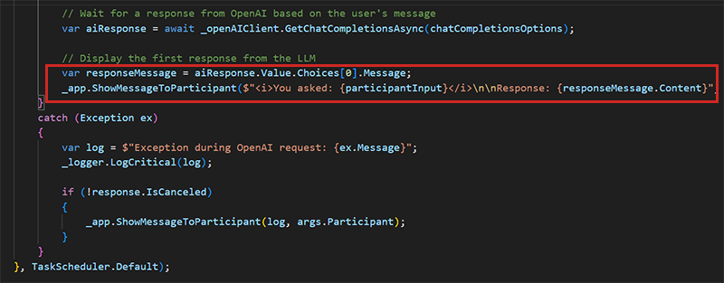
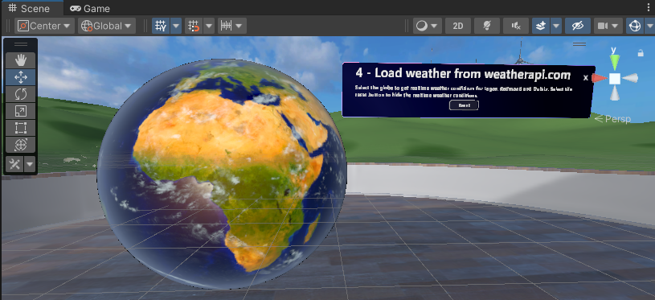
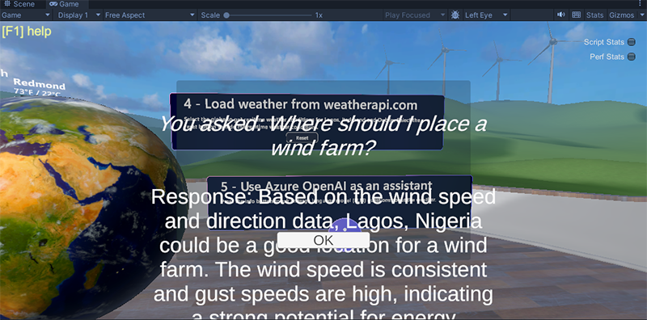

# Mesh 201 Tutorial Chapter 6: Get answers to questions using Azure OpenAI

In this chapter, we move on to the fifth and final station where where you'll learn how to implement Azure OpenAI as an AI assistant. Note that you could use any AI service you want here (for example, Copilot Studio). Keeping with the theme of searching for a location for a wind farm, the AI assistant will be customized to answer wind farm-related questions.

## Setting up for this station

In order to complete this station, you'll need to visit the Azure Portal and then get a *URI* (also called "Endpoint") and a *key* for your tenant. Later, you'll insert the key into some code that'll enable you to call Azure OpenAI. Let's do this step now so that you don't have to interrupt your workflow later on.

### Create an Azure OpenAI resource

1. In your browser, navigate to the [Azure Portal](https://azure.microsoft.com/en-us/get-started/azure-portal/) and then log in.
1. In the Search box at the top of the window, type in "azure openai" and then press the Enter key. This takes you to the **Azure AI services | Azure OpenAI** page.

    

1. Click the **Create** button.

    

**Basics page**

1. On the **Basics** page under **Product Details**, click the **Subscription** drop-down and then select _______TBD.

<image>

1. For **Resource group**, click **Create new** and then enter a name for the Resource Group. For this example, we'll enter ______TBD.

TBD: Do we need to include something about the "request/wait 24 hours" message that appeared for me?

1. Instance details, Region: _____ TBD.

1. In the **Name** text box, type in a name.

1. Click the **Pricing tier** drop-down and then select _________________TBD.

**Network Page**

1. On the **Network** page, select _______ TBD (three options--which one should I choose?).

    

**Tags page**

We can skip this page--click **Next**. TBD--should we skip it?

**Review and Submit page**

- Review the information on this page and then click the **Create** button.

    The resource deploys and you should see a message saying that the deployment is in progress. Eventually, you'll see a **Deployment is complete** page.

    

### Create the deployment in Azure OpenAI Studio

1. Click the **Go to Resource** button.

1. On the Resource page, click **Go to Azure OpenAI Studio**.

    

1. In the left-side menu under **Management**, select **Deployments**.

    

1. Select **Create new deployment**.

1. Click the **Select a model** drop-down and then choose "gpt-35-turbo".

1. For **Model version**, keep the selected option: "Auto-update to default". TBD

1. For **Deployment type**, keep the selected option: "Standard".

1. In the **Deployment name** text box, type in a name. For this tutorial, we'll use "gpt-35-turbo".

1. We'll keep the **Content Filter** setting of "Default."

1. For **Advanced options**, ________________. TBD: do we need to do anything here?

    

    If the deployment is successful, you'll see a message telling you this.

    

### Copy the URI and key

1. Navigate back to the Azure main page, and then under **Resources**, select the resource you created.

    

1. On the Resource page in the left-size menu, select **Keys and Endpoint**.

    

1. On the **Keys and Endpoint** page, click the "Copy to clipboard" button for **KEY 1** *or* *KEY 2* (it doesn't matter which one) and then paste it into a text file using Windows Notepad or another text editor.

    

1. Click the "Copy to clipboard" button for **Endpoint** and paste it into the same text file.

1. Save the text file. You'll need these two pieces of information later in the tutorial.

## Add the prefab for Station 5

1. In the **Project** folder, navigate to **Assets** > **MeshCloudScripting** and then drag **5 - AIAssistant** to the **Hierarchy** and place it as a child object to **Mesh Cloud Scripting** and just under **4 - GlobeWithCloudScripting**.

    

## Insert the URI and API information for Azure OpenAI

1. In the **Hierarchy**, select the **Mesh Cloud Scripting** GameObject.
1. In the **Inspector**, navigate to the **Mesh Cloud Scripting** component and then click **Open application folder**. This opens the project folder that contains the files for Mesh Cloud Scripting in the Windows File Explorer.

    

1. Open the file named *appsettings.UnityLocalDev.json* in your code editor. The last two lines of code contain placeholder comments for Azure OpenAI configuration settings.

    

1. Paste the URI and key that you got earlier from the Azure Portal into these two lines, replacing the placeholder comments.

    

## Update the csproj file

1. In the File Explorer window that displays the Mesh Cloud Scripting files, open the file named *StartingPoint.csproj* in your code editor.

    

1. Note that at the bottom of the file, just above the *ItemGroup* element with the WeatherAPI information, there's a comment with a placeholder for a package reference.

    

1. Delete the placeholder *PackageReference* element and replace it with the line below:

   	`<PackageReference Include="Azure.AI.OpenAI" Version="1.0.0-beta.15" />`

    

1. Save the file.

## Add the code that displays the OpenAI input dialog

1. In the File Explorer window that displays the Mesh Cloud Scripting files, open the file named *App.cs* in your code editor.

    

1. In the App.cs file, navigate to line 72, where'll you see a comment telling you to paste some code there.

    

1. Copy the code below:
```
    await _app.ShowInputDialogToParticipantAsync("Ask Azure OpenAI", args.Participant).ContinueWith(async (response) =>
    {
        try
        {
            if (response.Exception != null)
            {
                throw response.Exception.InnerException ?? response.Exception;
            }

            string participantInput = response.Result;

            // Paste code here

            // Wait for a response from OpenAI based on the user's message
            // Paste code here
        }
        catch (Exception ex)
        {
            _logger.LogCritical($"Exception during OpenAI request: {ex.Message}");
        }
    }, TaskScheduler.Default);
```

1. Paste the code into the App.cs file, replacing the "Paste code here" comment on line 72.

    

    The code does the following:

    - Call the Mesh Cloud Scripting through the method named *ShowInputDialogToParticipantAsync()*. The arguments are the message you want to prompt the user with ("Ask Azure OpoenAI"), who you want to display the input dialog to (*args.Participant*).
    - When the input dialog pops up, check for errors.
    - Save whatever the participant typed in (the *result*) to *participantInput* as a String. 

## Send ChatGPT the result of the input dialog

The code below sends ChatGPT the result of the input dialog with instructions on how to respond with the current weather data.

1. Copy the code below:

```
    var chatCompletionsOptions = new ChatCompletionsOptions()
    {
        DeploymentName = "gpt-35-turbo", // Use DeploymentName for "model" with non-Azure clients
        Messages =
        {
            // The system message represents instructions or other guidance about how the assistant should behave
            new ChatRequestSystemMessage(
                "You are a helpful assistant." +
                "You're part of a developer sample for the Mesh Toolkit." +
                "Use brief answers, less than 1 paragraph." +
                "You can suggest a good location for a wind farm based on current and historical weather data." +
                "We're looking at globe with the current weather data displayed for each of these locations:  Lagos Nigeria, Redmond WA USA, Dublin Ireland" +
                "Current weather conditions for these locations:" + _currentWeatherText
                ),
            new ChatRequestUserMessage(participantInput),
        }
    };
```

1. Paste the code into the App.cs file, replacing the "Paste code here" comment on line 83.

    

    The code does the following:

    - Create an instance of the *ChatCompletionOptions* class named *chatCompletionOptions*.
    - Intialize a variable named *DeploymentName* with the version of ChatGPT we're using ("gpt-35-turbo").
    - Initialize a new instance of *ChatRequestSystemMessage* with guidance on how the assistant should answer questions. This includes the locations with the weather data you're interested and the current conditions (*_currentWeatherText*) for those locations. The value of *_currentWeatherText* was received when we called weatherapi.com in Chapter 5.
    - Initialize a new instance of *ChatRequestUserMessag* with the question the participant asked.
    - Send the information about the request to the LLM (Large Language Model).

## Add the code that displays the response from the LLM

1. Copy the code below:

```
        var aiResponse = await _openAIClient.GetChatCompletionsAsync(chatCompletionsOptions);

        // Display the first response from the LLM
        var responseMessage = aiResponse.Value.Choices[0].Message;
        _app.ShowMessageToParticipant($"<i>You asked: {participantInput}</i>\n\nResponse: {responseMessage.Content}", args.Participant);
```

1. Paste the code into the App.cs file, replacing the "Paste code here" comment on line 103.

    

    The code does the following:

    - Wait for the response from the LLM.
    - The LLM sends back several responses in an array (*responseMessage*). You can choose the one you want to show. 
    - Call *ShowMessageToParticipant()* in the Mesh Cloud Scripting API to display the response.

1. Save the file.

## Test your work

1. In the Unity Editor, save the project and then press the Play button.

1. Your avatar is spawned on the side of the Sphere Terrace that contains the first three stations. Navigate to the opposite side of the Sphere Terrace and then position yourself in front of Station 5.

    


1. Click the Info button located in the information text box for Station 5.

    

1. When the **Ask Azure OpenAI** dialog appears, type in a question.

    

1. The response appears in the dialog. When you're finished, click **OK**.

    

## Conclusion

Congratulations! In this Mesh 201 tutorial, you learned about the following:

- Loading local shared and non-shared HTML files into a WebSlate.
- Using a 3D asset to call a Web API and download data into a WebSlate.
- Pull data from internal or public sources into your scene and display it in 3D.
- Set up AI-powered interactions using OpenAI.

Now you can put your new Mesh skills to work and build collaborative experiences that are even more useful and exciting!

## Next Steps

**Build and Publish**

If you want to build and publish this tutorial project, do the following:

1. Go to our article on [preparing a Mesh Cloud Scripting project](../../script-your-scene-logic/cloud-scripting/cloud-scripting-prepare-for-your-project.md#record-your-resource-group-and-subscription-id-for-later-use) and then follow the instructions to record your Resource Group and Subscription ID.
1. Go to our article on [building and publishing your environment](../../make-your-environment-available/build-and-publish-your-environment.md) and then follow the instructions there. At a certain point, you'll have to navigate to a supplementary article with specialized instructions for building a project with Mesh Cloud Scripting and then return to the main build and publish article. This flow is all laid out for you in the articles.
1. If you want to, you can [test your environment in the Mesh app](../../make-your-environment-available/test-your-environment.md).

**Learn more about WebSlates**

[Visit the WebSlates article on the Mesh Help site](../../enhance-your-environment/webcontent.md).

[Read a blog post written by the WebSlates product manager](https://devblogs.microsoft.com/microsoft365dev/web-content-in-microsoft-mesh-powered-by-webview/).

**Challenge**

Try creating your own Station with a WebSlate and a button that loads an HTML file. Be sure to share your efforts in our [Mesh Developer Forum](https://techcommunity.microsoft.com/t5/mesh-creators/welcome-to-the-microsoft-mesh-creator-discussion-space-a-hub-for/m-p/3938730)!
