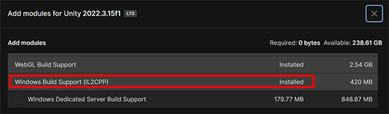

# Prerequisites for Mesh Development

## Platforms

Mesh is available for PC and Quest 2. The Mesh toolkit does *not* work on the Mac.

## License requirement

A Teams Premium license is required for using the Mesh application for custom immersive spaces in Mesh on PC and Quest. A license isn't required to develop with the Mesh toolkit, but you'll be blocked from building and publishing Environments to Mesh and organizing or joining events in Mesh if you and your users don't have Teams Premium licenses. For more information, see the article named [Set up Microsoft Mesh](../../Setup/Content/setup-m365-mesh.md).

## Unity version 2022.3.15

- You must use Unity version 2022.3.15. [Get help installing Unity Template](https://docs.unity3d.com/hub/manual/InstallEditors.html)
- Your installation should include modules for Android, Windows and *Windows Build Support IL2CPP*. 

> [!IMPORTANT]
> The [`Windows Build Support (IL2CPP)`](https://docs.unity3d.com/2023.2/Documentation/Manual/IL2CPP.html) is required; if it's not installed, you might experience build failures for your environments and see this message: `error CS7036: There is no argument given that corresponds to the required formal parameter 'safety' of 'NativeArray<T>.ReadOnly.ReadOnly(void*, int, ref AtomicSafetyHandle)'`

## Project template

When you create a new project, we recommend that you use the URP 3D Core template.

## Intermediate to advanced Unity skills

To build experiences for Mesh, you must have intermediate to advanced Unity skills.

*We can't guarantee that all steps will work as expected due to your unique Unity and computer configuration. There may be extra work needed on your end to triage errors or issues.*

[Learn Unity & review fundamentals](https://learn.unity.com/)

## Next steps

> [!div class="nextstepaction"]
> [Choose your journey](choose-your-journey.md)
