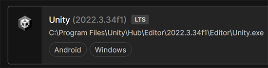

# Prerequisites for Mesh Development

## License requirement

A Teams Premium license is required for using the Mesh application for custom immersive spaces in Mesh on PC and Quest. A license isn't required to develop with the Mesh toolkit, but you'll be blocked from building and publishing Environments to Mesh and organizing or joining events in Mesh if you and your users don't have Teams Premium licenses. For more information, see the article named [Set up Microsoft Mesh](../../Setup/Content/setup-m365-mesh.md).

## Unity version 2022.3.7f1

You must use Unity version 2022.3.7f1.

[Get help installing Unity Template](https://docs.unity3d.com/hub/manual/InstallEditors.html)

Your installation should include modules for Android and Windows. When you create a new project, we recommend using the URP 3D Core template.

## Intermediate to advanced Unity skills

To build experiences for Mesh, you must have intermediate to advanced Unity skills.

*We can't guarantee that all steps will work as expected due to your unique Unity and computer configuration. There may be extra work needed on your end to triage errors or issues.*

[Learn Unity & review fundamentals](https://learn.unity.com/)

## Next steps

> [!div class="nextstepaction"]
> [Choose your journey](choose-your-journey.md)
