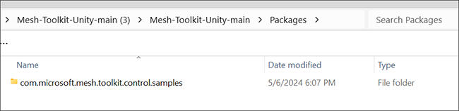
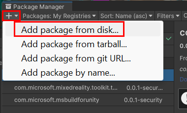
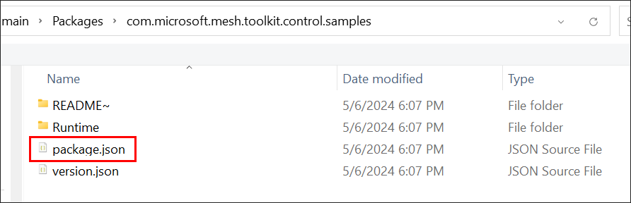
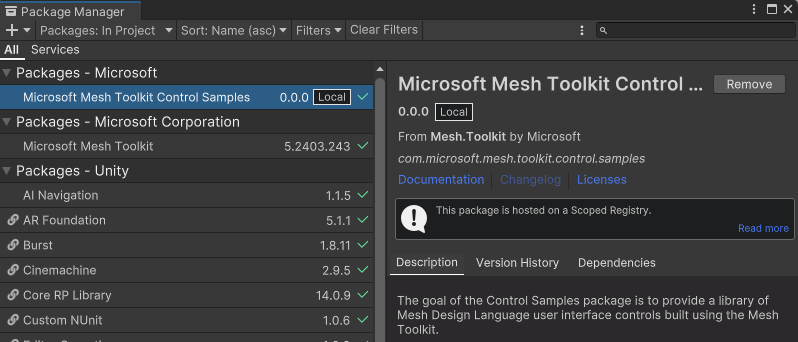
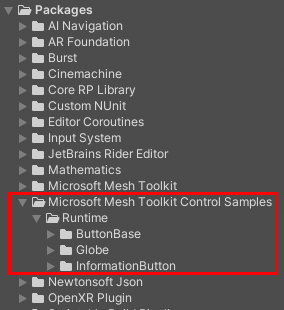
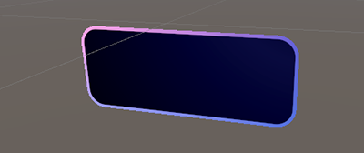
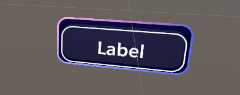
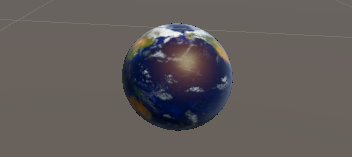
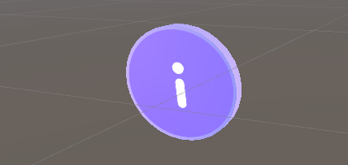

# Mesh Control Samples

## Overview

The Control Samples package provides user interface controls built using the Mesh Toolkit. We want to you have access to these features, but they're still in development so we call them "samples" to indicate that they're evolving and are subject to change over time.

## Getting started

The Control Samples package is included when you [download the Mesh samples from GitHub](./download-mesh-samples.md).

**To add the Control Samples package to your project**:

1. In your Unity project on the menu bar, select **Window** > **Package Manager**.
1. Click the '+' drop-down and then select **Add package from disk ...**.

1. In the **Select package on disk** window, navigate to the folder named *com.microsoft.mesh.toolkit.control.samples* and then double-click the *package.json* file.

1. The Control Samples package appears in the Package Manager tagged as "Local" ...

... and can be found in the **Project** > **Packages** folder.

## List of Control Sample prefabs

The Control Sample prefabs are in subfolders of the *Runtime* folder.

**Runtime** > **ButtonBase**

- **BackplateBase**: Use this prefab to place all of your controls on a backplate with rounded corners and an iridescent surface. 

- **ButtonBase**: The base prefab for all button variants. The button animates, produces audio feedback when pressed, and contains a label. Use *Visual Scripting* to set up events that trigger when an avatar clicks the button.

**Runtime** > **Globe**

- **Earth**: An Earth globe that spins and can be selected. When selected, the globe generates a latitude and longitude position and adds a marker. This functionality can be extended and modified with Visual Scripting. All actions are shared by all clients by default.

**Runtime** > **InformationButton**

- **InformationButton**: A floating world space coin button. The button features proximity detection through the `Avatar Trigger` behavior. When an avatar is a certain distance from the button, the coin stops spinning and is billboarded instead. The avatar is able to click the coin. If the avatar is out of range, it's no longer able to click on the button and the button returns to spinning. The button's interactable behavior is driven by its *Mesh Interactable Setup* component and the *InformationButton* script.  

## Next steps

> [!div class="nextstepaction"]
> [Samples overview](./samples-overview.md)
