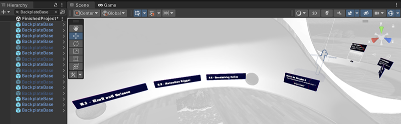
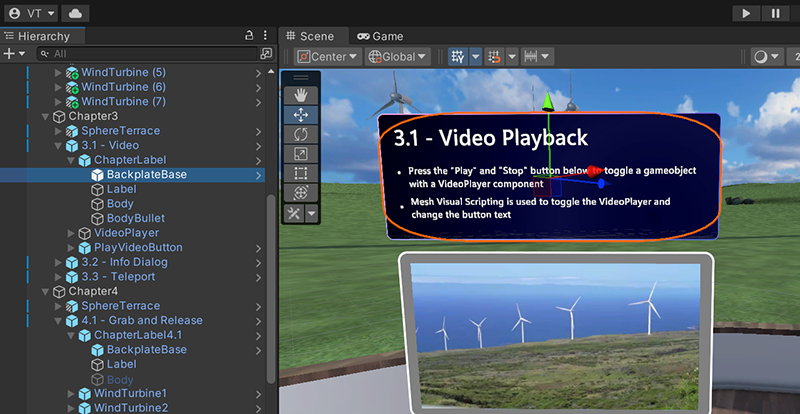
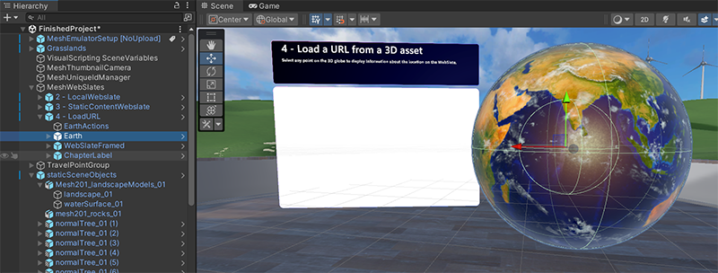
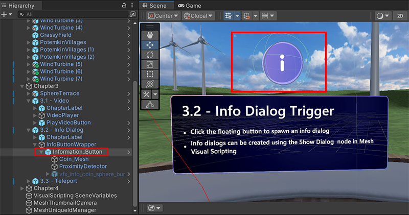

# Mesh Sample objects

## Overview

The Control Samples package provides user interface controls built using the Mesh Toolkit that you can use in your projects. The control samples are still in development so we call them "samples" to indicate that they're evolving and are subject to change over time. Details about the control samples are given in the [Control Samples in detail section](#control-samples-in-detail) further down this page, but here's a quick look at how we use them in our [Mesh 101](../mesh-101-tutorial/mesh-101-01-overview-and-setup.md) and [Mesh 201](../mesh-201-tutorial/mesh-201-01-overview-set-up-and-get-started.md) tutorials.

**BackplateBase**

Since a backplate is such a useful supporting object for any informational text display, the BackplateBase prefab is used in quite a few places in our tutorials.

One example: In the Mesh 101 tutorial, BackplateBase can be found as a child object to **ChapterLabel** which is the information text display for the first station, **3.1: Video Playback**.

**ButtonBase**

In the Mesh 101 tutorial, the ButtonBase prefab is used to create the *Play* button for the video screen in the *3.1: Video Playback* station. Note that the prefab has been renamed here to "PlayVideoButton".

**Earth**

In the Mesh 201 tutorial, the Earth prefab is used for *Station 4: Load a URL from a 3D asset*.

**InformationButton**

In the Mesh 101 tutorial, the InformationButton prefab is used for the *3.2: Info Dialog Trigger* station. Note that the prefab has been renamed slightly here to "Information_Button".

## Getting started

The Control Samples package is included when you [download the Mesh samples from GitHub](./download-mesh-samples.md).

**To add the Control Samples package to your project**:

1. In your Unity project on the menu bar, select **Window** > **Package Manager**.
1. Click the '+' drop-down and then select **Add package from disk ...**.

1. In the **Select package on disk** window, navigate to the folder named *com.microsoft.mesh.toolkit.control.samples* and then double-click the *package.json* file.

1. The Control Samples package appears in the Package Manager tagged as "Local" ...

... and can be found in the **Project** > **Packages** folder.

## Control Samples in detail

The Control Sample prefabs are in subfolders of the *Runtime* folder.

**Runtime** > **ButtonBase**

- **BackplateBase**: Use this prefab to place all of your controls on a backplate with rounded corners and an iridescent surface. 

- **ButtonBase**: The base prefab for all button variants. The button animates, produces audio feedback when pressed, and contains a label. Use *Visual Scripting* to set up events that trigger when an avatar clicks the button.

**Runtime** > **Globe**

- **Earth**: An Earth globe that spins and can be selected. When selected, the globe generates a latitude and longitude position and adds a marker. This functionality can be extended and modified with Visual Scripting. All actions are shared by all clients by default.

**Runtime** > **InformationButton**

- **InformationButton**: A floating world space coin button. The button features proximity detection through the `Avatar Trigger` behavior. When an avatar is a certain distance from the button, the coin stops spinning and is billboarded instead. The avatar is able to click the coin. If the avatar is out of range, it's no longer able to click on the button and the button returns to spinning. The button's interactable behavior is driven by its *Mesh Interactable Setup* component and the *InformationButton* script.  

## Next steps

> [!div class="nextstepaction"]
> [Samples overview](./samples-overview.md)
