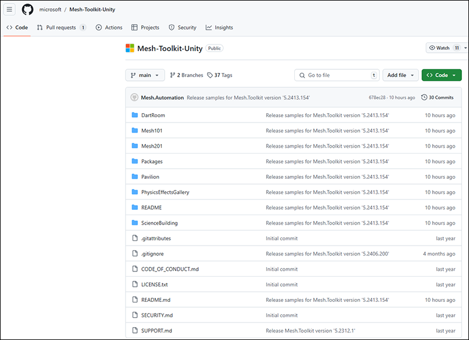

# Download Mesh samples

The Mesh toolkit samples repo on GitHub contains a variety of Mesh sample projects to inspire you about what you can build with Microsoft Mesh.

1. In your browser, go to GitHub, and then navigate to the [*Mesh-Toolkit-Unity* repository](https://github.com/microsoft/Mesh-Toolkit-Unity).

    

1. Select the **Code** button, and then select **Download ZIP**.

    

1. We recommend that you create a folder on your C: drive named "Mesh Samples" and then move or copy the downloaded Mesh toolkit Zip file to that folder. This is a good name for two reasons: it's short, so it avoids running into a problem with the Windows path length limit, which is 256 characters. Also, the Zip file contains a number of Mesh samples and this keeps them all in one place.

    **IMPORTANT**: *Don't* place the Zip file on the Windows desktop. Behind the scenes, this creates a very long path name.

    In the example below, the user created a folder on their C: drive named *Mesh Samples.* Next, they moved the downloaded Mesh toolkit Zip file to the *Mesh Samples* folder.

    

1. Unzip the samples Zip file into the same folder.

## Next steps

> [!div class="nextstepaction"]
> [Samples overview](samples-overview.md)