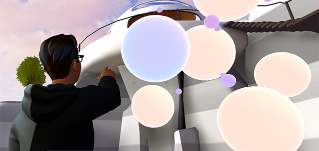
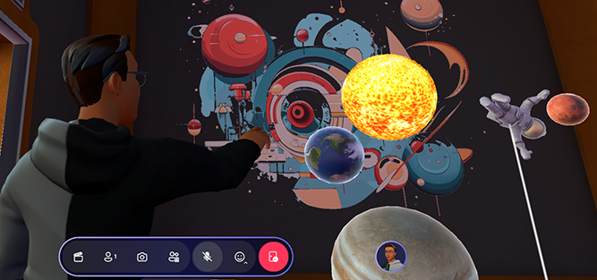

# Microsoft Mesh toolkit sample: Pavilion

The Mesh Pavillion sample lets you create environments that contain interactive activities and various assets found in the Mesh Toolkit. It features a simple, high-performance design. The Pavilion Unity project contains two scenes. 

## Samples scene (*MeshPavillion_Samples*)

In the **Samples** scene, you'll find activities constructed from objects [found in the Toybox package](../../enhance-your-environment/toybox.md), a globe from our [Control Samples](../../build-your-basic-environment/control-samples.md) package, various art assets, and Mesh toolkit features like screenshare that you can pull into your own environments.

To see a larger version of one of the images below, click the image.

:::image type="content" source="../../../media/samples/pavilion/007-campfire-small-350.png" alt-text="Screen shot of the Campfire activity in the Pavilion sample." lightbox="../../../media/samples/pavilion/009-campfire-large-1250.png"::: :::image type="content" source="../../../media/samples/pavilion/011-icebreaker-small-250.png" alt-text="________" lightbox="../../../media/samples/pavilion/010-icebreaker-large-1250.png":::

:::image type="content" source="../../../media/samples/pavilion/013-beanbag-small-350.png" alt-text="________" lightbox="../../../media/samples/pavilion/012-beanbag-large-1250.png"::: :::image type="content" source="../../../media/samples/pavilion/015-mesh-physics-small-350.png" alt-text="________" lightbox="../../../media/samples/pavilion/014-mesh-physics-large-1250.png":::

:::image type="content" source="../../../media/samples/pavilion/017-globe-small-350.png" alt-text="________" lightbox="../../../media/samples/pavilion/016-globe-large-1250.png"::: :::image type="content" source="../../../media/samples/pavilion/019-sound-spheres-small-350.png" alt-text="________" lightbox="../../../media/samples/pavilion/018-sound-spheres-large-1250.png":::

***

### Activities

The image below can help you find the different activities in the scene.

1.	Bean bag toss
2.	Fire pit with roasting marshmallows
3.	Waterfall (water shader)
4.	Ice breaker
5.	Radio
6.	Screenshare 
7.	Sphere sculpture
8.	Solar system
9.	Globe

There are also art assets such as plants and shaders distributed throughout the scene.

* **Bean Bag Toss**

 <!--   :::image type="content" source="../../../media/samples/009-beanbag-1.gif" alt-text="GIF that shows an event attendee playing the bean bag toss game."::: -->

This is a fun activity that can add a gaming element to your project and promote social interaction and team-building through some friendly competition. The bean bags are [interactables](../../enhance-your-environment/avatar-and-object-interactions/interactables.md) and rigidbodies that have visual scripts with several object variables attached. One set of targets has animations attached that cause the holes to rotate (object name: *Rotation*). When a bag "scores" by falling in a hole, a particle system component generates a "winning" visual cue (object name: *vfx_beanbag_score_001*).

* **Fire Pit & Roasting Marshmallows**
 <!--    :::image type="content" source="../../../media/samples/010-marshmallow-2.gif" alt-text="GIF that shows an event attendee roasting a marshmallow.":::
-->

Attendees can grab a marshmallow on a stick and join their friends for a marshmallow roast. A stick (object name: *MarshmallowStick*) can be grabbed and held because it has a [Mesh Interactable Setup component](../../enhance-your-environment/avatar-and-object-interactions/interactables.md#the-mesh-interactable-setup-component) with its **Object Type** set to [Equippable](../../enhance-your-environment/avatar-and-object-interactions/interactables.md#equippable). It also has a script graph attached that triggers an animation clip named *Roast*. If you want more insight into the marshmallow burning effect, have a look at the *S_VFX_BurntShader*  shader graph attached to the *Marshmallow_03_burnt* object. The fire is provided by particle systems attached to the *Main_Flame* object and its child objects. The sticks can be returned to their original places in the stickholder thanks to the *ResetButton* script attached to the *Reset_Button_Marshmallow_Varient* object.

* **Waterfall (water shader)**

A waterfall can enhance the visual appeal of a space, providing a calming and natural element that makes the environment more inviting. This waterfall asset comes with ambient sound and showcases our use of VFX tools. There are also custom shaders, including a shader that distorts UVs to simulate realistic water refraction and distortion. All of this, combined with various performance optimization techniques, ensures a seamless integration into real-time environments.

* **Ice Breaker**

 <!--   -->

When attendees have had their fill of roasted marshmallows, they can visit the *Ice Breaker* located close by. This activity is a great way for people to learn more about each other. Attendees can gather around a sphere that, when clicked, asks about a favorite TV show, memorable concert performance, advice they've gotten, or any number of other things related to their opinions, interests or experiences. The sphere is an [Interactable](../../enhance-your-environment/avatar-and-object-interactions/interactables.md) with a script named *IceBreaker* attached. It also has an object variable of type *List of String* that contains the potential questions.

* **Sphere Sculpture** 

 <!--    -->

This "sculpture" consists of over a dozen spheres of various sizes floating in space. The spheres are [Interactables](../../enhance-your-environment/avatar-and-object-interactions/interactables.md) (object name: *InteractableSphere*). When an attendee touches a sphere, a bell-like tone is generated. To see how this works, take a look at the *SpheresSculptureSphere_Simple* script attached to *InteracatableSphere*.

* **Solar System**

 <!--   -->

This is a mini-version of our solar system, with Earth, Mars and Jupiter models floating in orbit around the Sun (object names: *Planet_Earth*, *Planet_Mars*, *Planet_Jupiter*). There's also an astronaut model (object name: *Astronaut Rig*). An attendee can reach out and grab the models from a distance because they each have [Mesh Interactable Setup components](../../enhance-your-environment/avatar-and-object-interactions/interactables.md#the-mesh-interactable-setup-component) set to type [Manipulable](../../enhance-your-environment/avatar-and-object-interactions/interactables.md#manipulable). The astronaut model has joints and a rig; when it's grabbed and moved, its arms and legs flail about. The models can't be moved out of the room due to the presence of a [Containment Field](../../enhance-your-environment/physics/mesh-physics-programmers-guide.md#containment-field) object.

* **Radio**

 <!--   
-->

Just a simple radio to provide some jazzy background music for the Environment. The radio (object name: *Radio_Pressable_Prefab*) has a script attached (*PressableRadio*) that generates the audio. The music notes floating up from the radio are generated by the *Particle System* object (child object of *Radio_V2*).

* **Screenshare**

The Mesh toolkit Screenshare component allows developers to place Screenshares in their environments. These allow event hosts with Organizer or Co-Organizer privileges to share their screens, in the same way as they can in Microsoft environments that already include Screenshares or in any environment with Screenshare objects added. You can add multiple Screenshare components to a scene; all of them will show the same content when a screen is shared in a Mesh event.

**To add a Screenshare component**:

Do one of the following:

- In the **Hierarchy**, right-click to open the context menu and then select **Mesh Toolkit** > **Screen Share**.

    -or-

- In the **Project** window, search for the "ScreenShare"  prefab (it's in the Mesh Toolkit Package) and then drag it into your scene. 

You can resize and change the location of the ScreenShare prefab.  

* **Globe**

The Glove prefab represents planet Earth; you can spin and select it. When selected, the globe generates a latitude and longitude position and adds a marker. This functionality can be extended and modified with Visual Scripting and all actions are shared by all clients by default. Globe is one of the samples in the [Control Samples](../../build-your-basic-environment/control-samples.md) package, a sample library of user interface controls built using the Mesh Toolkit.                                                                                                             

* **Art assets**                                                 
                         
Throughout the Mesh Pavilion, you'll discover a variety of art assets that help to create a pleasing environment, including lush plants, shimmering water shaders, and stylish furniture. You can utilize these assets to enrich your own environments.

## Modules scene (*MeshPavillion_moduleGallery*)

The **Modules** scene contains rooms, corridors and halls that are constructed as individual modules. You can arrange these as you desire to create a custom layout. 

 
In order to align the modules precisely, you need to activate *Grid Snapping* in the Unity Editor.  

### Activate Grid Snapping

We’ll need to activate Grid Snapping inside the Unity editor to be able to align the modules precisely.

1. In the Scene window toolbar, set the *Tool Handle Rotation* toggle to "Global".
1. Toggle the visibility of the grid to "on" (the button should be blue).
1. Toggle the Grid Snapping button to "on" (this should also be blue).
1. Click the Grid Snapping icon and then, in the **Grid Snapping** dialog, set the **Grid Size: X** value to 0.5.

    

### Create a layout

1. Pick a Room module you wish to start with and then attach a corridor. The Grid Snapping will help you match it exactly to the doorway.

    

1. Continue to drag Room modules into place and attach Halls and Corridors as needed.

    

**Tip**: You can create new openings by deactivating the cover object at the center of each wall. Attach a new corridor to extend the environment in all directions.

## Contributions

We are not currently accepting code contributions to our samples.  If you have any feedback or if you run into any issues with the samples or the Mesh toolkit, do the following: in a Unity project that has the Mesh toolkit package installed, select **Mesh Toolkit** -> **Give feedback to Microsoft** and then use the feedback link in the Mesh toolkit to let us know.

This project has adopted the [Microsoft Open Source Code of Conduct](https://opensource.microsoft.com/codeofconduct/).
For more information see the [Code of Conduct FAQ](https://opensource.microsoft.com/codeofconduct/faq/) or
contact [opencode@microsoft.com](mailto:opencode@microsoft.com) with any additional questions or comments.

## License

The Mesh sample in this project is governed by the MIT license as shown in the [LICENSE.MD](https://github.com/microsoft/Mesh-Toolkit-Unity/blob/main/LICENSE) file in the *Mesh-Toolkit-Unity* repository. However, the samples functionality is dependent on the Mesh toolkit, which is governed by a separate license, and contains 3rd party software. 

## Share your work

Let us know how you use the Mesh Pavillion in our [Mesh Developer Forum](https://techcommunity.microsoft.com/t5/mesh-creators/welcome-to-the-microsoft-mesh-creator-discussion-space-a-hub-for/m-p/3938730)!

