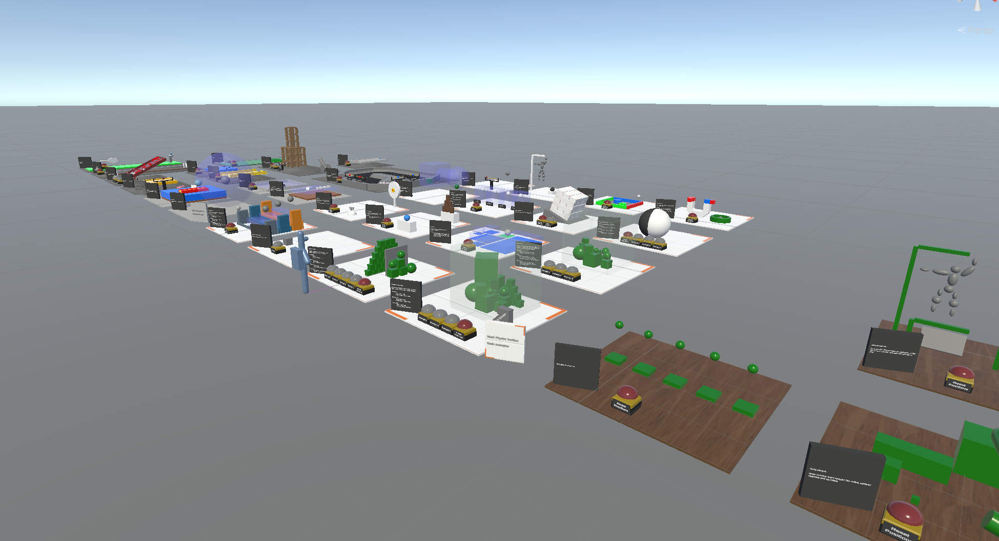

# Microsoft Mesh Toolkit Sample: Physics Effects Gallery

The *PhysicsEffectsGallery* project (scene: *PhysicsEffectsGallery*) contains a programmer-art designed scene that demonstrates the power of combining appealing visuals with the creative use of Mesh Physics features found in the Mesh Toolkit. Feel free to inspect, modify and play with the scene or use elements to creatively enhance your own custom experiences!

In this project, you'll find:

* **Default game physics**: demonstrating shapes, constraints and restitution
* **Explosions**: configured with different parameters (both spherical and directional)
* **Velocity fields**: showing different options to move objects 
* **Throwing objects**: with ball or dart-like behavior
* **Visual Scripting examples**: for 3D button and slider UI elements
* **Mass and Gravity**: scaled gravity or objects orbiting around the sun
* **Buoyancy**: objects floating on the waves

Additonally, there are several **unpolished** game mechanics examples:

* **Pinball**, **Bowling**, **Air Hockey**, **Balancing Maze**, **Fishing Game**, **Baseball Cage**, **Mini Golf**, **Cannon Shooting** and the **Toy Cars**.

The [Samples Overview](samples-overview.md) page contains instructions on how to download the Mesh Toolkit which contains this sample.

## Contributions

We are not currently accepting code contributions to our samples.  If you have any feedback or if you run into any issues with the samples or the Mesh Toolkit, do the following: in a Unity project that has the Mesh Toolkit package installed, select **Mesh Toolkit** -> **Give feedback to Microsoft** and then use the feedback link in the Mesh Toolkit to let us know.

This project has adopted the [Microsoft Open Source Code of Conduct](https://opensource.microsoft.com/codeofconduct/).
For more information see the [Code of Conduct FAQ](https://opensource.microsoft.com/codeofconduct/faq/) or
contact [opencode@microsoft.com](mailto:opencode@microsoft.com) with any additional questions or comments.

The [Samples Overview](samples-overview.md) page contains instructions on how to download the Mesh Toolkit.

## License

The Mesh sample in this project is governed by the MIT license as shown in the [LICENSE.MD](https://github.com/microsoft/Mesh-Toolkit-Unity/blob/main/LICENSE) file in the *Mesh-Toolkit-Unity* repository. However, the samples functionality is dependent on the Mesh Toolkit, which is governed by a separate license, and contains 3rd party software. 

