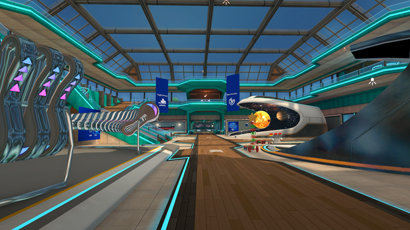

# Samples Overview

The Mesh samples are a great way to learn about the different kinds of Mesh Experiences you can create and the features you can add to an environment. They can also be used as a starting point for your custom environment; each project is already set up with the Mesh toolkit package and contains many assets that you might find useful.

## About the Mesh samples

- **Mesh 101**: Mesh 101 is a tutorial, but it also doubles as a sample. In the project, you can open the *StartingPoint* scene and begin walking through the tutorial. However, the project contains another scene named *FinishedProject* which is a completed version of the tutorial. You can view this scene as a sample and use it as starting point for your project just as you would with any of the other samples. [Get started with the Mesh 101 tutorial](../mesh-101-tutorial/mesh-101-01-overview-and-setup.md).

- **Toybox**: A project that showcases a number of useful Mesh features: assets, shaders, visual scripting, animations, VFX, and SoundFX. [Learn more about the Toybox sample](toybox.md).

- **Physics Effects Gallery**: Contains a programmer-art designed scene that demonstrates the power of combining appealing visuals with the creative use of Mesh Physics features. [Learn more about the Physics Effects Gallery sample](physics-effects-gallery.md).

- **Dart Room**: A saloon-style room with a dart game to showcase interactive Mesh Physics features. [Learn more about the Dartroom sample](dart-room.md).

- **Science Building**: An expansive museum exhibiting the power of Mesh Physics to create dynamic, engaging experiences. [Learn more about the Science Building sample](science-building.md).

**To start with a sample**:

1. If you haven't done so already, [download and unzip the Mesh samples](download-mesh-samples.md).

1. In the Unity Hub, select **Open** > **Add project from disk**, and then navigate to the folder you extracted that contains the samples.

1. Open the sample project you want.

1. In Unity, navigate to **Assets** > **Scenes** and then open the scene you want---this will vary from sample to sample. For example, in the *Science Building* project, you would open the **ScienceBuilding** scene.

Here's an example of what you'll find in that scene:

## Build and publish your customized sample

After you customize a sample, you can convert it into an *Environment* by building and publishing it to Mesh on the web. An event *Organizer* can then create an event based on that Environment. To learn more, see [Build and publish your environment](../../make-your-environment-available/build-and-publish-your-environment.md).

## Contributions

We are not currently accepting code contributions to our samples. If you have any feedback or if you run into any issues with the samples or the Mesh toolkit, do the following: in a Unity project that has the Mesh toolkit package installed, select **Mesh Toolkit** -> **Give feedback to Microsoft** and then use the feedback link in the Mesh toolkit to let us know.

This project has adopted the [Microsoft Open Source Code of Conduct](https://opensource.microsoft.com/codeofconduct/).
For more information see the [Code of Conduct FAQ](https://opensource.microsoft.com/codeofconduct/faq/) or
contact [opencode@microsoft.com](mailto:opencode@microsoft.com) with any additional questions or comments.

The [Samples Overview](samples-overview.md) page contains instructions on how to download the Mesh toolkit.

## License

The Mesh samples are governed by the MIT license as shown in the [LICENSE.MD](https://github.com/microsoft/Mesh-Toolkit-Unity/blob/main/LICENSE) file in the *Mesh-Toolkit-Unity* repository. However, the samples functionality is dependent on the Mesh toolkit, which is governed by a separate license, and contains 3rd party software. 
