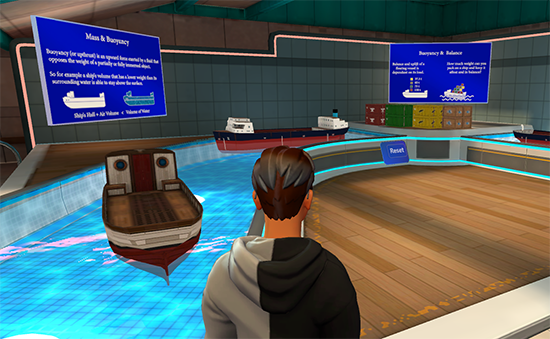

# Microsoft Mesh toolkit sample: ScienceBuilding

## Overview

The *ScienceBuilding* project (scene: *ScienceBuilding*) contains a carefully designed scene that demonstrates the power of combining appealing visuals with the creative use of Mesh Physics features found in the Mesh toolkit. Feel free to inspect, modify and play with the scene or use elements to creatively enhance your own custom experiences!

In the gallery there a number of exhibits activities. Four of the exhibits are on the ground floor in the Science Building's main hall.

:::image type="content" source="../../../media/samples/science-building/002-sci-bldg-wide-630.png" alt-text="Elevated view of the four exhibits in the main hall of the science building" lightbox="../../../media/samples/science-building/001-sci-bldg-wide-1260.png":::

1. **Mass and Gravity**: planets and other objects orbiting around the Sun

    

2. **Gravity Simulator**: switching between Earth, Moon and space

    

3. **Wave and Frequency**: connected physics bodies moving in a variety of synchronized ways

    

4. **Mass, Buoyancy and Balance**: ships or other objects floating on the waves

    

One exhibit is outside and in front of the main hall.

* **Gone Fishin'!**: catch fish, ships or a penguin with a magnetic fishing rod

    :::image type="content" source="../../../media/samples/science-building/004-gone-fishing-630.png" alt-text="Elevated view of the Gone fishing exhibit" lightbox="../../../media/samples/science-building/003-gone-fishing-1260.png":::

One exhibit is by the front desk in a building to the left of the main hall.

* **The Rambunctious Machine**: demonstrating interactive physics constrained to 2D

    :::image type="content" source="../../../media/samples/science-building/006-ramb-machine-630.png" alt-text="Elevated view of the rambunctious machine exhibit." lightbox="../../../media/samples/science-building/005-ramb-machine-1260.png":::

Activities: these are on the upper level of the main building.

* **Magnetism**

    

* **Bowling**

    

* **Air Hockey**

    

* **Balance Scales**

    

* **Black Holes**

    

* **Marble Race**

    

## Download the sample

The [Samples Overview](samples-overview.md) page contains instructions on how to download the Mesh toolkit which contains this sample.

## Warning about sample load time

The sample could take 15 minutes or slightly longer to load into Unity due to large asset sizes. If you need to, change your Sleep mode setting so that the computer doesn't go to sleep while the project is loading. If this happens, it could cause the project to not load properly.

## Contributions

We are not currently accepting code contributions to our samples.  If you have any feedback or if you run into any issues with the samples or the Mesh toolkit, do the following: in a Unity project that has the Mesh toolkit package installed, select **Mesh Toolkit** -> **Give feedback to Microsoft** and then use the feedback link in the Mesh toolkit to let us know.

This project has adopted the [Microsoft Open Source Code of Conduct](https://opensource.microsoft.com/codeofconduct/).
For more information see the [Code of Conduct FAQ](https://opensource.microsoft.com/codeofconduct/faq/) or
contact [opencode@microsoft.com](mailto:opencode@microsoft.com) with any additional questions or comments.

## License

The Mesh sample in this project is governed by the MIT license as shown in the [LICENSE.MD](https://github.com/microsoft/Mesh-Toolkit-Unity/blob/main/LICENSE) file in the *Mesh-Toolkit-Unity* repository. However, the samples functionality is dependent on the Mesh toolkit, which is governed by a separate license, and contains 3rd party software. 

