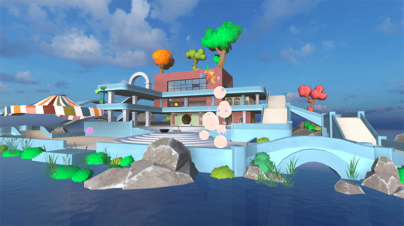

# Microsoft Mesh toolkit Sample: Toybox

*Toybox* is a Mesh sample that empowers creators to build interactive Mesh experiences and games. The sample provides a number of activities that use mixtures of assets, shaders, visual scripting, animations, VFX, and SoundFX to drive social engagment across Mesh experiences:
  
* **Bean Bag Toss** 

    :::image type="content" source="../../../media/samples/009-beanbag-1.gif" alt-text="GIF that shows an event attendee playing the bean bag toss game.":::

* **Fire Pit & Roasting Marshmallows** 

    :::image type="content" source="../../../media/samples/010-marshmallow-2.gif" alt-text="GIF that shows an event attendee roasting a marshmallow.":::

* **Ice Breaker**
* **Sound Orbs** 
* **Radio & Boombox** 
* **Bonus: Astronaut**

The [Samples Overview](samples-overview.md) page contains instructions on how to download the Mesh toolkit which contains this sample.

## Understanding the scene Interactables

In order to understand the interactions between objects in the scene, we recommend that you review the [Grab, hold and throw with Interactables](../../enhance-your-environment/avatar-and-object-interactions/interactables.md) article and then take a look at the objects in the Toybox sample that are made interactable by containing the *Mesh Interactable Setup* or *Mesh Interactable Body* components. Examining the visual scripts attached to certain objects will give you further insights. The scripts contain a mixture of standard Unity nodes and nodes that are specially made for Mesh. To learn more about the Mesh nodes, see the [Visual Scripting Node Reference](../../script-your-scene-logic/visual-scripting/visual-scripting-node-reference.md). There are a lot of GameObjects in the Toybox sample; the lists and tables below should make is easier for you to find the interactable objects and the Mesh nodes in the scripts.

**Some of the objects the Mesh Interactable Setup component is attached to:**

beanbag_red  
beanbag_blue  
toybox_beanbag_reset_button_variant  
InteractableSphere  
Planet_Mars  
Planet_Earth  
Planet_Jupiter  
Reset_Button_Marshmallow_Varient
MarshmallowStick
Button
toybox_play_button_01_varient
Planet_Mars
Planet_Earth
Planet_Jupiter
Planet_astronaut_hip
Button (child object of *ButtonHolder*)
toybox_play_button_01_varient

**Some of the objects the Mesh Interactable Body component is attached to:**

beanbag_red  
beanbag_blue  
toybox_beanbag_reset_button_variant  
Reset_Button_Marshmallow_Varient  
Button (child object of *ButtonHolder*)
toybox_play_button_01_varient

**Some of the objects with Mesh Physics Components**

| GameObject | Component |
|------------|-----------|
| Gravity | [Orbital Gravity Field](../../enhance-your-environment/physics/mesh-physics-programmers-guide.md#orbital-gravity-field) |
| ContainmentField | [Containment Field](../../enhance-your-environment/physics/mesh-physics-programmers-guide.md#containment-field) |
| Astronaut_containmen | Containment Field |
| Buoyancy | [Buoyancy Field](../../enhance-your-environment/physics/mesh-physics-programmers-guide.md#buoyancy-field) |
| BeanBags, Marshmallow Holder, Marshmallow_Pos | Reset Body Transform |
| Marshmallow_Pos | Reset Body Transforms |

### Mesh nodes used in script graphs

**[Microsoft Mesh: On State Changed](../../script-your-scene-logic/visual-scripting/visual-scripting-node-reference.md#on-state-changed)**
***

| Activity | GameObjects     | Script Machine Name | Graph Name |  
|----------|-----------------|---------------------|------------|  
| Campfire | Reset_Button_Marshmallow_Varient | ResetButton | ResetButton |
| Bean Bag Toss | beanbag_red, beanbag_blue | BeanBagPower | BeanBagGraph |
| Sphere Sculpture | InteractableSphere | SpheresSculptureSphere | SpheresSculptureSphere_Simple |
| IceBreaker | IceBreaker | IceBreaker | IceBreaker |  
| Music Box | Radio_Pressable_Prefab | Pressable Radio | PressableRadio
| Music Box | toybox_play_button_01_varient | PlayButton Script | PlayButton_Script |

 

**Mesh Interactable Body: Is Equipped**
***

| Activity | GameObjects     | Script Machine Name | Graph Name |  
|----------|-----------------|---------------------|------------|  
| Bean Bag Toss | beanbag_red, beanbag_blue | BeanBagPower | BeanBagGraph |

***
 

**Mesh Interactable Body: Is Aiming**
***

| Activity | GameObjects     | Script Machine Name | Graph Name |  
|----------|-----------------|---------------------|------------|  
| Bean Bag Toss | beanbag_red, beanbag_blue | BeanBagPower | BeanBagGraph |  

***
 

**Mesh Interactable Body: Is Selected**
***

| Activity | GameObjects     | Script Machine Name | Graph Name |  
|----------|-----------------|---------------------|------------|  
| Campfire | Reset_Button_Marshmallow_Varient | ResetButton | ResetButton |  
| Bean Bag Toss | beanbag_red, beanbag_blue | BeanBagPower | BeanBagGraph |  
| Sphere Sculpture | InteractableSphere | SpheresSculptureSphere | SpheresSculptureSphere_Simple |  

 

**Mesh Interactable Body: Is Selected Locally**
***

| Activity | GameObjects     | Script Machine Name | Graph Name |  
|----------|-----------------|---------------------|------------|  
| IceBreaker | IceBreaker | IceBreaker | IceBreaker |  
| Music Box | Radio_Pressable_Prefab | Pressable Radio | PressableRadio |
| Music Box | toybox_play_button_01_varient | PlayButton Script | PlayButton_Script |

 

**Mesh Interactable Body: IsHovered**
***

| Activity | GameObjects     | Script Machine Name | Graph Name |  
|----------|-----------------|---------------------|------------|  
| Sphere Sculpture | InteractableSphere | SpheresSculptureSphere | SpheresSculptureSphere_Simple | 
| IceBreaker | IceBreaker | IceBreaker | IceBreaker |  

 

**Reset Body Transforms: Reset Body Transforms Now**
***

| Activity | GameObjects     | Script Machine Name | Graph Name |  
|----------|-----------------|---------------------|------------|  
| Campfire | Reset_Button_Marshmallow_Varient | ResetButton | ResetButton |  

 

**Spatial Audio Properties: Create**
***

| Activity | GameObjects     | Script Machine Name | Graph Name |  
|----------|-----------------|---------------------|------------|  
| Bean Bag Toss | beanbag_red, beanbag_blue | BeanBagPower | BeanBagGraph |  
| Sphere Sculpture | InteractableSphere | SpheresSculptureSphere | SpheresSculptureSphere_Simple |  

 

**Microsoft Mesh: Play Mesh Audio**
***

| Activity | GameObjects     | Script Machine Name | Graph Name |  
|----------|-----------------|---------------------|------------|  
| Bean Bag Toss | beanbag_red, beanbag_blue | BeanBagPower | BeanBagGraph |  
| Sphere Sculpture | InteractableSphere | SpheresSculptureSphere | SpheresSculptureSphere_Simple |  

 

**Microsoft Mesh: Random Sound**
***

| Activity | GameObjects     | Script Machine Name | Graph Name |
|----------|-----------------|---------------------|------------|  
| Bean Bag Toss | beanbag_red, beanbag_blue | BeanBagPower | BeanBagGraph |  

 

## Warning about sample load time

The sample could take 15 minutes or slightly longer to load into Unity due to large asset sizes. If you need to, change your Sleep mode setting so that the computer doesn't go to sleep while the project is loading. If this happens, it could cause the project to not load properly.

## Contributions

We are not currently accepting code contributions to our samples.  If you have any feedback or if you run into any issues with the samples or the Mesh toolkit, do the following: in a Unity project that has the Mesh toolkit package installed, select **Mesh Toolkit** -> **Give feedback to Microsoft** and then use the feedback link in the Mesh toolkit to let us know.

This project has adopted the [Microsoft Open Source Code of Conduct](https://opensource.microsoft.com/codeofconduct/).
For more information see the [Code of Conduct FAQ](https://opensource.microsoft.com/codeofconduct/faq/) or
contact [opencode@microsoft.com](mailto:opencode@microsoft.com) with any additional questions or comments.

## License

The Mesh sample in this project is governed by the MIT license as shown in the [LICENSE.MD](https://github.com/microsoft/Mesh-Toolkit-Unity/blob/main/LICENSE) file in the *Mesh-Toolkit-Unity* repository. However, the samples functionality is dependent on the Mesh toolkit, which is governed by a separate license, and contains 3rd party software. 
