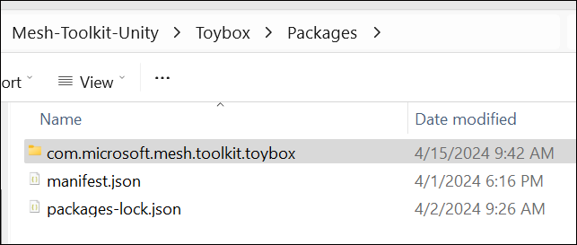
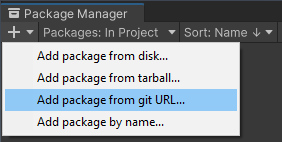

# Microsoft Mesh toolkit Sample: Toybox

*Toybox* is a Mesh sample that empowers creators to build interactive Mesh experiences and games. The sample provides a number of activities that use mixtures of assets, shaders, visual scripting, animations, VFX, and SoundFX to drive social engagment across Mesh experiences.

If this is your first time using one of our samples, we recommend that you review our [Samples overview](./samples-overview.md) if you haven't already. This page contains instructions on how to download the Mesh toolkit which contains this sample.

## The Toybox Package

The Toybox package is named *com.microsoft.mesh.toolkit.toybox* and can be found in File Explorer in the *Packages* folder.

Here's how it looks in the Unity project.

## Understanding the scene Interactables

In order to understand the interactions between objects in the scene, we recommend that you review the [Grab, hold and throw with Interactables](../../enhance-your-environment/avatar-and-object-interactions/interactables.md) article and then take a look at the objects in the Toybox sample that are made interactable by containing the [*Mesh Interactable Setup*](../../enhance-your-environment/avatar-and-object-interactions/interactables.md#the-mesh-interactable-setup-component) or *Mesh Interactable Body* components. Examining the visual scripts attached to certain objects will give you further insights. The scripts contain a mixture of standard Unity nodes and nodes that are specially made for Mesh. To learn more about the Mesh nodes, see the [Visual Scripting Node Reference](../../script-your-scene-logic/visual-scripting/visual-scripting-node-reference.md). There are a lot of GameObjects in the Toybox sample; the lists and tables below should make is easier for you to find the interactable objects and the Mesh nodes in the scripts.

## Toybox Activities

The image below can help you find the different activities in the scene. To see a larger version, click the image.

1. Bean Bag Toss
1. Fire Pit and Roasting Marhmallows
1. Ice Breaker
1. Sphere Sculpture
1. Solar System
1. Radio
1. Boombox

:::image type="content" source="../../../media/samples/019-toybox-map-625.png" alt-text="Long distance view of the Toybox scene with features numbered." lightbox="../../../media/samples/018-toybox-map-1250.png":::

* **Bean Bag Toss**

    :::image type="content" source="../../../media/samples/009-beanbag-1.gif" alt-text="GIF that shows an event attendee playing the bean bag toss game.":::

    This is a fun activity that can add a gaming element to your project and promote social interaction and team-building through some friendly competition. The bean bags are [interactables](../../enhance-your-environment/avatar-and-object-interactions/interactables.md) and rigidbodies that have visual scripts with several object variables attached. One set of targets have animations attached that cause the holes to rotate (object name: *Rotation*). When a bag “scores” by falling in a hole, a particle system component generates a “winning” visual cue (object name: *vfx_beanbag_score_001*).

* **Fire Pit & Roasting Marshmallows** 

    :::image type="content" source="../../../media/samples/010-marshmallow-2.gif" alt-text="GIF that shows an event attendee roasting a marshmallow.":::

    Attendees can grab a marshmallow on a stick and join their friends for a marshmallow roast. A stick (object name: *MarshmallowStick*) can be grabbed and held because it has a [Mesh Interactable Setup component](../../enhance-your-environment/avatar-and-object-interactions/interactables.md#the-mesh-interactable-setup-component) with its Object Type set to [Equippable](../../enhance-your-environment/avatar-and-object-interactions/interactables.md#equippable). It also has a script graph attached that triggers an animation clip named *Roast*. If you want more insight into the marshmallow burning effect, have a look at the *S_VFX_BurntShader*  shader graph attached to the *Marshmallow_03_burnt* object. The fire is provided by particle systems attached to the *Main_Flame* object and its child objects. The sticks can be returned to their original place in the stickholder thanks to the *ResetButton* script attached to the *Reset_Button_Marshmallow_Varient* object.

* **Ice Breaker**

    

    When attendees have had their fill of roasted marshmallows, they can visit the Ice Breaker located close by. This activity is a great way for people to learn more about each other. Attendees can gather around a sphere that, when clicked, asks about a favorite TV show, memorable concert performance, advice they’ve gotten, or any number of other things related to their opinions, interests or experiences. The sphere is an [Interactable](../../enhance-your-environment/avatar-and-object-interactions/interactables.md) with a script named *IceBreaker* attached. It also has an object variable of type *List of String* that contains the potential questions.

* **Sphere Sculpture** 

    

    This “sculpture” consists of over a dozen spheres of various sizes floating in space. The spheres are [Interactables](../../enhance-your-environment/avatar-and-object-interactions/interactables.md) (object name: *InteractableSphere*). When an attendee touches a sphere, a bell-like tone is generated. To see how this works, take a look at the *SpheresSculptureSphere_Simple* script attached to *InteracatableSphere*.

* **Solar System**

    

    A mini-version of our solar system, with Earth, Mars and Jupiter models floating in orbit around the Sun (object names: *Planet_Earth*, *Planet_Mars*, *Planet_Jupiter*). There’s also an astronaut model (object name: *Astronaut Rig*). An attendee can reach out and grab the models from a distance because they each have [Mesh Interactable Setup components](../../enhance-your-environment/avatar-and-object-interactions/interactables.md#the-mesh-interactable-setup-component) set to type [Manipulable](../../enhance-your-environment/avatar-and-object-interactions/interactables.md#manipulable). The astronaut model has joints and a rig; when it’s grabbed and moved, its arms and legs flail about. The models can’t be moved out of the room due to the presence of a [Containment Field](../../enhance-your-environment/physics/mesh-physics-programmers-guide.md#containment-field) object.

* **Radio**

    

    Just a simple radio to provide some jazzy background music for the Environment.  The radio (object name: *Radio_Pressable_Prefab*) has a script attached (*PressableRadio*) that generates the audio. The music notes floating up from the radio are generated by the *Particle System* object (child object of *Radio_V2*).

* **Boombox** 

    

    This is similar in operation to the Radio, with a slightly different music style. The script for playing the sound (*PlayButton_Script*) is attached to the *toybox_play_button_3_varient* object. The script has a subgraph (*BoomboxState*) that contains the nodes for the audio.

## Objects with the Mesh Interactable Setup component

- beanbag_red  
- beanbag_blue  
- toybox_beanbag_reset_button_variant  
- InteractableSphere  
- Planet_Mars  
- Planet_Earth  
- Planet_Jupiter  
- Reset_Button_Marshmallow_Varient  
- MarshmallowStick  
- Button  
- toybox_play_button_01_varient  
- Planet_Mars  
- Planet_Earth  
- Planet_Jupiter  
- Planet_astronaut_hip  
- Button (child object of *ButtonHolder*)  
- toybox_play_button_01_varient  

## Objects with the Mesh Interactable Body component

- beanbag_red  
- beanbag_blue  
- toybox_beanbag_reset_button_variant  
- Reset_Button_Marshmallow_Varient  
- Button (child object of *ButtonHolder*)
- toybox_play_button_01_varient

## Objects with the Mesh Physics Components

| GameObject | Component |
|------------|-----------|
| Gravity | [Orbital Gravity Field](../../enhance-your-environment/physics/mesh-physics-programmers-guide.md#orbital-gravity-field) |
| ContainmentField | [Containment Field](../../enhance-your-environment/physics/mesh-physics-programmers-guide.md#containment-field) |
| Astronaut_containmen | Containment Field |
| Buoyancy | [Buoyancy Field](../../enhance-your-environment/physics/mesh-physics-programmers-guide.md#buoyancy-field) |
| BeanBags, Marshmallow Holder, Marshmallow_Pos | [Reset Body Transform](../../enhance-your-environment/physics/mesh-physics-programmers-guide.md#reset-body-transforms) |
| Marshmallow_Pos | Reset Body Transforms |

### Mesh nodes used in script graphs

**[Microsoft Mesh: On State Changed](../../script-your-scene-logic/visual-scripting/visual-scripting-node-reference.md#on-state-changed)**
***

| Activity | GameObjects     | Script Machine Name | Graph Name |  
|----------|-----------------|---------------------|------------|  
| Campfire | Reset_Button_Marshmallow_Varient | ResetButton | ResetButton |
| Bean Bag Toss | beanbag_red, beanbag_blue | BeanBagPower | BeanBagGraph |
| Sphere Sculpture | InteractableSphere | SpheresSculptureSphere | SpheresSculptureSphere_Simple |
| IceBreaker | IceBreaker | IceBreaker | IceBreaker |  
| Music Box | Radio_Pressable_Prefab | Pressable Radio | PressableRadio
| Music Box | toybox_play_button_01_varient | PlayButton Script | PlayButton_Script |

 

**Mesh Interactable Body: Is Equipped**
***

| Activity | GameObjects     | Script Machine Name | Graph Name |  
|----------|-----------------|---------------------|------------|  
| Bean Bag Toss | beanbag_red, beanbag_blue | BeanBagPower | BeanBagGraph |

***
 

**Mesh Interactable Body: Is Aiming**
***

| Activity | GameObjects     | Script Machine Name | Graph Name |  
|----------|-----------------|---------------------|------------|  
| Bean Bag Toss | beanbag_red, beanbag_blue | BeanBagPower | BeanBagGraph |  

***
 

**Mesh Interactable Body: Is Selected**
***

| Activity | GameObjects     | Script Machine Name | Graph Name |  
|----------|-----------------|---------------------|------------|  
| Campfire | Reset_Button_Marshmallow_Varient | ResetButton | ResetButton |  
| Bean Bag Toss | beanbag_red, beanbag_blue | BeanBagPower | BeanBagGraph |  
| Sphere Sculpture | InteractableSphere | SpheresSculptureSphere | SpheresSculptureSphere_Simple |  

 

**Mesh Interactable Body: Is Selected Locally**
***

| Activity | GameObjects     | Script Machine Name | Graph Name |  
|----------|-----------------|---------------------|------------|  
| IceBreaker | IceBreaker | IceBreaker | IceBreaker |  
| Music Box | Radio_Pressable_Prefab | Pressable Radio | PressableRadio |
| Music Box | toybox_play_button_01_varient | PlayButton Script | PlayButton_Script |

 

**Mesh Interactable Body: IsHovered**
***

| Activity | GameObjects     | Script Machine Name | Graph Name |  
|----------|-----------------|---------------------|------------|  
| Sphere Sculpture | InteractableSphere | SpheresSculptureSphere | SpheresSculptureSphere_Simple | 
| IceBreaker | IceBreaker | IceBreaker | IceBreaker |  

 

**Reset Body Transforms: Reset Body Transforms Now**
***

| Activity | GameObjects     | Script Machine Name | Graph Name |  
|----------|-----------------|---------------------|------------|  
| Campfire | Reset_Button_Marshmallow_Varient | ResetButton | ResetButton |  

 

**Spatial Audio Properties: Create**
***

| Activity | GameObjects     | Script Machine Name | Graph Name |  
|----------|-----------------|---------------------|------------|  
| Bean Bag Toss | beanbag_red, beanbag_blue | BeanBagPower | BeanBagGraph |  
| Sphere Sculpture | InteractableSphere | SpheresSculptureSphere | SpheresSculptureSphere_Simple |  

 

**Microsoft Mesh: Play Mesh Audio**
***

| Activity | GameObjects     | Script Machine Name | Graph Name |  
|----------|-----------------|---------------------|------------|  
| Bean Bag Toss | beanbag_red, beanbag_blue | BeanBagPower | BeanBagGraph |  
| Sphere Sculpture | InteractableSphere | SpheresSculptureSphere | SpheresSculptureSphere_Simple |  

 

**Microsoft Mesh: Random Sound**
***

| Activity | GameObjects     | Script Machine Name | Graph Name |
|----------|-----------------|---------------------|------------|  
| Bean Bag Toss | beanbag_red, beanbag_blue | BeanBagPower | BeanBagGraph |  

 

## Add the Toybox package to an existing project

There are a couple of ways to add Toybox to your project.

1. Copy and paste the *com.microsoft.mesh.toolkit.toybox* folder located in "Toybox\Packages\" into your project's *Packages* folder.  
1. Reference the Toybox package from GitHub.  

**To import Toybox into your Unity project using GitHub**:

1. In your project, on the menu bar, select **Window** > **Package Manager**.
1. In the *Package Manager*, click the '+' drop-down and then select "Add package from git URL..."

1. Paste https://github.com/microsoft/Mesh-Toolkit-Unity.git?path=/Toybox/Packages/com.microsoft.mesh.toolkit.toybox into the text field and then click **Add**.

Toybox will now be installed in your Unity project as a package in the project's *Packages* folder with the name  *Microsoft Mesh Toolkit Toybox.*

## Warning about sample load time

The sample could take 15 minutes or slightly longer to load into Unity due to large asset sizes. If you need to, change your Sleep mode setting so that the computer doesn't go to sleep while the project is loading. If this happens, it could cause the project to not load properly.

## Contributions

We are not currently accepting code contributions to our samples.  If you have any feedback or if you run into any issues with the samples or the Mesh toolkit, do the following: in a Unity project that has the Mesh toolkit package installed, select **Mesh Toolkit** -> **Give feedback to Microsoft** and then use the feedback link in the Mesh toolkit to let us know.

This project has adopted the [Microsoft Open Source Code of Conduct](https://opensource.microsoft.com/codeofconduct/).
For more information see the [Code of Conduct FAQ](https://opensource.microsoft.com/codeofconduct/faq/) or
contact [opencode@microsoft.com](mailto:opencode@microsoft.com) with any additional questions or comments.

## License

The Mesh sample in this project is governed by the MIT license as shown in the [LICENSE.MD](https://github.com/microsoft/Mesh-Toolkit-Unity/blob/main/LICENSE) file in the *Mesh-Toolkit-Unity* repository. However, the samples functionality is dependent on the Mesh toolkit, which is governed by a separate license, and contains 3rd party software. 
