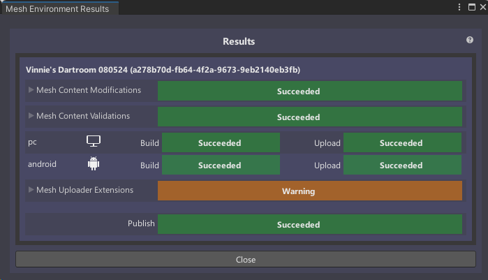
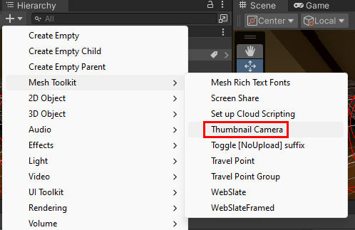

# Build and publish your environment

After you finish adding all your scene content, the next step is to build the scene as an *asset* and then upload it to your chosen *Collection* (formerly called "World") in Mesh on the web, where it's saved as an *Environment.* This is achieved by using the Mesh Uploader. Event producers with access to that World can then create an Event based on your Environment and invite participants to come and share in a *Mesh experience*.

## Configure your project settings

1. On the menu bar, select **Mesh Toolkit** > **Configure Project Settings**.

    

1. Select **Yes** to configure project settings for Mesh.

    

## Using the Mesh Uploader

## Mesh Uploader versions

As explained in the article named [Add the Mesh Toolkit package](../build-your-basic-environment/add-the-mesh-toolkit-package.md), there are two versions of the Mesh Toolkit: the stable build and the preview build. At the time of this writing (mid-November 2023), the preview build of the Uploader contains a few updates that make it slightly different from the stable build:

1. The preview version has a new Mesh logo. **NOTE**: In some case, you might see the new logo in the stable build.
1. *Mesh Worlds* in the stable version are now called *Mesh Environment Collections* in the preview version.

    

For this article, we'll assume you're using the stable build, with **Mesh Worlds** displayed, but keep these differences in mind if you're using the preview version.

## Sign in to the Mesh Uploader

1.  On the menu bar, select **Mesh Toolkit** > **Environments**.

1. In the **Mesh Environments** window, select **Sign In**.

1. Sign in with your account.

    Make sure you're in the **Create** **Environment** tab, and then fill
    in the **Internal Name** and **Description** fields. 
    
    > [!IMPORTANT]
    > The **Internal Name** field has a maximum of 100 characters, and the
    **Description** field has a maximum of 200 characters.

1. To ensure you have the latest worlds that are available, select the **Refresh List of Mesh Worlds** button.

1. Select the **Mesh World** drop down, and then select the world you
    want to upload your Environment to if it's not already selected.

1. In the **Capacity** field, enter the capacity for your Environment.
    The maximum is 16.

    

1.  Select **Create Asset** to create the Environment that you'll be
    uploading.

1. You'll receive a confirmation dialogue as shown below. Select
    **Close**.

    

    You should now be in the **Update Environment** tab of the **Mesh
    Environments** window.

    

    Note that in the **Environment Configurations** section, you already
    have an Environment configuration created which displays the name you
    added in the **Create Environment** tab: *Vinnie's Dartroom*.

## Configure the Environment for build and publish

1. Select the field that displays **Select a Scene** and then, in the
    **Select** **SceneAsset** window, double-click the scene in your
    project that you want as the Environment. In this example, we're
    using the Mesh sample project *Dartroom*, so our chosen scene will be the scene also named *DartRoom*.

    

1. In the **Build for Platforms** section, you choose which platforms
    to build for. Note that when a button background is gray, the button
    is "on"; when the background is black, the button is "off." Do one
    of the following:

    - To build for PC only, make sure that only the PC button ("Mesh
        app on PC", the button on the left) is "on."

        

    - To build for Android only, make sure that only the Android button ("Mesh app on Quest", the button on the right) is "on."

        

    - To build for both PC and Android, make sure that both buttons are "on."

        

## Build and publish the Environment

1. Select the **Build and Publish** button.

    

1.  If the Environment builds and uploads successfully, the **Build and
    Upload Results** dialog appears and confirms the results.

    

    If the build and upload process fails, this is confirmed in the **Build and Upload** Results dialog:

    

    > [!TIP]
    > If a build and upload process fails, look in the **Console** for clues about what might have happened.

    > [!IMPORTANT]
    > Every time you update the Environment, it can affect future events that reference this Environment.
    >
    > 

After your environment was uploaded, you will be able to see for what platforms it has been built.

When uploading repeatedly to the same Environment, please note that only the platforms from the last iteration will be available.
For example, if you built and publish an Environment for PC platform, but later want to include Android, you will need to build for both PC and Android. Building for Android only will cause the PC build to be lost.

## Environment thumbnails

Adding a custom thumbnail image that will be added to your Environment listings in Mesh on the web or Mesh App comes in handy when you're selecting Environments in either place because it gives you a visual reminder of what the Environment looks like.

You can customize the thumbnails from your environment in two ways:

1. You can add a **MeshThumbnailCamera** to your scene which will ensure you always get the latest changes from your scene in the thumbnails.
2. You can specify a folder containing the images you want to use for the thumbnails.

### Option 1 - Adding the thumbnail camera

To add the thumbnail camera to the scene and set its view:

1. In the **Scene** window, adjust the view so that it shows what you
    want to display in the thumbnail (the Thumbnail Camera's view will
    be based on the **Scene** view).

1. Select the "+" drop-down located below the **Hierarchy** tab, and
    then select **Mesh Toolkit > Thumbnail Camera**.

    

1. To confirm that the view in the Thumbnail Camera is what you want,
    in the **Hierarchy**, select **MeshThumbnailCamera**, you should see what the thumbnails will look like in the default camera view window which usually is on a small window in the lower right of the **Scene**
    view.

    

    **Note**: If you decide you want a different view for the Thumbnail
    Camera, you can adjust it directly in the **Scene** view or change its
    **Position** and **Rotation** values in the **Inspector** prior to
    uploading your Environment to Mesh.

    There are no set rules for how your thumbnail should look---it's totally
    up to you. For the following example, we chose a close-up front view of
    the darts.

1. To upload the environment with your thumbnails open the **Mesh Uploader**, on the menu bar, select **Mesh Toolkit** > **Environments**.

1. On the **Update Environment** tab make sure you have the correct Environment and scene selected. Then check the **Custom Thumbnails** field and choose the **Generate from Thumbnail Camera** option.

    

1. Once you are ready to publish your environment, click on **Build & Publish** and the custom thumbnails will be uploaded together with your environment.

    **Note**: If you uncheck the **Custom Thumbnails** field the thumbnails from your Environment will be replaced by the default thumbnail image, so make sure this is always checked when you do **Build & Publish**

### Option 2 - Custom thumbnail folder

If you prefer to have static images as thumbnails you can choose to select the images from a folder:

1. Open the **Mesh Uploader**, on the menu bar, select **Mesh Toolkit** > **Environments**.

1. On the **Update Environment** tab make sure you have the correct Environment and Scene selected. Then check the **Custom Thumbnails** field and choose the **Take from folder** option. The default folder is shown and you can either add your images to this folder or choose a different folder.

    

    **Note**: To choose a new folder for your thumbnails click on the button highlighted in yellow.

1. The thumbnail images need to follow a specific name pattern, the easier way to follow that is to click on the button **Add provisional thumbnails** which will add three images to the folder selected with the correct names and sizes, you can then replace those images with the images you like, just remember to keep their names and try to follow their sizes for a better UI experience.

1. Once you are ready to publish your environment, click on **Build & Publish** and the custom thumbnails will be uploaded together with your environment.

    **Note**: If you uncheck the **Custom Thumbnails** field the thumbnails from your Environment will be replaced by the default thumbnail image, so make sure this is always checked when you do **Build & Publish**

## Next steps

> [!div class="nextstepaction"]
> [Test your environment in the Mesh app](./test-your-environment.md)
