# Build and publish your environment

After you finish adding all your scene content, the next step is to build the scene as an *asset* and then upload it to your chosen *Collection* (formerly called "World") in Mesh on the web, where it's saved as an *Environment.* This is achieved by using the Mesh Uploader. Event producers with access to that Collection can then create an Event based on your Environment and invite participants to come and share in a *Mesh experience*.

## Configure your project settings

1. On the menu bar, select **Mesh Toolkit** > **Configure Project Settings**.

    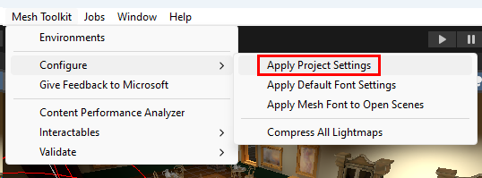

1. Select **Yes** to configure project settings for Mesh.

    

## Using the Mesh Uploader

### Mesh Uploader versions

As explained in the article named [Add the Mesh toolkit package](../build-your-basic-environment/add-the-mesh-toolkit-package.md), there are two versions of the Mesh toolkit: the stable build and the preview build. Note that from time to time you may see minor differences between the two versions.

### Sign in to the Mesh Uploader

1.  On the menu bar, select **Mesh Toolkit** > **Environments**.

1. In the **Mesh Environments** window, select **Sign In**.

1. Sign in with your account.

    Make sure you're in the **Create** **Environment** tab, and then fill
    in the **Internal Name** and **Description** fields.

    > [!IMPORTANT]
    > The **Internal Name** field has a maximum of 100 characters, and the
    **Description** field has a maximum of 200 characters.

1. To ensure you have the latest Collections that are available, select the **Refresh Environment collections** button.

1. Select the **Environment collection** drop down, and then select the Collection you
    want to upload your Environment to if it's not already selected.

    > [!NOTE]
    > If the Environment Collection field shows **No Environment collections available** then we have not found any valid collections for your account. If this is unexpected try refreshing with the **Refresh Environment Colletions** button. Otherwise see [Manage Mesh Collections](../../Setup/Content/manage-mesh-on-web.md) to setup/manage your collections.

1. In the **Capacity** field, enter the capacity for your Environment.
    The maximum is 16.

    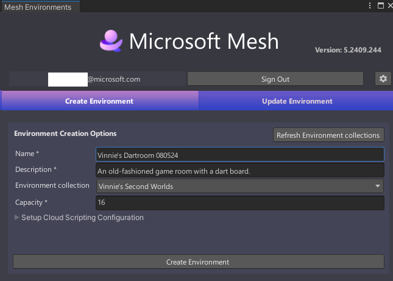

1.  Select **Create Environment** to create the Environment that you'll be
    uploading.

1. You'll receive a confirmation dialogue as shown below. Select
    **Close**.

    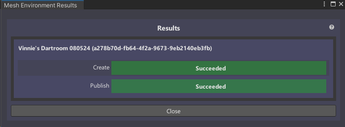

    You should now be in the **Update Environment** tab of the **Mesh
    Environments** window.

    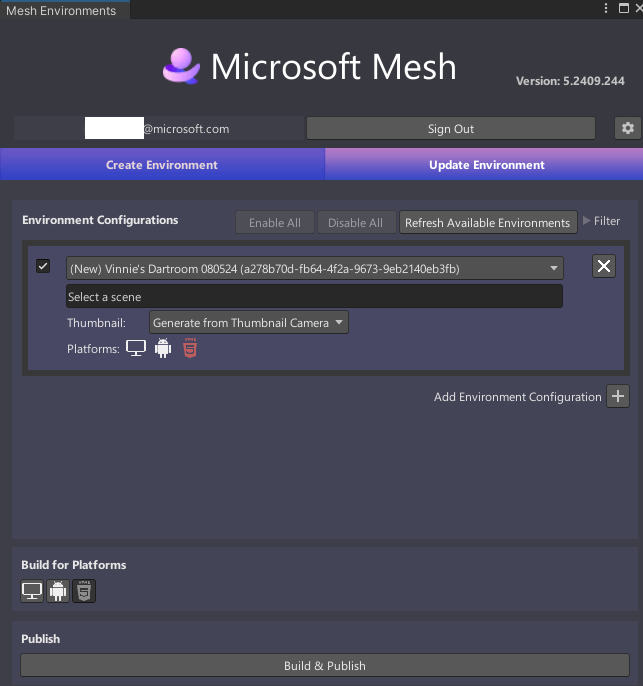

    Note that in the **Environment Configurations** section, you already
    have an Environment configuration created which displays the name you
    added in the **Create Environment** tab: *Vinnie's Dartroom*.

### Configure the Environment for build and publish

1. Select the field that displays **Select a Scene** and then, in the
    **Select** **SceneAsset** window, double-click the scene in your
    project that you want as the Environment. In this example, we're
    using the Mesh sample project *Dartroom*, so our chosen scene will be the scene also named *DartRoom*.

    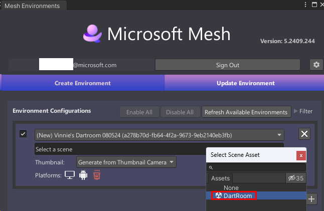

1. In the **Build for Platforms** section, you choose which platforms
    to build for. Note that when a button background is gray, the button
    is "on"; when the background is black, the button is "off." Do one
    of the following:

    - To build for PC only, make sure that only the PC button ("Mesh
        app on PC", the button on the left) is "on."

        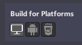

    - To build for Android only, make sure that only the Android button ("Mesh app on Quest", the button on the right) is "on."

        

    - To build for both PC and Android, make sure that both buttons are "on."

        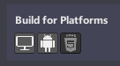

If you create repeated builds of the same Environment but want to change the platform(s) they're being created for, make sure you choose the correct **Build for Platforms** buttons.

### Build and publish the Environment

1. Select the **Build and Publish** button.

    

1.  If the Environment builds and publishes successfully, the **Build and Upload Results** window appears and confirms the results.

    

    However, you may get **Warning** or even **Failed** indicators in this window. To learn more about what these mean and how to make needed corrections, see the article named [Understanding your Build and Publish results](./understanding-build-and-publish-results.md).

    > [!TIP]
    > If a build and publish process fails, look in the **Console** for clues about what might have happened.

    > [!IMPORTANT]
    > Every time you update the Environment, it can affect future events that reference this Environment.
    >
    > :::image type="content" source="../../media/make-your-environment-available/uploader_warning_about_updating_environment.png" alt-text="Screenshot of warning about updating your environment.":::

### Environment thumbnails

You may want to add a custom thumbnail image that will be added to your Environment listings in Mesh on the web or the Mesh App. This comes in handy because it gives you a visual reminder of what the Environment looks like.

You can customize the thumbnails from your environment in two ways:

1. You can add a **MeshThumbnailCamera** to your scene which will ensure that you always get the latest changes from your scene in the thumbnails.
2. You can specify a folder containing the images you want to use for the thumbnails.

#### Option 1 - Adding the thumbnail camera

**To add the thumbnail camera to the scene and set its view**:

1. In the **Scene** window, adjust the view so that it shows what you
    want to display in the thumbnail (the Thumbnail Camera's view will
    be based on the **Scene** view).

1. Select the "+" drop-down located below the **Hierarchy** tab, and
    then select **Mesh Toolkit > Thumbnail Camera**.

    

1. To confirm that the view in the Thumbnail Camera is what you want,
    in the **Hierarchy**, select **MeshThumbnailCamera**, and then view the thumbnail in the small window in the lower right of the **Scene** view.

    

    **Note**: If you decide you want a different view for the Thumbnail
    Camera, you can adjust it directly in the **Scene** view or change its
    **Position** and **Rotation** values in the **Inspector** prior to
    uploading your Environment to Mesh.

    There are no set rules for how your thumbnail should look---it's totally
    up to you.

**To upload the environment with your thumbnails**:

1. On the menu bar, select **Mesh Toolkit** > **Environments**. This opens the **Mesh Uploader**.

1. In the **Update Environment** tab, make sure you have the correct Environment and scene selected. The **Thumbnail** option displays **Generate from Thumbnail Camera**. Keep this setting.

    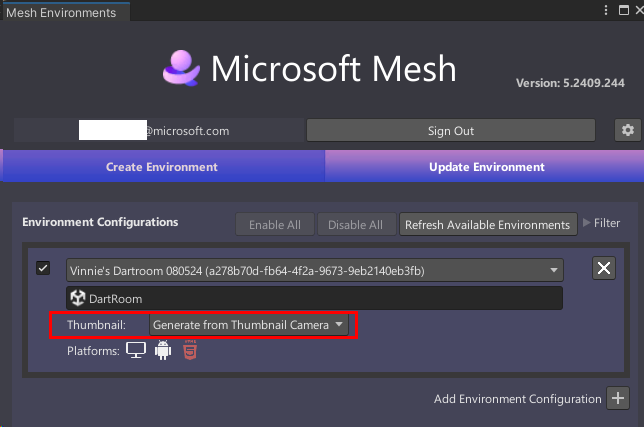

1. When you're ready to publish your environment, select **Build & Publish**. The  thumbnail will be uploaded together with your environment.

#### Option 2 - Custom thumbnail folder

If you prefer, you can create a custom thumbnail, then save it in a designated "thumbnail folder", and then use that image as your thumbnail.

1. On the menu bar, select **Mesh Toolkit** > **Environments**. This opens the **Mesh Uploader**.

1. In the **Update Environment** tab, make sure you have the correct Environment and Scene selected.

1. Click the **Thumbnail** drop-down and then select **Take from folder**.

    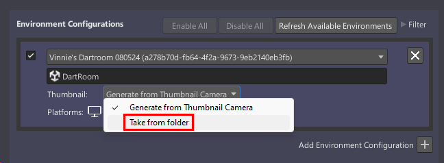

1. Drag the right side of the **Mesh Environments** window to make it wider. This makes it easier to read all the thumbnail options.

    

1. Select the folder that will store your custom thumbnails: click the *Select custom thumbnail folder* button (the three-dot button). **TIP**: You may have to click it twice. 

    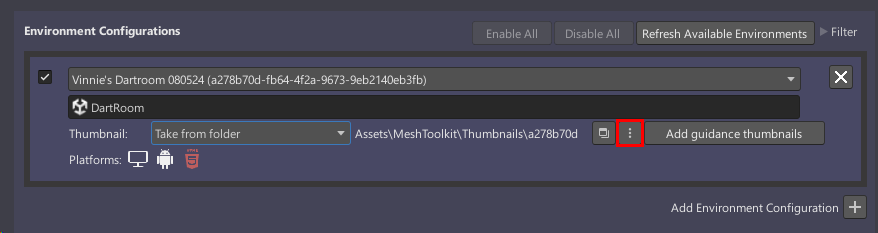

    You can choose any folder you want or create a new one, but note that it must be located in the path of the **Assets** folder in your project. There's already a folder conveniently named *Thumbnails* in our current sample project so we'll use that.

1. In the **Thumbnail Images Folder** dialog, navigate to **Assets** > **MeshToolkit** > **Thumbnails**, and then click the **Select Folder** button.

    

    Note that in the Uploader, the thumbnail folder path has changed and now displays **Assets/MeshToolkit/Thumbnails**.

    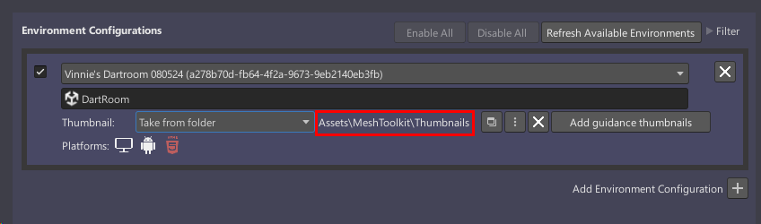

1. Click the **Add guidance thumbnails** button. A **Success** dialog appears telling you that thumbnails were generated successfully.

    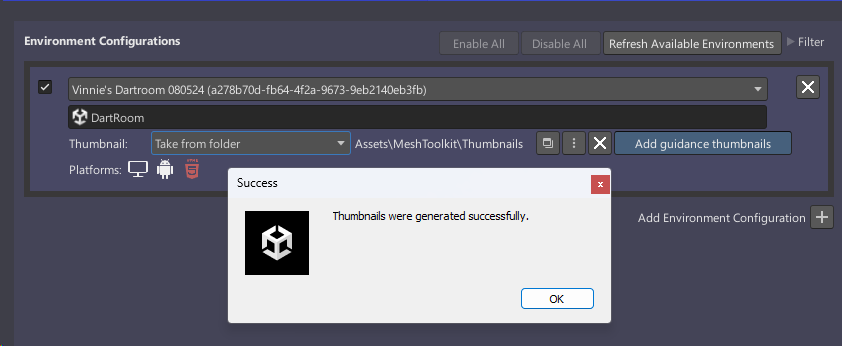

1. Navigate to the **Thumbnails** folder and confirm that three thumbnails were generated.

    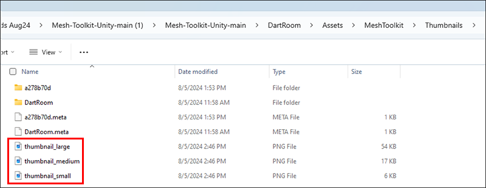

You can now create your custom thumbnails and save them in this folder. There are two guidelines you must follow:

1. Create three versions of your thumbnail: a "large" one, a "medium" one, and a "small" one. The sizes for each are:

    Large = 1024 x 512 px  
    Medium = 512 x 256 px  
    Small = 256 x 128 px

    Having three versions of your thumbnail means that each device running Mesh can choose the best size for its user interface.

1. Give your thumbnails the same names as the provisional thumbnails:

    thumbnail_large.png  
    thumbnail_medium.png  
    thumbnail_small.png

    (Your custom thumbnails will replace the provisional ones in your chosen thumbnails folder.)

1. Once you're ready to publish your environment, select **Build & Publish**. The thumbnails will be uploaded together with your environment.

## Next steps

> [!div class="nextstepaction"]
> [Test your environment in the Mesh app](./test-your-environment.md)
