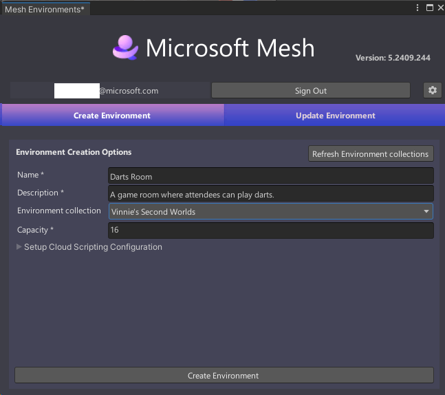
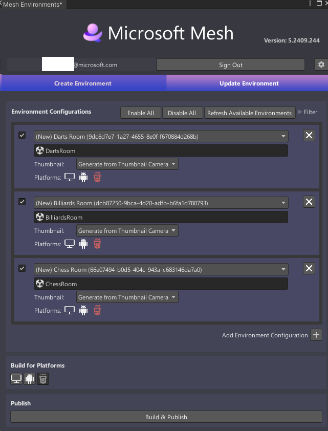

# Publish multiple Environments from one Unity project

## Overview

There might be times when you can benefit by having a single Unity project that can generate multiple Experiences. Here's one example: Let's say you want to build a series of gaming Experiences that'll reuse a lot of the same assets. You can create a single Unity project that contains all your assets, then create each individual game room as a Scene, and then use the Mesh Uploader to turn the Scenes into Experiences and upload them to a Collection in Mesh on the web.

Using the scenario above as an example, here's what you would do:

1. Create a new Unity project named "GameRooms."
1. Create an individual Scene for each game room. Name each Scene as follows:

    DartsRoom  
    BilliardsRoom  
    ChessRoom  

## Mesh Uploader versions

As explained in the article named [Add the Mesh toolkit package](../build-your-basic-environment/add-the-mesh-toolkit-package.md), there are two versions of the Mesh toolkit: the stable build and the preview build. Note that from time to time you may see minor differences between the two versions.

## Create your Environments

1. Follow the instructions detailed in the [Build and publish your Environment](./build-and-publish-your-environment.md) article to open the Mesh Uploader and then create your first Asset, named "DartsRoom":

    

1. Select **Create Environment**.
1. In the **Create Results** window, confirm that the operation was successful and then click the **Close** button. 

    The Uploader automatically takes you to the **Update Environment** tab. If you were creating a single Environment, this would be the right place to continue the process. However, in this example, we're creating multiple Environments, which means we have more work to do in the **Create Environment** tab.

1. Select **Create Environment** to return to that tab.
1. Replace the current information displayed in that tab with the information that applies to the *BilliardsRoom* Experience.

    

1. Select **Create Environment**.
1. In the **Create Results** window, confirm that the operation was successful and then click the **Close** button. 
1. Select **Create Environment** to return to that tab.
1. Replace the current information displayed in that tab with the information that applies to the *ChessRoom* Experience.

    

1. Select **Create Environment**.
1. In the **Create Results** window, confirm that the operation was successful and then click the **Close** button. 

    You've now created three Experiences--one for each game room. This finishes our work in the **Create Environment** tab. The Uploader moves us to the **Update Environment** tab; we can stay there because this is where we select the correct Scene for each Experience.

1. In the first **Environment Configuration** (the one that displays *(New) Dart Room*), click the field that displays **Select a Scene** and then, in the **Select** **SceneAsset** window, double-click **Dartrooms**.
1. Repeat the step above for the other two Environment Configurations, selecting **BilliardsRoom** for #2 and **Chessroom** for #3.

    

    **Tip**: You might have to scroll down or make the **Mesh Environments** window taller to see all three Environment Configurations.

You're now set up to generate the three different Environments. For instructions on completing the build and publish process, see the [Build and publish your Environment](./build-and-publish-your-environment.md) article.

