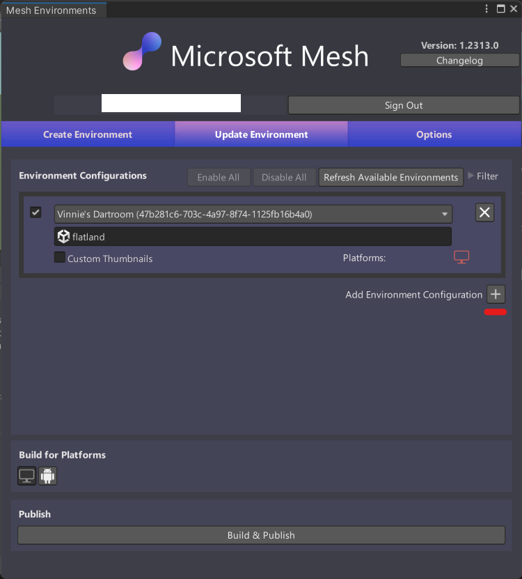

# Publish multiple environments from one Unity project

## Add more Environments for build and publish

If you want to build and publish more than one environment from a single Unity project, click on **Add Environment Configuration** button and make sure you have the correct Environment and scene selected (you can see the details on the steps from [Configure the Environment for build and publish](https://github.com/MicrosoftDocs/mesh-docs-pr/blob/main/mesh/develop/make-your-environment-available/build-and-publish-your-environment.md#configure-the-environment-for-build-and-publish)).

## Select the Environment for build and publish

If you want to pick one that already exists, select the field that displays **Select Environment**. Then pick your Environment and scene that you want to update it with.

Environments that are already selected will be disabled.

Sometimes the list of the available Environments can be big. Use these 2 filters to help sort environments:

### Filter Environments by Worlds

By default you can see Environments from all the Worlds you have access, you can filter the list by specifying one specific World.

### Filter Environment by Name

You can also filter the list by a specifying a text and that will only show Environments with that given text in the title.

