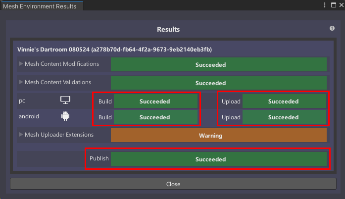
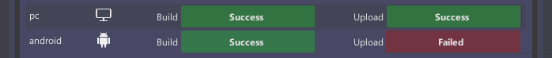
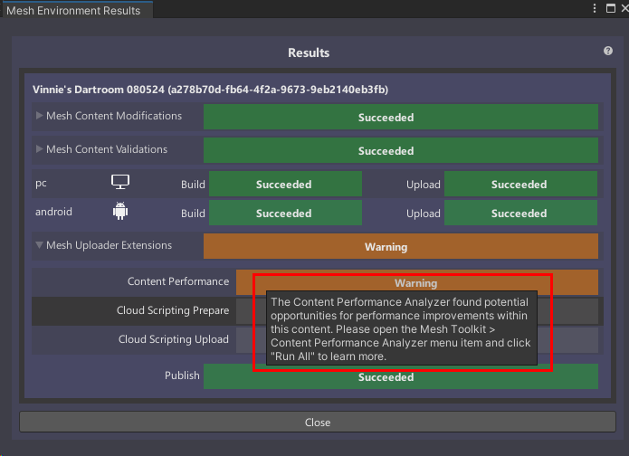
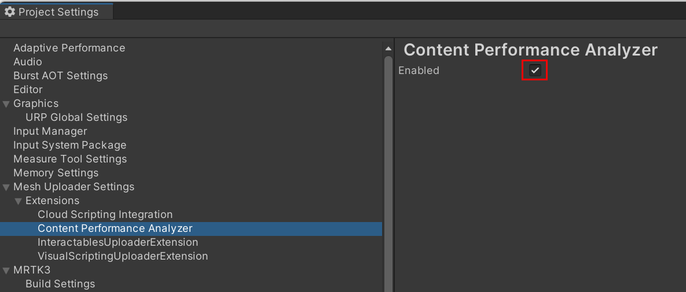

# Understanding your Build and Publish results

## Overview 

After you select the **Build & Publish** button in the Mesh Uploader to [build and publish your environment](../make-your-environment-available/build-and-publish-your-environment.md), that process will take place and then you'll automatically see the **Build and Upload Results** window. If all goes well, you'll see that **Build**, **Upload**, and **Publish** all have the green **Success** indicator. 

Here's what each of those mean:

**Build**: Unity built your scene.

**Upload**: Your assets bundles were uploaded to your OneDrive folder.

**Publish**: Your Environment was published to Mesh on the web.

## Failed results

If you get the **Failed** indicator for any one of these, it means there's a problem that needs to resolved.

**Build failed**: Unity failed to build the scene. Look at the **Console** to see if contains messages on what went wrong. This will probably need to be fixed before you can continue.

**Upload failed**: Your asset bundles weren't uploaded to your OneDrive folder.

**Publish failed**: The Environment failed to upload to Mesh on the web. Look at the **Console** to see if there are any helpful error messages related to this.

Note that if you have an upload or publish fail, the **Retry failed operations** button appears at the bottom of the window. 

If you think the failure may have been due to some temporary circumstance such as a network outage, you can click this button to try the process again.

## Mesh Uploader Extensions

You may have noticed in the above images that there's a **Warning** indicator next to the **Mesh Uploader Extensions** drop-down. This means that at least one of the extensions in this section has a warning indicator. Click the drop-down to see the extensions.

If you hover the cursor over the text in an indicator, a popup tip appears. (This also works for certin **Build**, **Upload** and **Publish** indicators.)

### Content Performance

Here are the three potential indicators for the **Content Performance** extension:

**Success**: Everything looks great performance-wise from static analysis.

**Warning**: Unity found one or more issues but they're not blocking. Look at the **Console** for more information, and also try running the [Content Performance Analyzer (CPA) tool](../debug-and-optimize-performance/cpa.md).

**Failed**: Unity found something that's blocking the upload. Look at the **Console** for more information, and also try running the [Content Performance Analyzer (CPA) tool](../debug-and-optimize-performance/cpa.md).

If you don't want to see **Content Performance** results in the Mesh Uploader Extetensions, you can disable it in the **Project Settings** window.  
1. On the menu bar, select **Edit** > **Project Settings**.
1. Navigate to **Mesh Uploader Settings** > **Extensions** > **Content Performance Analyzer**.
1. Clear the **Enabled** check box.

.

### Interactables

The **Interactables** validation checks to see if the Interactables have been saved with the latest serialization data and have valid unique ID's.

**Warning**: *MeshInteractableSetup serialized with previous version*. 

This indicates you that your scene hasn't been updated with the latest serialization. Everything will still work properly in the Mesh app; if you want to remove the warning:

1. Open the scene.
1. On the menu bar, select **Mesh Toolkit** > **Interactables** > **Update Serialized Versions**. 
1. Save the project.

**Error**: *Interactables cannot be both equippable and manipulable*. 

This indicates that your project contains one or more objects created using an earlier version of the Mesh toolkit, when an object could be both equippable and manipulable. This dual option is no longer available. The error message will include the object. To fix this:

1. In the **Hierarchy**, select the object.
2. In the **Inspector**, navigate to the **Mesh Interactable setup** component.
3. Click the **Object Type** drop-down and then select one of the options in the menu.

.

**Error**: *Multiple Unique Id Managers found*, *No Unique Id Manager found*, or *Invalid Unique interactables found*.

All of these error messages indicate that something went wrong with the automatic process to set up Interactables with unique IDs. To fix this:

1. Open the scene.
1. On the menu bar, select **Mesh Toolkit** > **Interactables** > **Validate Unique Ids**. 
1. Save the project.