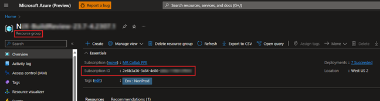

# Prepare for your first Mesh Cloud Scripting project

## Overview

In this article, you'll learn about how to prepare for your first Mesh Cloud Scripting project. You'll need some of the information you'll choose during this process to [build and publish your project](../../make-your-environment-available/build-and-publish-your-environment.md) with the necessary [Cloud Scripting details](./cloud-scripting-provide-details.md).

[Learn more about Mesh Cloud Scripting Infrastructure and management](cloud-scripting-setup-infrastructure.md).

## Prerequisites

- An M365 Office subscription with access to SharePoint, OneDrive, and M365 Calendar.

- An [Azure subscription](https://azure.microsoft.com/products/cloud-services/) and familiarity with the Azure portal. Azure subscriptions come in a variety of forms; if you're unsure about this, talk to your IT admin.

- Make sure you have the following installed:

[Azure CLI 2.40.0.](/cli/azure/install-azure-cli)

[.NET 6.0 SDK Windows](https://dotnet.microsoft.com/en-us/download/dotnet/6.0) (This is needed by the Cloud Scripting cloud deployment tool.)

[.NET 7.0 SDK Windows](https://dotnet.microsoft.com/en-us/download/dotnet/7.0)

**To confirm that you have the Azure CLI installed**:

- Run the az --version command. (Learn about [choosing the right Azure command-line tool](/cli/azure/choose-the-right-azure-command-line-tool).)

**To confirm that you're logged in to the subscription where you have permissions to deploy Mesh Cloud Scripting's infrastructure**:

- Run the **az account show** command. If you're not logged in to the correct subscription, run **az logout** and then **az login** to log in to the right account. If you have access to multiple Azure subscriptions in different tenants, it's easier to log in using the **az login --use-device-code** command.

**Note**: Switching Azure subscriptions/tenants using the Azure CLI resets your default subscription. To ensure that you update your default subscription if you switch tenants, use the **az account set -n "\<subscription-name\>"** command. Example: **az account set -n "My Azure Subscription"**.

## Record your resource group and Subscription ID for later use

For the required Cloud Scripting services to be deployed correctly, you'll need to add the items listed below to your project. We recommend that you obtain them and have them handy before you're ready to build and publish your project; you'll need to specify them in the Mesh Uploader. If you're not sure how to obtain them, talk to your Azure Admin.

### Resource Group

You'll need to select an Azure resource group for Mesh Cloud Scripting (see the [Supported regions and abbreviations](#supported-regions-and-abbreviations) section below for further details). This is the resource group you intend to use to deploy the *Mesh Cloud Scripting Service* to. You can do one of the following:

- If you have subscription access privileges, let the project create a default resource group for you.  
-or-  
- Get contributor-level access to a specific resource group from your subscription admin and make a note of the name of this resource group.  

### Subscription ID

This is the subscription ID for your chosen resource group. 

**IMPORTANT**: The configuration of a subscription and resource group for the Mesh Collection that you'll publish your Environment to may or may not be the same as the configuration of a subscription and resource group for Mesh Cloud Scripting.

### Supported regions and abbreviations

Resources can be deployed to any of the following supported regions. All resources are deployed into the same location. You can deploy resources to a different location than your resource group, but you'll need to supply the location in the Mesh Uploader's *Update Environment* tab.

| Australia Central (ac)   | Australia Central 2 (ac2) | Australia East (ae)    | Australia Southeast (ase) | Brazil South (bs)      | Brazil Southeast (bse) | Canada Central (cc)        | Canada East (ce)      | Central India (ci) |
|--------------------------|---------------------------|------------------------|---------------------------|------------------------|------------------------|----------------------------|-----------------------|--------------------|
| Central US (cu)          | East Asia (ea)            | East US (eu)           | East US 2 (eu2)           | France Central (fc)    | France South (fs)      | Germany West Central (gwc) | Japan East (je)       | Japan West (jw)    |
| Jio India Central (jic)  | Jio India West (jiw)      | Korea Central (kc)     | Korea South (ks)          | North Central US (ncu) | North Europe (neu)     | Norway East (ne)           | Norway West (nw)      | Qatar Central (qc) |
| South Africa North (san) | South Africa West (saw)   | South Central US (scu) | Southeast Asia (sea)      | South India (si)       | Sweden Central (sc)    | Switzerland North (sn)     | Switzerland West (sw) | UAE Central (uc)   |
| UAE North (un)           | UK South (us)             | UK West (uw)           | West Europe (we)          | West US (wu)           | West US 2 (wu2)        | West US 3 (wu3)            |

## Next steps

   > [!div class="nextstepaction"]
   > [Create a simple Cloud Scripting project](./cloud-scripting-create-a-simple-project.md)
