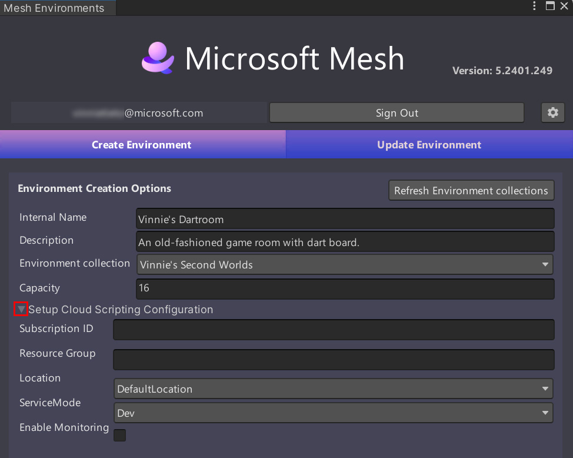

# Provide Cloud Scripting details in your project

## Overview

In order to use Mesh Cloud scripting in your Mesh experience, there are three things you must do:

1. Deploy the Mesh Cloud Scripting Service cloud infrastructure to Azure.
2. Set up your development environment.  
1. Provide cloud scripting details when you build and publish your experience.

In this article, you'll learn about Step #3: provide cloud scripting details when you build and publish your experience. If you've reached this point, you should have already completed steps 1 and 2 above. You should also have a resource group and Subscription ID handy as mentioned in the article named [Set up Mesh Cloud scripting on your system](./cloud-scripting-setup-on-your-system.md).

As explained in the [Cloud Scripting basic concepts](./cloud-scripting-basic-concepts.md) article, an application service called *Mesh Cloud Scripting Service* is deployed to a particular Azure resource group that you provide. This service contains the C# code that supports multiplayer interactivity and is built and deployed automatically when you upload your Environment to Mesh.

## Cloud Scripting options in the Mesh Uploader

The rest of this article focuses solely on the information you need to provide for Mesh Cloud Scripting when building and publishing your environment. To learn about the full build and publish process, see [Build and publish your environment](../../make-your-environment-available/build-and-publish-your-environment.md).

### Settings in the Create Environment tab

At this point you should have a resource group and Subscription ID handy.

1. In the Mesh Uploader, in the **Create Environment** tab, expand the **Setup Cloud Scripting Configuration** drop-down.

1. Copy the subscription ID that you recorded earlier for *Mesh Cloud Scripting Service* and then paste it into the Subscription ID field.  
1. Enter a [Resource Group](./cloud-scripting-setup-on-your-system.md#resource-group) or let the project choose one for you.  
1. You can accept the default **Location** or choose a different one.

1. For **ServiceMode**, you have two options:

    **Dev**: Allows unauthenticated connections. This is useful for debugging when connected to an environment from Unity.

    **Prod**: This is more secure--it requires that clients be authenticated and joined to the Mesh session. This mode should be preferred for any production deployment.

1. If you want to use [Azure Monitor](./cloud-scripting-troubleshooting.md#b-azure-monitor), select **Enable Monitoring**.

### Settings in the Update Environment tab

After you click the **Create Environment** button in the **Create Environment** tab, you're taken to the **Update Environment** tab, where you select an environment and Scene to build and publish. If the Scene has a Mesh Cloud Scripting component, the deployment configurations are also shown here.

If you navigated to this article from the *Build and publish your environment* article, [return to that article](../../make-your-environment-available/build-and-publish-your-environment.md#create-your-environment).

If you navigated to this article from the *Mesh Cloud Scripting getting started* article, [return to that article](./cloud-scripting-getting-started.md)

## Next steps

   > [!div class="nextstepaction"]
   > [Cloud scripting programmer's guide](./cloud-scripting-programmers-guide.md)
