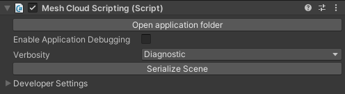
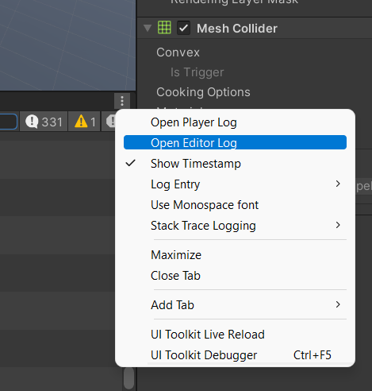
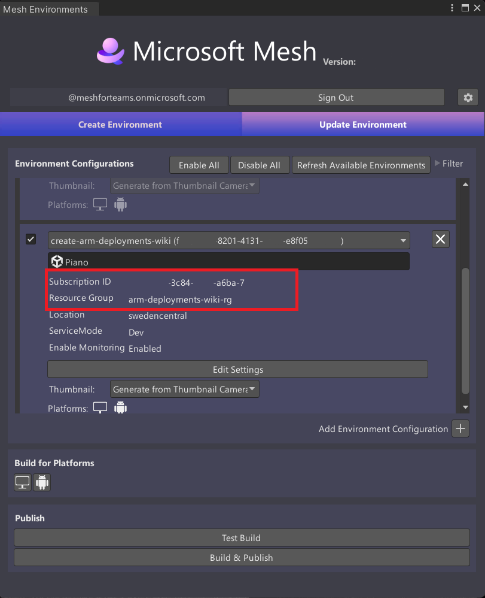
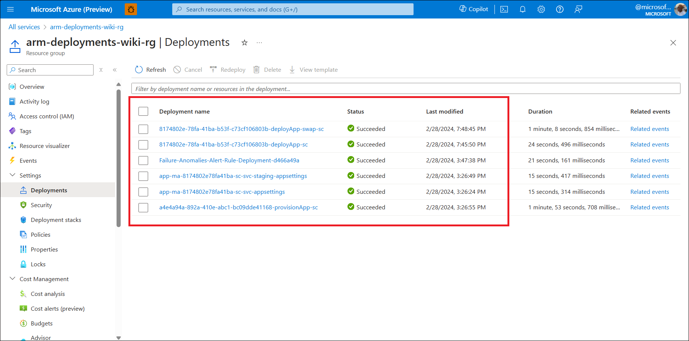
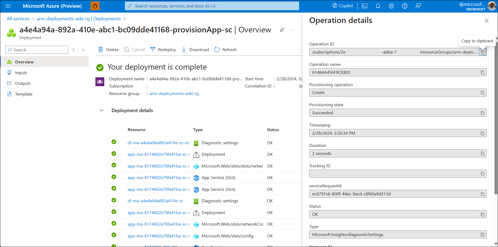
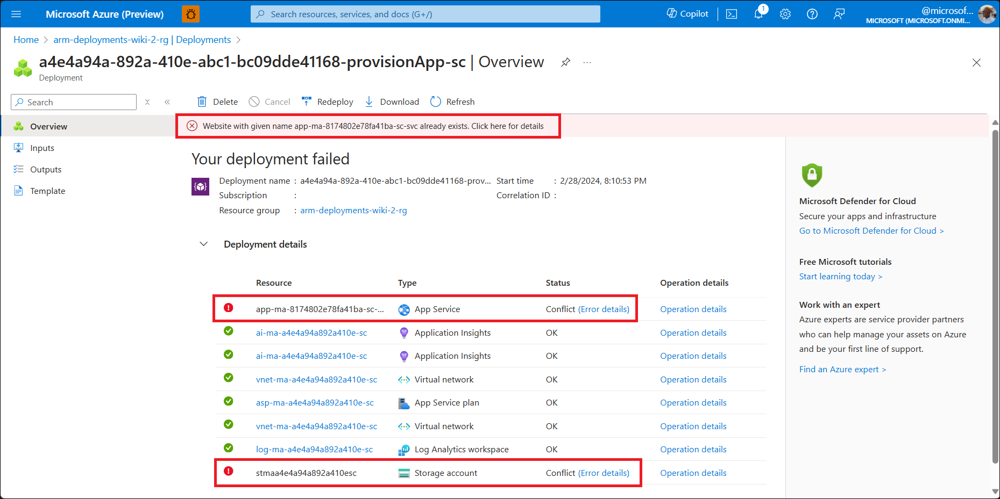
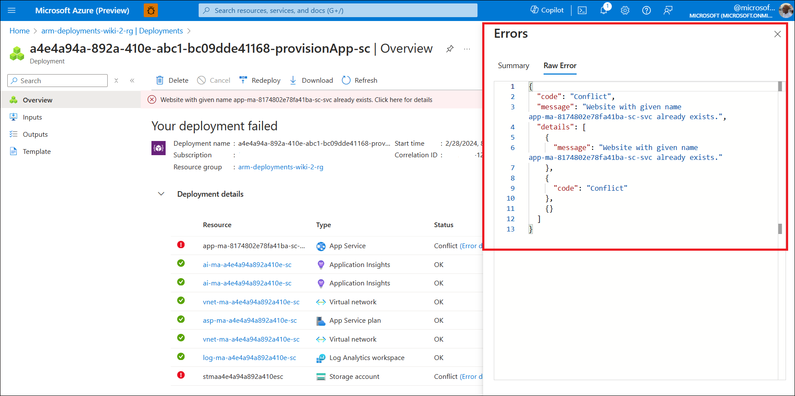

# Cloud Scripting Troubleshooting

### Environment Upload Failed

If a Mesh Cloud Scripting stage during the Mesh Uploader process failed and the error shown is "Check the logs for more information", make sure Info logs are being shown in the Unity Console. Currently some errors are shown as info logs. This will be improved in a future release.

### Mesh Cloud Scripting Package Installation Failed

1. If you encounter errors related to package installation or .NET tool installation (`The tool package could not be restored` or `Verify your unity package integrity`), verify that you don't have non-valid package sources in your global NuGet config (under `C:\Users\<UserName>\AppData\Roaming\NuGet\NuGet.config` or default NuGet config directory which is configured on the machine).
1. If you encounter the `package is already installed` error when starting Play Mode, exiting Play Mode and starting it again should mitigate that.
1. Verify access rights on the directory `Assets\.MeshCloudScripting\.Packages`.

### After pressing the Unity Editor Play button, nothing happens

1. Check Unity logs for any errors. In particular, if your Mesh Cloud Scripting code has a compile error, you'll see "Cloud Scripting build failed" in your error log. In this case, open the *csproj* file for your Mesh Cloud Scripting and fix the errors. If you build from Visual Studio, it'll show you the errors more conveniently in the build output.
1. If there are other errors, review this page for additional troubleshooting information on particular errors.
1. If there are no errors, there might be runtime errors in your Mesh Cloud Scripting code. Attach to your application with the debugger and inspect the output for any errors.
1. If nothing helps, [report a bug](#how-to-report-issues).

### When joining an event in the Microsoft Mesh application, the Mesh Cloud Scripting doesn't work

1. Ensure that the scene plays as expected when you preview it locally in Unity.
2. Ensure that the deployed environment matches the *scene.map* used by the Mesh Cloud Scripting service.
    1. In the Unity project, navigate to the **Mesh Cloud Scripting** component and then press `Serialize Scene` to force scene graph serialization.
    1. Re-upload your environment with the Mesh Uploader.
1. Test your local Unity version [against the deployed service](cloud-scripting-getting-started.md#connect-to-the-cloud-scripting-service-from-unity).
   - Check the logs in Unity for any errors if not working.
1. If nothing helps, [report a bug](#how-to-report-issues).
   - Inspect [Mesh Cloud Scripting logs](#how-to-collect-logs) and include relevant information where possible in your bug report.

### Clicks aren't received

1. It's possible that your Mesh Cloud Scripting Service is sending messages at too high a frequency for the system to handle. In this case, your click might actually be received but, due to a large backlog of messages, it takes a long time for the result to be propagated back to the client. Try temporarily disabling your high frequency update code to see if this fixes the problem. If it does, consider moving to drive Unity Animators instead of updating properties from Mesh Cloud Scripting.
1. If nothing helps, [report a bug](#how-to-report-issues).

### Unity freezes after you press Play

If you switch focus from Unity to another app while Unity is playing, the Mesh Cloud Scripting Service continues to run, submitting messages to the message queue. When you switch focus back to Unity, it pauses until it completely drains the queue. If the Mesh Cloud Scripting Service is making lots of frequent state changes and/or you've switched focus away from Unity for a long time, Unity can freeze for some time while this happens.

## How to collect logs

### Collecting Unity logs

Before reporting an issue, set *Verbosity* to *Diagnostic*.



Reproduce the issue, and then send the Unity logs. You can find the log file using the Unity menu, which is stored by default at `%LOCALAPPDATA%\Unity\Editor\Editor.log`.



### Collecting client logs from the Microsoft Mesh application

Configure the PC client logs by creating a file on the Desktop named "startup_settings.json" with the following content:
```
{
  "use_startup_settings": true,
  "log_groups": [
    { "name": "CloudScriptingClientSDK", "level": "Debug" },
    { "name": "CloudScriptingUnityRuntime", "level": "Debug" }
  ]
}
```

Reproduce the issue, and then share the Unity logs. Microsoft Mesh application logs can be found at `%USERPROFILE%\AppData\LocalLow\Microsoft Corporation\Microsoft Mesh\player.log`

### Collecting server logs

#### **A. Log Stream**

##### I. Log Stream on Azure Portal

To see logs from the Mesh Cloud Scripting Service, in the **Monitoring** section of the *AppService* resource, click the **Log Stream** menu to see logs from the container as shown in the image below.


##### II. Log Stream via Azure CLI
If you have the Azure CLI installed on your local machine, you could also tail these same logs from your local machine by running the following command in your terminal:

```az webapp log tail --name <APP_SERVICE_NAME> --resource-group <RESOURCE_GROUP_NAME>```

##### III. Download the logs as a zip file

You can also download log files from the hosted app service by going to the Advanced Tools (Kudu). In the **"Development Tools"** section of the left pane, locate **Advanced Tools** and then click the **Go** button.


The SCM website opens and you can then download the Docker logs as a Zip file, as shown below.


#### **B. Azure Monitor**

Alternatively, using Azure Monitor, you could write KQL (Kusto Query Language) queries to pick out logs that you're particularly interested in from events, time ranges and more. This would be automatically set up for you if you checked the "Enable App Monitoring" box during deployment. If not, see the [manual setup for Azure Monitor](#manual-setup-for-azure-monitor-optional) section to configure Azure Monitor for your deployment.

To use this, in the **Monitoring** section of the navigation pane, select **Logs**. 


In the query Monitoring pane, you can select the logs you're interested in. At the time of writing, we have "AppServiceConsoleLogs", "AppServiceHTTPLogs", "AppServiceAppLogs" and "AppServicePlatformLogs". To view the logs from the Docker container, you may find the logs in "AppServiceAppLogs" and/or "AppServiceConsoleLogs" more useful.


In the textbox provided on the right-hand side of the **Tables** menu, type in the following KQL query:

```
AppServiceConsoleLogs
| extend newLog = iif(
ResultDescription has ": Orleans.LifecycleSubject"
or ResultDescription has ": Orleans.Runtime.Catalog"
or ResultDescription has ": Microsoft.Hosting.Lifetime"
or ResultDescription has ": Microsoft.Mesh.CloudScripting.CloudApplication"
or ResultDescription has ": Microsoft.Mesh.CloudScripting.Hosting.Launcher.CloudAppInstance"
or ResultDescription has ": Microsoft.Mesh.CloudScripting.Hosting.Core.NamedPipesCloudScriptingSessionGrain"
or ResultDescription has ": Microsoft.Mesh.CloudScripting.Cloud.Middleware.CloudScriptingBridge"
or ResultDescription has "UNOBSERVED EXCEPTION:"
or ResultDescription has ": Microsoft.SceneAppService.SceneAppHub"
or ResultDescription has ": Microsoft.Mesh.CloudScripting.Hosting.Core.NamedPipesCloudScriptingSessionGrain"
or ResultDescription has ": Microsoft.Mesh.CloudScripting.Hosting.Launcher.CloudAppInstanceFactory"
or ResultDescription has ": Microsoft.ClientChannel.Hosting.ProcessLifecycleLoggers"
or ResultDescription has ": Microsoft.Mesh.CloudScripting.Services.ApplicationWorkDispatcher"
or ResultDescription has ": Microsoft.Mesh.CloudScripting.Services.CloudScriptingHostedService"
or ResultDescription has ": Microsoft.Mesh.CloudScripting.Hosting.Launcher.CloudScriptingPreparationService"
or ResultDescription has ": Microsoft.Mesh.CloudScripting.Cloud.Middleware.CloudAppProcessFactory"
or ResultDescription has ": Microsoft.ClientChannel.Resources.ClientLinkGrain"
, 1, 0)
| sort by TimeGenerated asc
| extend logId = row_cumsum(newLog) 
| summarize ResultDescription=make_list(ResultDescription), TimeGenerated=min(TimeGenerated) by logId
| extend ResultDescription = strcat_array(ResultDescription, "")
| sort by TimeGenerated desc
| project TimeGenerated, ResultDescription
| where not (ResultDescription has "Broadcasting data of size")
```


Export data to csv.


##### **Manual Setup for Azure Monitor (Optional)**

Skip if you checked "Enable App Monitoring" during deployment.

A Log Analytics workspace is required for this setup. If you don't have an existing workspace, follow the official [guide](/azure/azure-monitor/logs/quick-create-workspace?tabs=azure-portal).

1. Open Azure Portal and navigate to the AppService resource in which your Mesh Cloud Scripting Service is running.
2. Click the "Monitoring" tab and scroll to the bottom of the page. Click the "Configure Azure Monitor" button

    

3. Click the link "+ Add diagnostic setting" to set the log categories that would be sent to your chosen workspace.

    

4. In the prompt, fill the "Diagnostic setting name" field, then select the log categories you're interested in (examples: App Service Console Logs, App Service Application Logs), then check the box to "Send to Log Analytics workspace", and then select your preferred existing Log Analytics workspace.

    

5. Enable Application Insights from the App Service page. This would ensure logs are propagated to the Log Analytics workspace.


6. Fill in the form, and be sure to point it to the same workspace in which your Diagnostic Setting was created.

    

7. Restart your AppService and wait a couple of minutes. You should now be able to query logs in Azure Monitor as described in the section [Azure Monitor](#b-azure-monitor).

## Investigating Cloud Scripting Deployments in Azure

1. In the Mesh Uploader **Create Environment** tab, take note of the **Subscription ID** and **Resource Group** values you chose.

    
 
1. On the Azure Portal and in your selected Subscription, navigate to the resource group. You can either search for the resource group name from the search bar or navigate to the "Resource Groups" service and find your resource group there. Ensure you're in the correct Tenant and Subscription.
1. In the resource group's "Settings" pane, navigate to "Deployments". This should contain a list of all the deployments that have been made to the resource group.
1. The Cloud Scripting deployments that are of interest to you are:

- **App Provisioning**: This is the first deployment run and is used to provision all the cloud scripting resources required. It can be identified by using **provisionApp** as a filter in the Deployments window.  
- **App Settings**: This creates and updates the web app's settings. It can be identified by using **svc-appsettings** as a filter in the Deployments window.  
- **Staging App Settings**: This creates and updates the web app's staging slot. It can be identified by using **svc-staging-appsettings** as a filter in the Deployments window.  
- **App Deployment**: This is used for subsequent infrastructure changes. It deploys the latest version of the cloudhost docker image to the web app's staging slot. This can be identified by using **deployApp** as a filter in the Deployments window.   
- **App Slots Swapping**: This swaps the cloudhost docker image versions present in the web app and staging slot web app. This can be identified by using **deployApp-swap** as a filter in the Deployments window.

    

To see additional details related to the deployment, click on the deployment name. The **Operation Details** for each resource type includes the error message related to the deployment.



Here's an example of a deployment that didn't succeed, including the cause of the failure:




 
Subsequent actionable steps are dependent on the specific error messages.

## How to report issues

1. [Collect](#how-to-collect-logs) all the logs available.
1. Follow [feedback](../../../Resources/feedback.md) guidance.
