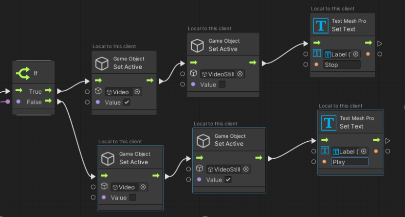
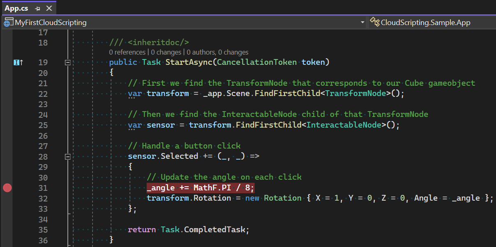
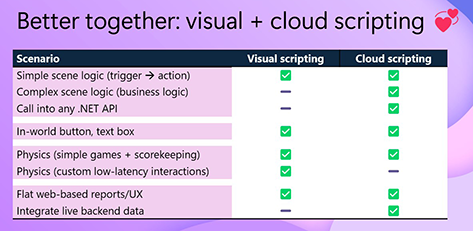

# Mesh Scripting overview

## Introduction

You can add Mesh Scripting development tools to your project in Unity, then create an Environment, and then assign behaviors to objects in the Environment and the Environment itself. There are two different Mesh Scripting approaches:

**Mesh Visual Scripting**

The easiest way to add interactivity and magic to your Microsoft Mesh Environments with zero-latency responsiveness is through Mesh Visual Scripting. Mesh Visual Scripting is based on Unity Visual Scripting but has added features for Mesh development. Developers can create industry-standard Unity visual script graphs that execute within Mesh and synchronize their state changes across users. 

Mesh Visual Scripting makes it easy to build: 

- Message buttons 
- Teleport maps 
- Information points 
- Scorekeeping for physics-based games 

... and much more! 

For an introduction to how Visual Scripting works with Mesh, we recommend our [Mesh 101 tutorial](../getting-started/mesh-101-tutorial/mesh-101-01-overview-and-setup.md). The tutorial takes you step-by-step through the process of building several interactive Mesh features using script graphs. The tutorial project also contains a completed tutorial scene that you can use as a starting point for your own custom Mesh experience.

[Learn more about Mesh Visual Scripting](visual-scripting/visual-scripting-overview.md)

**Mesh Cloud Scripting**: 

You’ve built a beautiful Microsoft Mesh Environment and you’ve made it interactive using Mesh Visual Scripting, but how do you now bring real-time cloud data into your world? With Mesh Cloud Scripting, you can call any .NET API and connect to any of your Azure resources. This uses a simple programming model that, once on the server, runs your business logic, keeping all participants in sync without the complexity of traditional multi-user development.

Cloud scripting enables you to: 

- **Integrate live backend** data into your 3D environments. 
- **Call into any .NET API** to connect out to cloud services or do your own computation directly.  
- **Synchronize scene changes easily across all clients** (including late joiners), while still supporting per-user content when needed. 

The development workflow and model for Mesh Cloud Scripting is very similar to regular Unity scripting with MonoBehaviours. Scripts can edit runtime values of game objects, have "initialize" and "quit" methods, and subscribe to events. As with MonoBehaviours, Mesh scripts are written in C#.

[Learn more about Mesh Cloud Scripting](cloud-scripting/cloud-scripting-basic-concepts.md)

## Benefits of using Mesh Visual Scripting

- Add interactivity and dynamic runtime behavior to your Mesh Environments without writing code.
- Enables client-side scripting.
- Allows low latency operations such as custom tethered objects from the character’s viewpoint.
- Server deployment can be hard or even impossible in some organizations. Mesh Visual Scripting is simpler to get started with than Mesh Cloud Scripting because it can work “standalone” without a server deployment.

## Benefits of using Mesh Cloud Scripting

- Simple application model (all code and logic runs in one place).
- Easy connection to cloud side content.
- Allows code reviews, diffs, history inspection, and Git integration.
- Better debugging tools.
- Access to external assemblies.

## Which scripting approach should you use?

While you can theoretically use Mesh Visual Scripting only or Mesh Cloud Scripting only, we recommend that you use both, because there are certain Mesh features that are only available in one or the other. If you're accustomed to doing traditional C# scripting in Unity, and haven't yet tried Visual Scripting, it's well worth it to learn. It's not that difficult--it basically presents coding concepts you already understand, along with some new Mesh concepts, in a node-based format. You'll appreciate the Mesh features it adds to your toolkit (for example, custom low-latency physics interactions). Here's a sampling of what you can do in Mesh using either method:

The two systems work well together; if you start scripting with one system, your script will still work seamlessly in the other.

## Prerequisites

Before getting started with Mesh Scripting, you should be able to create a basic Environment in Unity (to learn more, see our article named [Create a new project or update an existing one](../build-your-basic-environment/create-a-new-project-or-update.md)). You can also benefit from reviewing our [Designing for Mesh article series](../design/overview.md). That series goes beyond the basics and includes many tips for building an Environment in Unity. Mesh Scripting builds on this Unity-based toolchain to let you add scripts to your Environments.

## Next steps

> [!div class="nextstepaction"]
> [Mesh Visual Scripting](visual-scripting/visual-scripting-overview.md)

> [!div class="nextstepaction"]
> [Mesh Cloud Scripting](cloud-scripting/cloud-scripting-basic-concepts.md)

