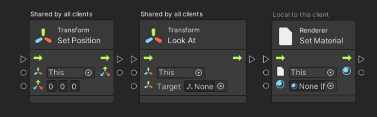
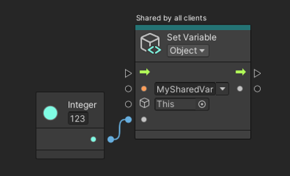
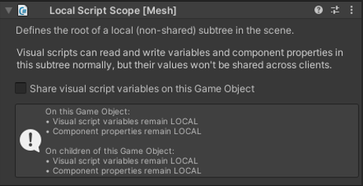

# Mesh Visual Scripting best practices for Networking

## Overview

In Mesh, most scene properties are by default automatically shared across all clients connected to the same room. For example, a scene object's Transform position and rotation, a Component's enabled state, or a TextMeshPro's text.

As a rule of thumb, component properties that have simple scalar types (Boolean, Integer, Float, or String) are automatically shared by default. Collection types (lists and sets) and scene object references aren't shared.

Visual script nodes that access or modify properties in Mesh are tagged with a label that indicates if they're "Shared by all clients" or "Local to this client":

Script Object variables are shared by default as well if you've declared them with a simple scalar type (*Boolean*, *Integer*, *Float*, or *String*):

 
Mesh doesn't support *Scene* variables, but you can use standalone *Variables* components in the environment to stash variables that can be shared independently from any specific *Script Machine* component.

If you don't want auto-sharing of properties or *Object* variables, you can add a *Local Script Scope* component to your scene. This will make all scene properties and script variables on this game object and any of its descendants local.

 
For local script variables that you're only using in a single *Script Machine*, it's best to use *Graph*  variables, which are never shared across clients by Mesh.

Sharing through Mesh Visual Scripting gives the following guarantees:

- **Guaranteed eventual consistency**: All clients will eventually arrive at the same shared state.

- **Guaranteed per-component atomicity**: All updates to properties of the same scene component (or the same *Variables* component) in the same update will be applied atomically on each client.

However:

- **No ordering guarantee**: Updates applied by one client to several *different* scene components may arrive in different orders on different clients.

- **No timeliness guarantee**: Mesh will try its best to replicate state changes across clients as quickly as possible, but networking conditions can delay the arrival of any given state update on some or all clients.

- **No granularity guarantee**: Any client may not see all individual incremental updates to shared state. This can happen when networking conditions force the Mesh server to rate-limit updates. It also happens when a client late-joins a room.

## State is shared--not events

You can't send or receive explicit network messages with Mesh Visual Scripting. This might be surprising at first, but it helps establish a networking paradigm that makes it easy to uniformly handle runtime changes as well as late join. Instead of messages, there's *shared state* in scene properties and script variables.

Your scripts can respond to shared state updates in a uniform way regardless of whether those updates were by a local script or user, or by another client who shares the experience in the same room, or by other clients that were already in the room before you even joined it yourself.

Not being able to explicitly send network messages means that you'll have to start thinking about *shared state that gets updates* instead of thinking about *shared events that may change state*. Shared events are a consequence of shared state getting updated, not the opposite.

Fortunately, Mesh Visual Scripting makes it easy for your visual scripts to react to state updates. Use the *On State Changed* event node and connect its left-hand side inputs with any script variable or Component property you'd like to observe for changes, and the event node will trigger your script (connected to its right-hand side) whenever any of the variables or properties connected to it change their value.
 
This works with shared state as well as with local state. The On State Changed event will trigger regardless of whether the variables or properties it's observing were changed by the local client, by a remote client, or even by a remote client before the local client even joined the room.
Using On State Changed to respond to state changes is efficient: There's no idle bandwidth or performance cost. You can have any number of visual scripts passively listen for state updates in this way without negatively affecting the frame rate or bandwidth use of your environment.
Late join
Late join happens when a client joins a room that already has other clients connected to it.
On late join, Mesh receives the room's current state from the server--for example, who's already in the room, and where their avatars are currently located –, and quickly prepares the joining client's local version of the shared environment so that it matches the state shared by everyone in the room.
For a large part, Mesh Visual Scripting does the same: Any shared Component properties and visual script variables that were changed in the room before the client just joined are updated locally to match the shared state, and then any On State Changed event nodes observing these properties or variables are triggered.
Late joiners don't replay shared events--they get shared state.
From the local client's point of view, the environment always evolves from its initial state it had just after loading the scene you've uploaded to Mesh. In the case of late join, the first state change may be larger than what happens while the local user is interacting with the room in an ongoing session, but it's the exact same thing in principle.
All of this happens as the environment loads up before it even fades in from black. As soon as the user can actually see and interact with the environment, late join is already done.
Make local state follow shared state
Very often, the "shared state" a user can observe in an environment is actually a combination of state shared directly by Mesh and local state that was established by visual scripts in response to an event that occurred in the room.
For example, when a user flips a switch in the environment (shared state), a visual script might change the color of the skybox (local state).
You might be tempted to apply the local change (update the skybox color) directly in response to the user interacting with the switch. However, even if the interaction event occurs on all clients currently in the room, any client that joins the room later won't get that event simply because they weren't there when it happened.
Instead, you should make local state follow shared state like this:
1.	When the user interacts (for example, flips the switch), make this trigger a local event that updates a shared variable (for example, the on/off state of the switch).
2.	Use On State Changed to observe the shared variable.
3.	When the On State Changed event triggers (because the shared variable changed its value), apply any local change you want (for example, update the skybox color).
In this way, local state (the skybox color) is following shared state (the state of the switch).
What's nice about this is that it works without change for the local client that flipped the switch; for all other, remote clients that are present in the room at the same time; and for any future clients that will join the room later.
Make local state follow shared state: Best practices
Local events--for example, an On State Changed event node observing the Is Selected Locally property of a Mesh Interactable Body component:
- Can change local state that's private to a client. These state changes will remain strictly on the local client and they'll vanish when the client leaves the session.
- Can change shared state.
- Cannot change local state to be consistent across clients. A local event only executes on one client, so the updates necessary to keep the local state consistent across clients simply won't happen on any other client.
Shared events--for example, an On Trigger Enter event node attached to a shared physics trigger collider:
- Can change local state for momentary effects (for example, a particle effect or a short audio effect). Only clients present in the room when the shared event occurs will be able to see the local effect; any clients joining the room later won't.
- Cannot change local state to be consistent across clients. A shared event only executes on clients who are present at the time it occurs, but it won't be replayed for clients that join the session later.
- Must not change shared state. Since a shared event executes on all clients, anything it does is done by all clients very close in time. Depending on the nature of the change, it might end up being repeated several times (for example, a score counter might be incremented by more than one in response to a single event).
On State Changed events that observe shared state in shared variables or shared component properties:
- Can change local state to be consistent with the shared state across clients. For this to work well in a repeatable and consistent way for all clients, you must translate every possible new value of the observed shared state into local state, not just a few cherry-picked state transitions (such as Is Selected becoming true).
Make local state follow shared state: Example
In this example, there are two interactive buttons in this environment: one labeled with "Star", the other one labeled with "Sponge". Selecting either of the buttons is supposed to do two things:
- Store the corresponding label in a shared string variable named ObjectKind.
- Store the reference to a corresponding scene object in a local GameObject reference variable named ObjectRef.
Here are the two script flows, one for each button. Each listens to the shared Is Selected property of one button's Mesh Interactable Body component and updates ObjectKind and ObjectRef depending on which button was selected:
  
Everything seems to work fine…
 …but only for users who are already in the room when one of the buttons is selected. Any user who joins the session later finds an inconsistent state in their local version of the shared environment: Only ObjectKind is correctly set according to the most recently selected button, but ObjectRef remains null.
What's wrong with these two script flows?
First, notice that these script flows are triggered by a shared event because they're both listening to each button's shared Is Selected property changing. This seems to make sense because it's the only way to get the local ObjectRef variable to be updated on all clients.
However:
- Shared events must not change shared state--but these script flows are updating the shared ObjectKind variable.
- Shared events cannot change local state to be consistent across clients--but these script flows are updating the local ObjectRef variable, which we're intending to be consistent on all clients, just like ObjectKind.
So the way this is currently set up, we actually shouldn't be doing either of the things we need the buttons to do.
The only obvious way to get out of this conundrum is to make the events that trigger these flows local. We can do that by making the On State Changed event node observe the Is Selected Locally property instead of Is Selected.
With the event now being local, this means…
- Local events can change shared state--so we can now safely update the shared ObjectKind variable, and its value will be automatically shared across clients by Mesh Visual Scripting's built-in networking.
- Local events cannot change local state to be consistent across clients--so we still can't update the local ObjectRef variable in these script flows. We'll have to find another way.
This is how the two script flows look after these changes:
 
 
Now, what can we do to set the local ObjectRef variable so it stays consistent with this?
Fortunately, these two script flows already establish some shared state we could follow: the shared ObjectKind variable. All we have to do is to use an On State Changed event that observes this variable and updates the local ObjectRef variable depending on its value:
 
This is a fine way to do it because On State Changed events that observe shared state can change local state to be consistent with it--and this will work for the client who pressed the button, and for all other clients present in the same room at the same time, and for all clients who will join the session later.
Networking pitfalls
High-frequency shared updates
Almost the entire scene state is shared by Mesh Visual Scripting by default. That's great for sharing, but it can also sneak in by accident and cause unnecessary network load.
For example, the following script flow will flood the network with redundant updates to the Transform's rotation--but since all clients are executing it at the same time, none of the remote updates will ever have an actual impact on any client locally:
 
In this case, you should probably use a Local Script Scope to make the Transform component local to every client. (And you should probably use an Animator component rather than an On Update script flow to start with.)
The Mesh Visual Scripting Diagnostics panel and Content Performance Analyzer (CPA) (as of Mesh Toolkit 5.2411) show a "High-frequency shared update" warning for this kind of construct.
On Start runs on each client
You may be tempted to think of the On Start event as something that runs at session startup, but it's actually triggered on each client, locally, when they join the session.
So it's perfectly suited for initializing local state:
 
But when you try to use On Start to initialize shared state, you'll find that the shared state will unintentionally get re-initialized for everyone whenever anyone joins the session:
 
The Mesh Visual Scripting Diagnostics panel (as of Mesh Toolkit 5.2410) and Content Performance Analyzer (CPA) (as of Mesh Toolkit 5.2411) show a "Shared update on session join" warning when they detect this.
Sharing is typed--but variable assignment isn't
For safety and security reasons, shared visual script variables are strongly typed. This means that the type you select in the Variables component for the script variables you've declared defines which exact value type that will be synchronized between clients.
Unfortunately, Unity Visual Scripting completely ignores declared a variable's declared type when you update its value: For example, you can easily by accident store a Float-typed value in a variable that was declared for type Integer.
Within the local client, your visual scripts won't notice this error because Visual Scripting will auto-convert the erroneous Float to the expected Integer where needed.
However, when it comes to synchronizing this value across clients, Mesh Visual Scripting can't take the same liberties: The "eventual consistency" guarantee precludes any value conversion in flight; and safety and security considerations make it unadvisable to accept a different value type from a remote client than what was declared for the variable.
For example, consider this declaration of a shared variable named MyIntegerVar:
 
Here's a script flow that updates this variable:
 
What could possibly go wrong?
Unfortunately, the Random | Range script node used in this example comes in two flavors: one that produces a random Integer value, and one that produces a random Float value. The difference is between those two script nodes in the node selector panel is subtle:
     
Keep this in mind as a potential reason why a share variable you've created may seem to have stopped being shared. Future releases of Mesh Visual Scripting may warn of this kind of script error when they can detect it.
