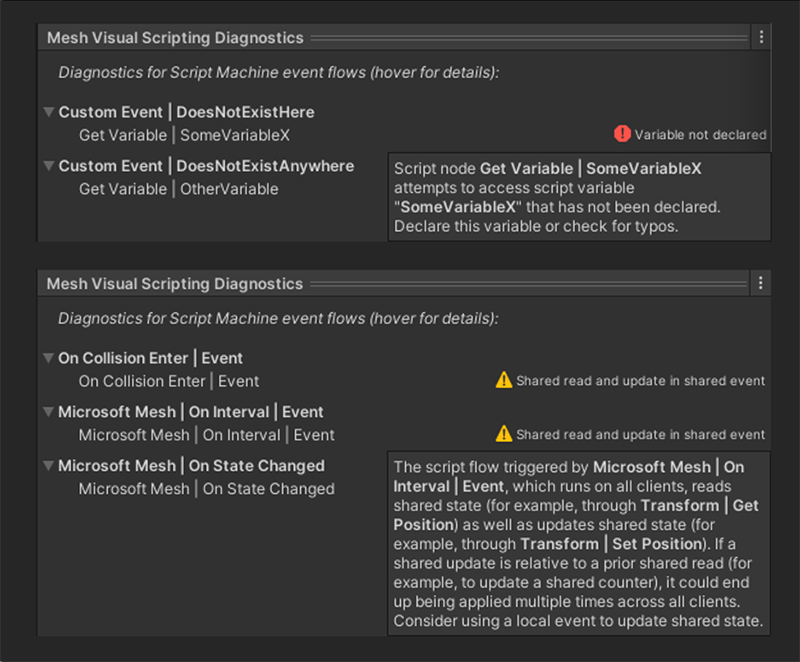
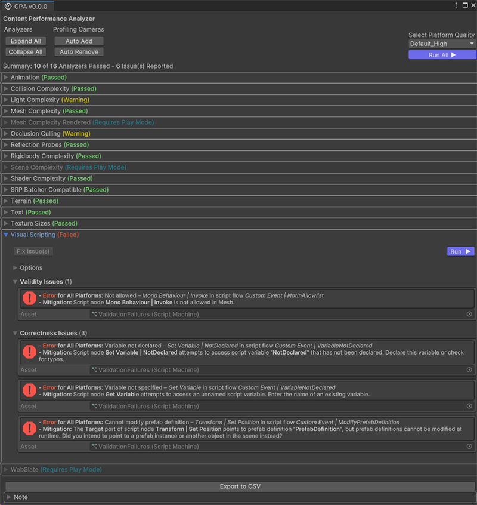
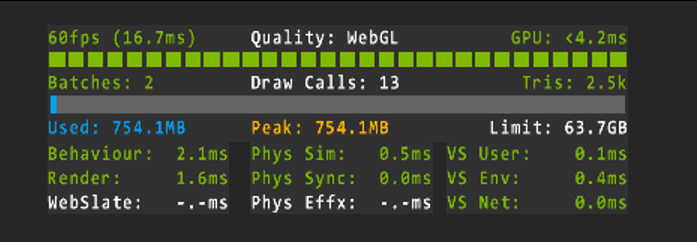
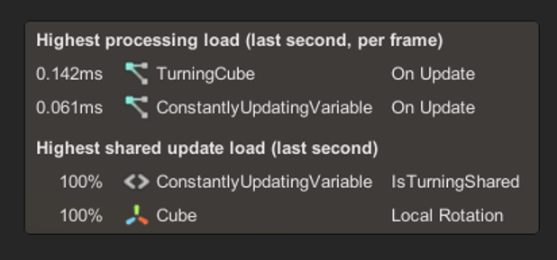
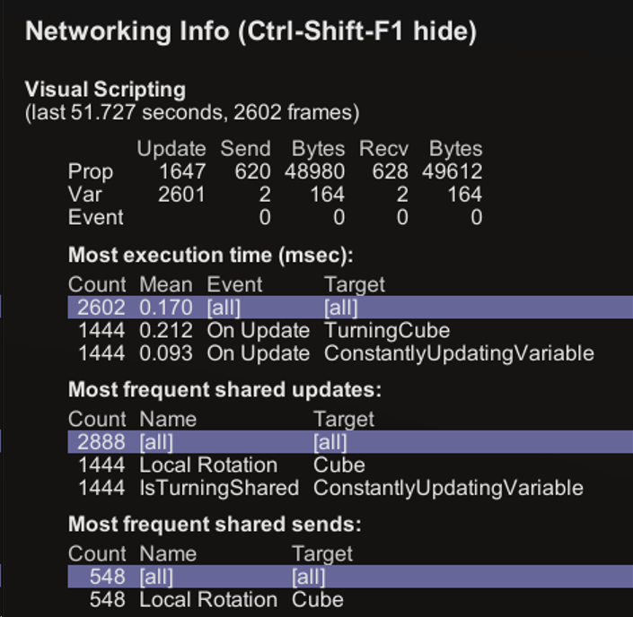

# Mesh Visual Scripting best practices for debugging

## Edit-time diagnostics

In Unity Editor, you can view on-the-fly guidance on errors and potential bandwidth or performance bottlenecks for the *Script Machine* you're currently editing in the *Mesh Visual Scripting Diagnostics* panel at the bottom of Unity Editor's *Inspector* panel.

Hovering the mouse pointer over an error, warning, or notice in the *Diagnostics* panel pops up a tooltip with a detailed explanation:

      
You can get a compilation of the same diagnostics across your entire environment by viewing the Content Performance Analyzer (CPA).

1. On the Unity menu bar, select **Mesh Toolkit** > **Content Performance Analyzer**.
1. In the CPA, click the **Run All** button.

 
## Runtime diagnostics in the Mesh Emulator

When you test-run your environment in the Unity Editor, select the **Perf Stats** checkbox in the upper-right corner of the **Game** window to show real-time summary statistics across all aspects of your environment:

 
The right-most column in the lower-right corner provides summary information on visual script performance, with times given in milliseconds per frame:

- **VS User** shows time spent on executing the visual script flows you've created, excluding any overhead incurred by Mesh.  
- **VS Env** shows overhead incurred by the Mesh Visual Scripting runtime environment.  
- **VS Net** shows overhead incurred by the Mesh networking stack underneath the Mesh Visual Scripting runtime, dispatching and receiving updates to shared state.

To get more detailed information on individual visual scripts executing in the environment, you can enable real-time runtime statistics on visual script execution by selecting the **Script Stats** checkbox in the upper-right corner of the **Game** window:

 
The **Highest processing load** section lists the script flows that have taken the most time to run within the last second, shown as an average time cost per frame.

- The number of script flows appearing in this section and their total time cost should be as low as possible.  
- Ideally, when the environment is idle, there shouldn't be any script flows executing at all.

The **Highest shared update load** section lists shared scene properties and script variables that were most frequently updated within the last second. A load of 100% means that the property or variable was updated in every frame in that second.

- The number of shared property and script variable updates and their total load in this section should be as low as possible.
- Ideally, when the environment is idle, no shared properties or variables should be updated at all.  
- If you notice any properties or script variables showing up in this section that you didn't intend to be synchronized over network across clients, consider adding *Local Script Scope* components to make them local.

You can click on any game object name in the middle column to directly jump to the corresponding game object in the *Hierarchy* panel.

If you want to have a closer look at a situation, you can click any other part of the *Script Stats* panel or press Shift+X to temporarily halt its updates. To resume updating it, click it again or press Shift+X again.

## Runtime diagnostics in Mesh

When running an environment in Mesh (for example, in a Teams event), you can press Ctrl+Shift+F1 to pop up the **Networking Info** sidebar, which shows lots of very technical information about the current session. Scroll down to find detailed information on visual scripts running in the environment:

 
The **last (number) seconds, (number) frames** statement directly below the **Visual Scripting** section heading shows the number of seconds and frames aggregated for the counters shown below. Up to 90 seconds of data is aggregated before the counters reset. The table directly below shows information on sharing:

- The **Prop**, **Var**, and **Event** rows describe shared properties, shared script variables, and shared events, respectively.  
- The **Update** column counts how often properties or variables were updated by visual scripts.  
- The **Send** and **Bytes** columns count how often property, variable, or event updates were sent over  network. This number can be lower than the *Update* count due to rate limiting and because redundant updates may not be sent at all.  
- The **Recv** and **Bytes** columns count how often property, variable, or event updates were received over network from other clients.
- The **Bytes** columns in this table don't account for all networking overheads and can only be meaningfully used to compare between runs. Actual bandwidth use may be much higher.

The **Most execution time** table lists all visual script flows by how much time they took to execute. The highlighted row labeled **[all]** shows cumulative data across all rows, including rows currently not shown. Click **Show more rows…** to reveal more rows.  
- The **Count** column counts how often this script flow was executed.  
- The **Mean** column shows the average time cost per frame, in milliseconds, of this script flow.  
- The **Event** column names the event node that triggered the script flow.  
- The **Target** column names the Script Machine that executed the script flow.  

The **Most frequent shared updates** and **Most frequent shared sends** tables list shared properties and shared script variables that were most frequently updated by visual scripts or had updates dispatched over network, respectively. The highlighted rows labeled **[all]** show cumulative data across all rows, including rows currently not shown. Click **Show more rows…** to reveal more rows.

- The **Count** column counts how often this shared property or shared variable was updated or had an update dispatched over network, respectively.  
- The **Name** column names the shared property or shared variable.  
- The **Target** column names the component hosting the property or variable.

Press Ctrl+Shift+F1 for a second time to enlarge the **Networking Info** panel, which reveals the entire transform path of the *Target* game objects in the tables shown above.

**To close the panel**:
Press Ctrl+Shift+F1 for a third time.

## Next steps

> [!div class="nextstepaction"]
> [Visual Scripting best practices overview](./visual-scripting-best-practices-overview.md)
> [Visual Scripting best practices for performance](./visual-scripting-best-practices-performance.md)
> [Visual Scripting best practices for networking](./visual-scripting-best-practices-networking.md)

