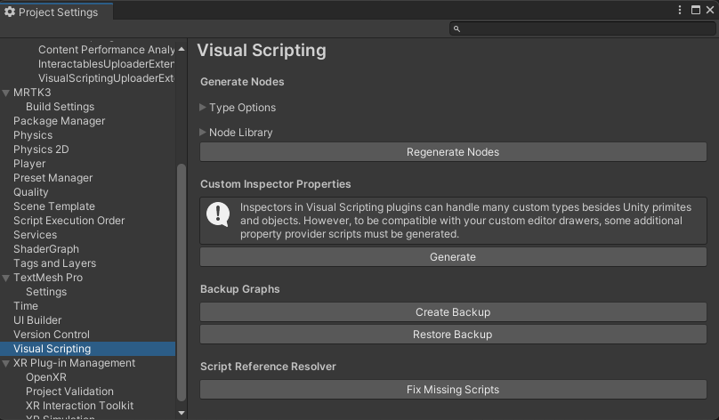

# Keeping types and node options updated in Visual Scripting

Here are some things you can do to avoid the "out-of-sync database" issue:

- Preserve the following file by keeping it in version control:
    
    `ProjectSettings\VisualScriptingSettings.asset`

    Note that prior to version 23.15, we were recommending that the following file also be kept in version control:

    `Assets\Unity.VisualScripting.Generated\VisualScripting.Flow\UnitOptions.db`

    As of version 5.2315.0, this file should *not* be kept in version control. You should also exclude the folder named `Assets\Unity.VisualScripting.Generated` from version control. Both of the above are regenerated on demand as needed. We recommend that you put the `Assets\Unity.VisualScripting.Generated` folder into `.gitignore` or its equivalent in your version control system.

- On the **Edit** > **Project Settings** > **Visual Scripting** page, don't change anything in the **Type Options** or **Node Library** sections and don't click the **Regenerate Nodes** button.

    .