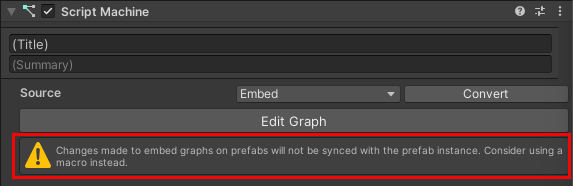
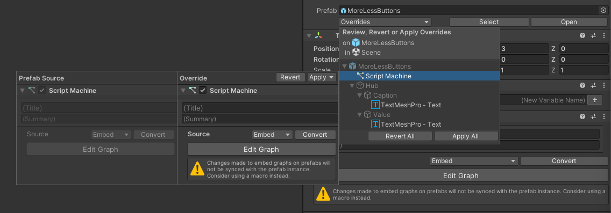

# Visual Scripting troubleshooting

**Issue**: "Embed" visual script graphs (as opposed to "Graph" assets, also called "Macros" in *Unity.VisualScripting*) in Prefabs often fail to correctly update in instances of the Prefab after they've been edited in the Prefab definition. This issue is sufficiently well known that the *Unity.VisualScripting* authors thought it warranted an in-Editor warning:

.

If you open a Prefab definition, then edit the embedded visual script, and then look at any instances of that Prefab in your scene, you'll find that the visual script hasn't changed. It maintains the state it was in when the Prefab instance was added to the scene.

**Solution**: 

1. Select the Prefab instance.
1. In the **Inspector**, click the **Overrides** drop-down.
1. Select the "Script Machine" entry (or entries).
1. Click the **Revert** button.

.

This reverts the visual script's definition to what it currently is in the prefab's definition--in other words, the updated version of the visual script.
