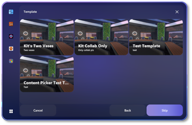

# Create an event

Create an event to host a Mesh experience! Once an
event is created in a World, people with access to the world will see
the event in Mesh. Creating an event is the first step. Then you can
invite people to collaborate as hosts or designers and customize the
event.

## Prerequisites for producing events

### Content contributor Role in Azure

To create, manage, or customize events for a Mesh world, your account
must be added as a Content contributor. Speak to your Azure or IT Admin
to get added as a Content contributor for a Mesh world if you haven't
been already.

### Create the event or be invited to collaborate on it

To create, manage, or customize events you must have created the event
yourself or be a collaborator for the event.

## Single vs Multiple room Events

You can host a single room event with 16 people, or multiple room event
with up to 200 people, split into 16 person rooms.

## Create an event

1. Open the Mesh app and login with an account that has
    Content contributor privileges to create and manage events.

2. In the left-side vertical button bar, click the icon for your World,
    or or click the [**All Mesh worlds**
    button](#mesh-dashboard-overview) at the bottom left and then select
    the world you want.

    

    > [!NOTE]
    >
    > You may have to scroll to view all the worlds.

    > [!TIP]
    > You can pin worlds to the left nav bar for easy access!
    > 

3. In your Mesh world, select the **Create** button.

    

    > [!IMPORTANT]
    > If you don't see **Manage** or **Create**, then you aren't a [Content contributor](#content-contributor-permissions) for this world. Please speak to your IT Admin to get Content contributor privileges.

4. Add your event details (**Name**, **Date**, **Time**,
    **Description**, etc.). 

    

5. Choose your Room settings: **Single room** or **Multiple Rooms.**

    

    > [!NOTE]
    > **If you choose Multiple room:**
    >
    > - You must fill in the Room capacity and Total participants fields.
    >
    > - You must [provision your meeting](#multiple-rooms-event). Detail provided after this section.

6. When you're finished, click **Next**.

7. On the **Template** page, this is where you can reuse any event
    templates that you create. If you choose a template, skip step 8.
    Otherwise, press **Skip** to select an Environment.

     

8. On the **Environment** page, select an environment, and then click
    **Next**.

    You can choose from a set of Default Environments or use a Custom
    Environment Template. Default environments are pre-made to suit your
    meeting. Custom environments are made in Unity and uploaded to Mesh.

     [Learn more about Environments](#_Key_terminology)

     

    See the [Choose your journey](../Create/Getting%20started/choose-your-journey.md) article
 to learn how to create a custom environment.

9. Review your event details. Click **Back** if you need to change
    anything.

10. Click **Create Event**. This saves your event and takes you to the
    **Manage Events** page.

     

**Congrats! Let's manage your event by inviting participants and
inviting others to collaborate!**

   > [!div class="nextstepaction"]
   > [Manage an event](manage-event.md)

   > [!div class="nextstepaction"]
   > [Customize an event](customize-event.md)
