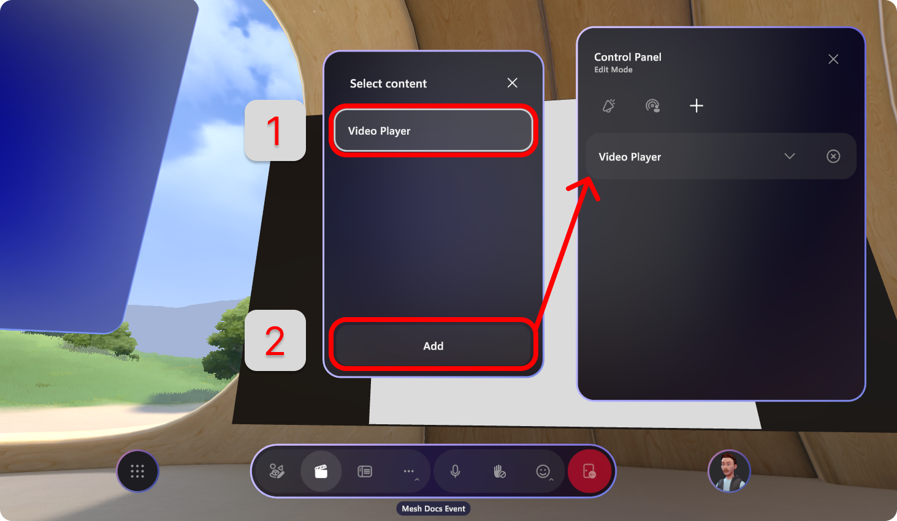

# Customize your event

Now that you've created an event, it's time customize it in the [Microsoft Mesh app](https://apps.microsoft.com/store/detail/microsoft-mesh/9NLXZJ1FDBD7?hl=en-us&gl=us&rtc=1) and add any run-of-show tools you'd like to use.

At a high level, there are three major steps to customize your event or template:

1. **Add content** using the **Environment Editor** (or playable content uploaded from Unity to a custom environment).

    :::image type="content" source="../Resources/media/environment-editor.png" alt-text="Add content with environment editor":::

1. Select the artifact to edit its properties.

    :::image type="content" source="../media/mesh-event-producer-guide/customize-image-artifact.png" alt-text="Image artifact adjustment":::

1. **Configure** content with the **Control Panel** for your live event. Ensure that you've added artifacts to the control panel to be used in the production of your event.

    :::image type="content" source="../media/mesh-event-producer-guide/Control-panel-button.png" alt-text="Control panel button":::

1. **Save changes** in the **Event Customization** window.

    :::image type="content" source="../media/mesh-event-producer-guide/Event-customization-save-changes.png" alt-text="Save changse in event customization":::

## Considerations before starting your event

### Customize and save before event

Saving is not available once event is joined. Plan to customize and save your event at-least **30 minutes before** the event start time.

:::image type="content" source="../media/mesh-event-producer-guide/Environment-editor-saving.png" alt-text="Save customization in your Mesh environment":::

> [!TIP]
> **Who should customize an event?**
>
> Anyone who has been invited as a **Co-organizer** can customize an event. Do this with
> caution, knowing that any edits you make will affect the environment
> that event participants will join in.

## Add content

Use the Environment editor to place content in your environment and customize the content displayed in each artifact.

Currently, the three artifacts that you can add to your event are **Video**, **Screenshare**, and **Image**.

:::image type="content" source="../media/mesh-event-producer-guide/environment-editor-artifacts-no-text.jpg" alt-text="Video, screenshare, image artifacts in the environment editor":::

### Add content with the Environment editor

Use the environment editor to add content to your environment that can be controlled during your run-of-show.

1. Open the Mesh app on your computer or use the link in the calendar invite.

1. Look for the event in the **Upcoming** category and select it.

    :::image type="content" source="../media/mesh-event-producer-guide/Customize-event-entrypoint3.png" alt-text="Event showing in Mesh app in the upcoming category":::

1. In the Event details window, select **Customize**.

    :::image type="content" source="../media/mesh-event-producer-guide/Customize-event-entrypoint-event-details.png" alt-text="Customize button in the event details window":::

1. Select the **Join now** button.

1. Once it loads, Select the **Environment editor** button.

    :::image type="content" source="../media/mesh-event-producer-guide/Environment-editor-button-open2.png" alt-text="Environment editor button":::

1. Select the **+** plus button to open the Catalog of artifact you can add. Select one to add it to the environment editor.

    :::image type="content" source="../media/mesh-event-producer-guide/environment-editor-open-artifacts - Made with Clipchamp.gif" alt-text="Open environment editor and add artifact":::

1. Once you've added an artifact, you'll see it show up in the Artifacts window as shown below:

    :::image type="content" source="../media/mesh-event-producer-guide/image-environment-editor-added-artifact.png" alt-text="Video player artifact shown in list of artifacts":::

    Note the **Copy**, **Edit**, and **Delete** buttons available for the selected artifact.

1. Now you can manipulate the artifact as you'd like by selecting it with your cursor, dragging it to another location, or using the edges of the artifacts to scale them as you see fit.

    :::image type="content" source="../media/mesh-event-producer-guide/environment-editor-maneuver-artifact2.png" alt-text="Move artifact with avatar arm up":::

    To position your artifact - with the environment editor open:

    1. Select and drag your artifact to move it left, right, up, or down.
    1. **Alt + Select** and drag up or down to move the artifact toward and away from you.
    1. **Shift + Select** and drag up or down to make the artifact bigger or smaller.
    1. You can also use the rotation and scale handles on the artifact to rotate and scale your artifact. Just select the handle and drag to rotate or scale.

    Make sure you check out the position from different angles to verify you’ve placed it properly.

    >[!Tip]
    >while you are moving an artifact you’ll see a small line drawn from your artifact down to the floor. This can help you position your artifacts relative to landmarks in the scene such as the edge of a stage or a piece of furniture.

### Video artifact requirements

For video artifacts, you must:

- Use **.MP4** file type only.
- Use direct links to video files that are stored on SharePoint or HTTPS URLs. Links to video services like YouTube, Vimeo, etc. are not supported

    For example, use the **Share** or the **Copy Link** functionality in SharePoint to copy the link of the video you want to share and paste it in the Video player artifact URL field.

    :::image type="content" source="../media/mesh-event-producer-guide/SharePoint-link.png" alt-text="Sharepoint link copied in sharepoint":::

### Edit artifact controls

Once you've added an artifact, you can maneuver it around the spaces and select the it to edit the controls.

1. Select an added artifact and adjust the controls to suit your preferences.

    :::image type="content" source="../media/mesh-event-producer-guide/image-environment-editor-open-controls-window.png" alt-text="Controls window showing for artifact that has been added to an environment":::

1. Configure the controls for the artifact. For example, you can add the URL for your video:

    :::image type="content" source="../media/mesh-event-producer-guide/environment-editor-add-artifacts.gif" alt-text="Add artifacts and update url":::

    > [!NOTE]
    > The only video type that is supported is **.MP4** inside the video artifact.

## Prepare content with the Control Panel

> [!IMPORTANT]
> You **must add the artifacts to the Control Panel** and **save** before starting your event.

Use the **Control Panel** to prepare your artifacts to be used during an event. Like having a technical booth for theatrical technicians, it's designed to give the Event Producer the ability to orchestrate a performance in real time.

1. Once you're satisfied with your artifact, open the **Control Panel**.

    :::image type="content" source="../media/mesh-event-producer-guide/Control-panel-button.png" alt-text="Control-panel button in the Mesh app":::

1. Select the **+** add button to add your artifact.

    :::image type="content" source="../media/mesh-event-producer-guide/Control-panel-add-button.png" alt-text="Control panel add button in Microsoft Mesh app":::

1. In the **Select content** window, select the artifact then select  **Add**. You will see it show up in the Control Panel.

    

**Control Panel Notes:**

- Playable content can be added from the environment editor or from a Unity project that has been uploaded to a custom environment. Reference the [Choose your journey article](../Create/getting-started/choose-your-journey.md)
    to get started with adding custom content.

## Save your content

Before you start your event, you must save the changes that you've made to your environment.

Select the Event Customization button, then select **Save changes** or **Revert changes.**

:::image type="content" source="../media/mesh-event-producer-guide/Event-customization-save-changes.png" alt-text="SAve changes button in the Event Customization window in the Microsoft Mesh application":::

### Preview the live run of your event

Within a Customize event experience, open the Control Panel, then Toggle
to Preview Mode.

While in preview mode, you can test out using the control panel to play your video or interact with your content.

:::image type="content" source="../media/mesh-event-producer-guide/Environment-editor-preview-play-video.png" alt-text="Video playing in the control panel during preview mode mesh app":::

   > [!div class="nextstepaction"]
   > [Produce your event](produce-event.md)
