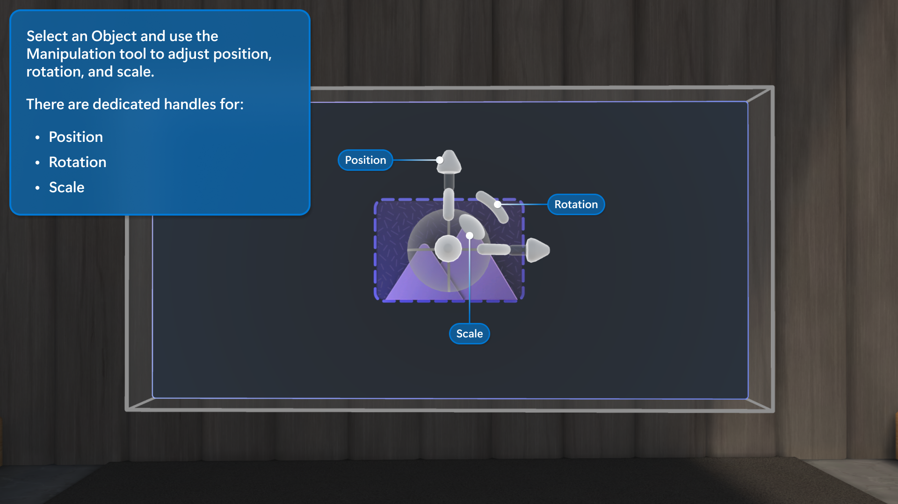

# Customize your event

Mesh enables no-code customization of 3D environments that help your organization create experiences tailored to your business goals.

## Why customize an event?

As a host for a Mesh event, you have many tools at your disposal to orchestrate an experience for attendees.

Along with [tools to interact with and manage attendees](produce-event.md#event-producers-tools), you have a **Control Panel** to manage aspects of the environment.

With the Control panel, you can control individual objects like playing a video when people enter the event, or execute a pre-planned sequence of actions like queuing a video, displaying images, and showing a Screenshare simultaneously.

If you're using a custom environment or there are [**Controllable** objects in your environment that have been added through Unity](../develop/enhance-your-environment/multi-room-sync.md#controllables), these will also show up in the Control panel as well.

### Types of customizations

* Add objects through the **Editor** like Screenshares, Images, Videos, or Text. Drag and resize these objects easily by selecting the objects and moving them around the environment.

    :::image type="content" source="../media/mesh-event-producer-guide/customize-event-add-objects-catalog.png" alt-text="Screenshot showing the catalog of possible objects to add when customizing an event in the Mesh application.":::

* Use the **Control Panel** to granularly adjust or configure Objects that you have in your environment using the **Controls** tab.

    :::image type="content" source="../media/mesh-event-producer-guide/Control-panel.png" alt-text="Screenshot of control panel showing the objects in an environment.":::

* Use the **Control Panel** > **Action Groups** tab to control multiple objects at once for an experience such as displaying photos of your team, or showing a company logo and playing a video.

    :::image type="content" source="../media/mesh-event-producer-guide/Action-groups-gif.gif" alt-text="Gif of an avatar in the Mesh app using action groups to display imaes, a video and company logo, and screenshare.":::

## Considerations before starting your event

* To ensure the event runs smoothly, ensure that you customize and save customizations at least **30 minutes before** the event start time. Once someone joins the event, saving customizations is not available.

* Anyone who has been invited as a **Co-organizer** can customize an event. Do this with caution, knowing that any edits you make will directly alter the Event or Template that event attendees will join.

## How to customize an event

## Customization flow

At a high level, this is the flow you can expect to follow when customizing your event:

1. Once your event is created using [https://mesh.cloud.microsoft/](https://mesh.cloud.microsoft/), open the Mesh app to find and start customizing your event.

1. **Enter a Customization session** for your Event or Template.

1. **Add content** using the **Editor**.

1. **Configure** content with the **Control panel** to be used in your live event. You can edit the Controls of each object individually or group them together in **Action Groups**.

1. **Save changes** in the **Event Customization** window.

## Enter a Customization session for a template or event

# [Template](#tab/template)

### Customize a Template

To learn more about creating a Template, see how to [Create Template](create-template.md).

1. In the Microsoft Mesh app, select the **Manage Templates** button.

    :::image type="content" source="../media/mesh-event-producer-guide/Select-manage-event-templates.png" alt-text="Screenshot of Mesh app dashboard showing Manage event templates button highlighted.":::

1. Find your **Template** draft.

    :::image type="content" source="../media/mesh-event-producer-guide/Template-selection.png" alt-text="Screenshot of Mesh app Manage Templates window, draft events highlighted.":::

1. Select the **Customize event experience** button to start customizing the Template.

    :::image type="content" source="../media/mesh-event-producer-guide/Select-customize-template.png" alt-text="Screenshot of Mesh app showing Customize template button highlighted.":::

# [Event](#tab/event)

### Customize a single Event

1. Open the Mesh app on your computer or use the link in the calendar invite.

1. Look for the event in the **Upcoming** category and select it.

    :::image type="content" source="../media/mesh-event-producer-guide/Select-event-details-blurred.png" alt-text="Screenshot of Mesh app showing an upcoming event highlighted to indicate that you should select it.":::

1. In the Event details window, select **Customize**.

    :::image type="content" source="../media/mesh-event-producer-guide/Select-customize-button.png" alt-text="Screenshot of Mesh app showing Customize button for an event highlighted.":::

---

## Start customizing

Now that you've created an event and joined the Event customization experience, it's time customize it in the [Microsoft Mesh app](https://apps.microsoft.com/store/detail/microsoft-mesh/9NLXZJ1FDBD7) and add any run-of-show tools you'd like to use.

At a high level, there are three major steps to customize your event or template:

1. **Add content** using the **Environment Editor** (or playable content uploaded from Unity to a custom environment).

   :::image type="content" source="../media/mesh-event-producer-guide/customize-event-add-objects-catalog.png" alt-text="Screenshot showing the catalog of possible objects to add when customizing an event in the Mesh application.":::

1. Select the object to edit its properties.

    :::image type="content" source="../media/mesh-event-producer-guide/Customize-event-control-panel-object-selection.png" alt-text="Image object adjustment":::

1. Use the **Control Panel** to adjust your objects or create **Action Groups** to control multiple objects simultaneously.

    :::image type="content" source="../media/mesh-event-producer-guide/Action-groups.png" alt-text="Screenshot of the control panel in Mesh experience with Action Groups tab selected. Several actions are highlighted such as display images.":::

1. **Save changes** in the **Save** window. Or select **Revert** to discard recent changes and revert to the last saved state.

    :::image type="content" source="../media/mesh-event-producer-guide/Customize-event-object-save-changes.png" alt-text="Screenshot of Mesh app showing save changes dialogue after customizing.":::

### Add content with Editor

Use the Editor to place content in your environment and customize the content displayed in each object.

The three objects that you can add to through the editor are **Video**, **Screenshare**, and **Image**.

|Object |Controls  |Notes  |
|---------|---------|---------|
|Video   |   URL, Looping, Volume, Backplate, Visible      |  Direct links to videos hosted via SharePoint or HTTPS URLs and **.MP4** file types only.       |
|Screenshare     |  Visible       |  Display screen as an event host with Organizer or Co-Organizer privileges.       |
|Image     |  URL, Orientation, Backplate, Visible      |   Direct links to images hosted via SharePoint or HTTPS URLs      |
|Text     |  Display text, Auto resize, Text style, Font Size, Show backplate, Visible      |   Simple text for labels, signage, and attendee instructions      |

Use the Editor to add content to your environment that can be controlled during your run-of-show.

1. Select the **Editor** button.

    :::image type="content" source="../media/mesh-event-producer-guide/Event-customization-editor-open.png" alt-text="Screenshot of Mesh app showing Editor open with no objects added.":::

1. Select the **+** plus button to open the **Catalog** of objects that you can add. Select one to add it to the environment editor.

    :::image type="content" source="../media/mesh-event-producer-guide/customize-event-add-objects-catalog.png" alt-text="Screenshot showing the catalog of possible objects to add when customizing an event in the Mesh application.":::

1. Once you've added an object, you'll see it show up in the Objects window as shown below:

    :::image type="content" source="../media/mesh-event-producer-guide/image-environment-editor-added-artifact.png" alt-text="Video player object shown in list of objects":::

    Note the **Edit**, **Duplicate**, and **Delete** buttons for the selected object.

    > [!TIP]
    >  Playable content can be added from the environment editor or from a Unity project that has been uploaded to a custom environment. Reference the [Choose your journey article](../develop/getting-started/choose-your-journey.md)
    >     to get started with adding custom content.

1. Now you can manipulate the object as you'd like. Select it with your cursor and then use the manipulation tool to adjust position, rotation, and scale.

    
   
   
   
   You can also use a few other shortcuts for moving Objects around:
   
   1. Select and drag your object to move it left, right, up, or down.
   1. **Alt + Select** and drag up or down to move the object toward and away from you.
   1. **Shift + Select** and drag up or down to make the object bigger or smaller.
   > [!Tip]
   > while you are moving an object you’ll see a small line drawn from your object down to the floor. This can help you position your objects relative to landmarks in the scene such as the edge of a stage or a piece of furniture.
#### Edit object controls

Once you've added an object, you can maneuver it around the spaces and select it to edit the controls.

1. Select an added object and adjust the controls to suit your preferences.

    :::image type="content" source="../media/mesh-event-producer-guide/image-environment-editor-open-controls-window.png" alt-text="Controls window showing for object that has been added to an environment":::

1. Configure the controls for the object. For example, you can add the URL for your video:

    :::image type="content" source="../media/mesh-event-producer-guide/Configure-controls-artifact-larger.gif" alt-text="Add objects and update url":::

    > [!TIP]
    > Use the **Share** or the **Copy Link** functionality in SharePoint to copy the link of the video or image that you want to share and paste it in the Video player or Image object URL field.
    > :::image type="content" source="../media/mesh-event-producer-guide/SharePoint-link.png" alt-text="Sharepoint link copied in sharepoint":::

### Prepare content with the Control panel

The **Control panel** holds all the controls available for your content during the event. Like having a technical booth for theatrical technicians, it's designed to give the organizer the ability to orchestrate a performance in real time.

You can try out the controls during the customization session, but make sure you set everything back to how you want your event to look when it starts and then save your changes (or if you're just practicing, you can use **Revert changes** in the save dialog).

#### Create an Action Group

Sometimes you want to trigger multiple production elements simultaneously, like starting a video and revealing a banner image at the same time. To simplify multiple actions into just one click in the Control Panel, you can create an Action Group.

Action Groups allow organizers to take a bunch of content, preconfigure the controls for it, and save everything to a single-click group in the Control Panel.

For example, you might want to create an Action Group that contains all of the things you’d like to trigger for the Welcome portion of your event. Here, you might want to hide a countdown video, toggle the screenshare object to visible, and unfurl some logos. If you add each element individually to the Control Panel, you will have to take multiple actions to trigger these changes. Or you can simplify it all down to one-click with an Action Group.

To create an **Action Group**, start by opening your **Control Panel** and selecting the “Action Groups” tab:

1. Select the **+** button then type in your name for the Action Group.
1. In the Action group panel, select the **Pencil icon** then choose the objects you want to add to the group and **Confirm**.

    :::image type="content" source="../media/mesh-event-producer-guide/Action-groups-select-objects.gif" alt-text="Gif showing objecst being selected to be added to an action group.":::

1. For each object, choose the **Pencil icon** to choose which properties you want to control then select the controls you want to be included in the Action Group.

    :::image type="content" source="../media/mesh-event-producer-guide/Action-groups-select-controls-for-objects.gif" alt-text="Gif showing an avatar in the Mesh app choosing the controls for objects that they want to be in the Action Group.":::

1. Adjust the controls for each object and select the **Save** icon. You'll see the Action Group show up in the **Control Panel** to the right.

    :::image type="content" source="../media/mesh-event-producer-guide/Action-groups-adjust-properties-for-each-object.gif" alt-text="Gif showing an avatar or user adjusting the controls for each object in an action group and saving to show the Action Group in the control panel.":::

1. Repeat for all Action Groups you want, then you'll have a sequence of Actions available for use in your event.

    :::image type="content" source="../media/mesh-event-producer-guide/Action-groups-gif.gif" alt-text="Gif showing Action Groups populated and available to select Play for each to see the actions occur in your environment.":::

## Save your content

Before you start your event, you must save the changes that you've made to your environment.

Select the **Save button** or **Revert changes.**

:::image type="content" source="../media/mesh-event-producer-guide/Event-customization-save-changes.png" alt-text="SAve changes button in the Event Customization window in the Microsoft Mesh application":::

## Next steps

> [!div class="nextstepaction"]
> [Produce your event](produce-event.md)
