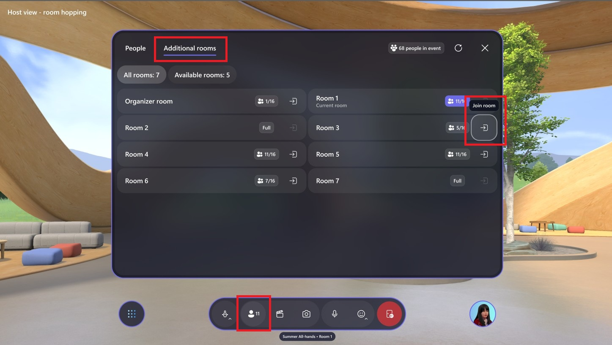

# Produce your event

## Considerations before starting your event

### Customize **before** your event

To ensure the event runs smoothly, ensure that you customize and save customizations at least 30 minutes before the event start time.

#### Capacity and event type considerations

**Single room events:**

- Capacity: 16 people
- Time limit: 24-hours
- Events can be rejoined from the Mesh Dashboard or via the join link created for the event

**Multi-room events:**

- Capacity: 330 people
- Time limit: 3-hours
- Events can be rejoined from the Mesh Dashboard or via the join link created for the event
- Co-organizers are in their own room and attendees are grouped into 16 person rooms

## Event Producers tools

- **[Organizer tools](#organizer-tools)**: Mute all, enable/disable Hand Raise, Megaphone, Screenshare, and Broadcast (for Multi-room events) are all located in the left Organizer tools button in the Menu bar.

    **Single room events**

    :::image type="content" source="../Resources/media/Organizer-tools-people-panel-single-room-2412.png" alt-text="Screenshot of the organizer tools and people panel in the Mesh app.":::

    **Multi-room events**

    :::image type="content" source="../Resources/media/Organizer-tools-people-panel-multi-room-2412.png" alt-text="Screenshot of Organizer tools and People panel in the Mesh app.":::

- **[People panel](#people-panel)**: The people in your event can be found in the People panel. In this panel, you can see who has raised their hand and megaphone or broadcast (in multi-room events) them.

    **Single room events**

    :::image type="content" source="../Resources/media/People-panel-single-room-2412.png" alt-text="Screenshot of the Mesh app showing the people panel in a single room event.":::

    **Multi-room events**
    For Multi-room events, you'll be able to switch between the People tab and the Additional rooms tab

    :::image type="content" source="../Resources/media/People-panel-multi-room-2412.png" alt-text="Screenshot of Mesh app showing the people panel expanded in a multi-room event.":::

- **[Control panel](#control-panel):** Control the elements that were added in a Customization session. [Play a video](#control-objects-in-the-control-panel), for example, or control custom objects that you may have added!

## Common event scenarios

For those interested in running question and answer scenarios where participants can raise their hand, be called on by the host, and megaphoned or broadcast to the entire event, see the [common event scenarios article](common-event-scenarios.md) for more info.

## Join the event

After you've created your event, customized it, and added content to the control panel, it's time to join and produce your event.

> [!TIP]
> **Ensure that you've [customized your event](customize-event.md) properly** (added custom content or objects to your environment, added it to the control panel, and saved) before producing your event.

1. Open the Mesh app directly or use the link your calendar invite to open the Mesh app.

1. Find your event in the **Upcoming** or **Happening now** sections, and select **Join**.

    :::image type="content" source="../media/mesh-event-producer-guide/Join-event-2314-2.png" alt-text="Screenshot of Mesh app showing join button highlighted.":::

    > [!NOTE]
    >
> As a host, you'll join into a Host Room along with any other co-organizers. Attendees will be in their own room(s).

1. Adjust your device settings to ensure they're set up properly.

    :::image type="content" source="../media/mesh-event-producer-guide/Device-settings-setup-before-join.png" alt-text="Device settings adjustment  inside pre-join window for Mesh event.":::

Once you select **Join now**, you'll utilize two main tools, Organizer tools and the People panel, for your run of show:

## Produce your event

Use the organizer tools to access the tools that you'll use to help run your event like the Mute, Hand raise, Megaphone and/or Broadcast, and Share features.

### Organizer tools

#### Organizer tools in a single room event

:::image type="content" source="../media/mesh-event-producer-guide/Organizer-tools-single-room-2412.png" alt-text="Screenshot of organizer tools in the Mesh app showing the single room options available.":::

#### Organizer tools in a multi-room event

:::image type="content" source="../media/mesh-event-producer-guide/Organizer-tools-multi-room-2412.png" alt-text="Screenshot of organizer tools in the Mesh app showing the multi-room options available.":::

#### Mute all

Mute all attendees in the event. Hosts in the event can still use their mics and mute or unmute.

**Enabled:** Attendees are muted and cannot mute or unmute.

**Disabled:** Attendees can now use their microphone.

#### Hand raise

Enable or disable Hand Raise for participants. Hand Raise is ideal for Question and Answer scenarios. When an attendee raises their hand, there will be an indicator next to their name in the host panel and a hand raise emoji their avatar or profile bubble.

**Hand Raise enabled:** Participants can raise their hand to await being called on and megaphoned.

**Hand Raise disabled:** Participants cannot raise their hand.

When an attendee has their hand raised, you'll see the hand raise notification next to their name in the People panel.

In a single room event, you'll also see hand raise icon above their avatar.

> [!TIP]
> In multi-room events, you won't see any attendee avatars until they are broadcast.

Learn how to [use Hand Raise for question and answer (Q&A) scenarios](common-event-scenarios.md#using-hand-raise-for-qa)

#### Megaphone or Broadcast (in multi-room events)

Amplify your voice to all participants with Megaphone and show your avatar to all participants with Broadcast. The megaphone and broadcast features are essential when leading a meeting, especially in multi-room events where you as a host are in your own room without general attendees.

> [!NOTE]
> A maximum of five people can broadcast at the same time, including host avatars and attendee avatars.

**Megaphone enabled/disabled:** Choose whether your voice is amplified to all participants in all rooms.

**Broadcast Enable/disabled:** Control whether or not your host avatar and voice are broadcast to all rooms in the event.

#### Megaphone or broadcast other participants

As an event organizer or host, you'll have the ability to megaphone or broadcast attendees when someone wants to ask a question, for example, or lead a presentation using the Screenshare.

In a **single room event**, you'll see the Hand Raise icon next to the person who is raising their hand. Next to the raised hand, you can choose to Megaphone them:

:::image type="content" source="../media/mesh-event-producer-guide/People-panel-handraise-2412.png" alt-text="Screenshot of the people panel in the Mesh app showing a hand raise icon next to a profile in the panel.":::

In a **multi-room event**, you'll see the Hand Raise icon next to the person who is raising their hand. Next to the raised hand, you can choose to broadcast them, making their avatar visible and voice audible to all rooms in the event:

:::image type="content" source="../Resources/media/People-panel-multi-room-2412.png" alt-text="Screenshot of multi-room scenario with hand raise icon next to their name visible and broadcast button.":::

When you request an attendee to broadcast or megaphone, you'll receive a notification. Once you request it, the attendee will also receive the request and be able to accept or deny the option.

:::image type="content" source="../media/common-event-scenarios/Request-to-broadcast-or-megaphone.png" alt-text="Screenshot of request to megaphone or broadcast from the host perspective.":::

#### Share

Share your screen or a specific window on your PC to all participants. Screenshare requires the Screenshare object that is [added when you customize your Event or Template](customize-event.md#add-content-with-editor).

**Enabled:** Host screen or window will be shown to all participants.

**Disabled:** Host screen or window is not shown.

:::image type="content" source="../media/mesh-event-producer-guide/Screenshare-single-room-2412.png" alt-text="Screenshot of single room event showing the Share button highlighted.":::

> [!NOTE]
> When sharing content with system audio on, the organizer will be heard in a non-spatialized or megaphoned manner. It is not currently possible to share content with audio without simultaneously being megaphoned.

**How to screenshare:**

1. Open the **Organizer tools** in the menu bar and select the Share button.

    :::image type="content" source="../media/mesh-event-producer-guide/Screenshare-single-room-2412.png" alt-text="Screenshot of single room event showing the Share button highlighted.":::

1. Select the monitor screen or window that you want to share.

1. Exit or stop sharing your screen by selecting the Share button again in the **Organizer tools**.

## People panel

The people panel allows you to see who is in your event, and call on participants when they raise their hand. In a single room, you'll be able to megaphone or broadcast participants to make them audible (and visible in multi-room events) to all participants in the event.

**Single room**

:::image type="content" source="../Resources/media/People-panel-single-room-2412.png" alt-text="Screenshot of people panel in a single room in the Mesh app.":::

**Multi-room**

:::image type="content" source="../Resources/media/People-panel-multi-room-2412.png" alt-text="Screenshot of the people panel in a multi-room event in the Mesh app.":::

## Room Hopping for Hosts

Hosts are able to move freely between rooms in their multiroom events in order to connect to their audiences. To Room Hop you must:

1. Open the People Panel

1. Navigate to the Additional Rooms tab

1. Select a room to travel to

Movement between rooms will fade out the people and content from the current room, while loading the people and content in the new room. Hosts can freely move between any open rooms and a maximum of two hosts will be able to simultaneously bypass the capacity limit for rooms that are currently full.

> [!NOTE]
> Certain scripting content may differ after Room Hopping. We recommend pre-event testing to ensure experience predictability.
> 
## Control panel

The Control panel is used to control the content or objects that were added when customizing an Event or Template. To learn more, see how to [Customize your event](customize-event.md).

### Control objects in the Control panel

1. Select the **Control panel** button in the bottom right of the menu bar.

    :::image type="content" source="../media/mesh-event-producer-guide/Event-production-control-panel-button.png" alt-text="Screenshot of Mesh app showing Control panel button and panel":::

In the Control panel, you'll see all the objects and content that you added to your Event or Template.

1. In the Control panel, select an object and interact with its controls as desired during your event.

    In the example below, in the **Play state** section for the **Video** object, we can select the **Play** button to play the video.

    :::image type="content" source="../media/mesh-event-producer-guide/Event-production-control-panel-play-artifact-2.png" alt-text="Screenshot of Mesh app, the control panel playing a video object.":::

   > [!div class="nextstepaction"]
   > [Getting started with attending events](../user-guide/getting-started.md)
