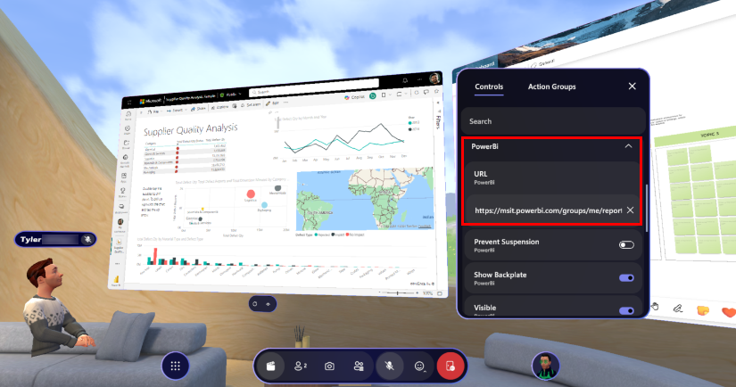
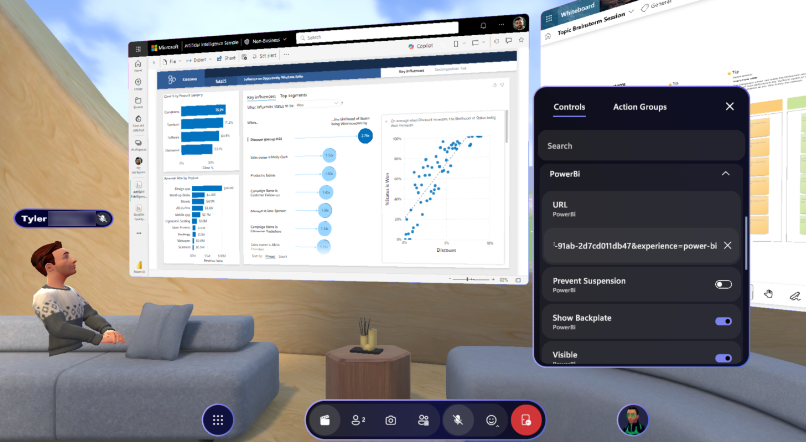
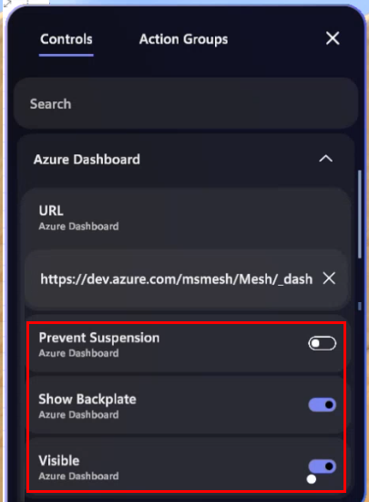
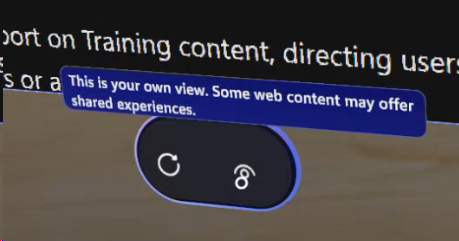
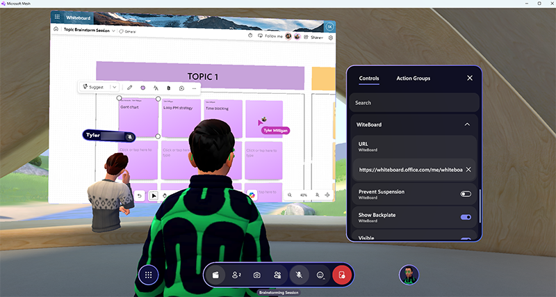

# Update WebSlate URLs during an event

If you want to view and control web content in an event, your developer needs to have added one or more WebSlates to the environment the event is based on. These WebSlates will show up in the Control Panel for your event. If you aren't already familiar with WebSlates, we recommend that you review our [WebSlate overview article](../develop/enhance-your-environment/web-content/webcontent.md).

Event Organizers can use the Control Panel to change the URL for a WebSlate during an event, as explained below.

## Control a WebSlate in an event

## Change the WebSlate's URL

1. Create an event in the Mesh Portal.  
1. Up to 10 minutes prior to the event (or at Start time), join the event (not Customization mode) and then navigate to a WebSlate you want control.  
1. Open the Control Panel, and then navigate to the name of the WebSlate. The name should reflect the contents of the WebSlate; for example, if it displays Power Bi data, then "Power Bi" would be a likely name.
1. Click the down-facing arrow to the right of the name to display the URL field.

   

1. Paste a URL that you previously copied into the URL field for the WebSlate and then press the Enter key. 

   

## Configure settings (optional)

   

**Prevent Suspension**: If an attendee moves away from a WebSlate such that the WebSlate is no longer in their view for 30 seconds or longer, the Webslate is automatically suspended to conserve memory and will reload if the WebSlate returns to the attendee's view. In some situations, content may need to play for attendees regardless of their position in the event (for example, if the WebSlate is running live strea content). In this case, keep the *Prevent Suspension* setting toggled **on**. 

**Show backplate**: Adds a frame around the WebSlate and is for visual purposes only. 

**Visible**: Toggles visibility of WebSlates on or off for all event attendees. 

**Note**: Any of these settings can be configured during events and changes will be reflected in real-time for all users.  

## WebSlate menu

When anyone (users or organizers) approaches the WebSlate and hovers over it with their cursor or VR controller, the WebSlate menu appears. 

The menu contains the following:  

**Refresh button** (left button): Reloads the default URL or URL set by the Organizer for the attendee who presses the button. This can be useful in case the attendee has navigated away from the original content and wants to return to it, or if they get an unexpected error with the web content.

**Eye icon** (right button): Provides a tooltip explaining that web content on the slate is unique to the user’s view. Some experiences may be shared--for example, a Whiteboard web app.

   

 
## Recommendations for Web content experiences in Mesh:

•	Interacting with maps, diagrams, and data  
•	Viewing dashboards and webpages  
•	Productivity apps such as Microsoft 365 apps (require manual authentication)  
•	Showcasing content that highlights products and services, customer stories, and brand identity 
 
## Limitations:  

### WebSlate behavior

Web content in Mesh behaves like it would in a browser: All web content experienced in Mesh is unique to an individual attendee's view, meaning multiple people may see the same URL but the places they navigate to on a given page or app will not be synced. There are some exceptions to this when using apps designed for multi-user experiences--for example, Microsoft Whiteboard and Loop (Fluid Framework apps), which show where other attendees are drawing or typing.  

### URL editing during customization sessions

WebSlate URLs don't persist between events or saved during the customizing of an event before its intended start time (before the event). **Workaround**: Join your event up to 10 minutes prior to start time, then open the Control Panel, and then change WebSlate URLs to point to your desired content.

### SSO Support

Currently, WebSlate doesn’t offer SSO support for apps. For secure access content, all users must manually sign in to each web application displaying on a WebSlate.  
 
**Workaround**:

- In the Mesh app for Windows, users can sign in to Microsoft Sign in-enabled apps through an account picker (also referred to as the Microsoft account manager). This is possible because Mesh leverages WebView2 on PC which is capable of recommending that the user signs in through the accounts they're logged into their device with. Once logged in, subsequent apps will automatically log in upon refresh without needing to sign in again. 

- For Quest, users must manually input their credentials using the keyboard. There is no option for Account picker-based sign-in.  
 
In the example below, the other attendee in the space sees their own account picker and doesn't see the same view. Once both users individually log in to the content, both will see the same webpage. Further navigation and scrolling won't be synced, but inputs will be synced if the web app supports this. 

## Next steps

> [!div class="nextstepaction"]
> [WebSlate performance and security](../develop/enhance-your-environment/web-content/webslate-performance-and-security.md)
