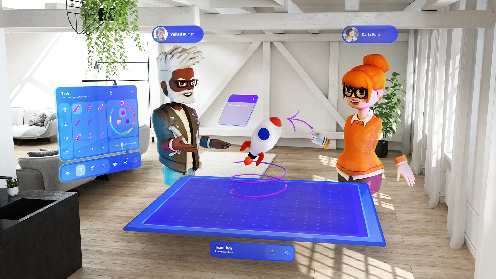

# Get started with the Mesh app on your HoloLens 2 (Preview)

The Microsoft Mesh app (Preview) is a collaboration-first experience for HoloLens 2, built on [Microsoft Mesh services](../overview.md). With the Mesh app, you can create spaces to work with others in your organization. You'll get a more natural and productive collaboration experience, with the feeling of being in the same room while working from different locations.

## Requirements

To try the Microsoft Mesh app (Preview), you will need:

- [HoloLens 2](/hololens/hololens2-options) with Windows 10, version 2004 (build 19041) or greater.
  
    (For more info, see [Update HoloLens](/hololens/hololens-update-hololens) and [HoloLens 2 enterprise deployment and management](/hololens/hololens-requirements).)
- One of the following accounts:
  - An [Azure Active Directory (Azure AD)](/azure/active-directory/) account that has been provisioned with an O365 license that includes access to OneDrive for Business. (Azure AD users can only collaborate with others who are part of the same organization.) - OR -
  - A personal [Microsoft Account (MSA)](/windows/security/identity-protection/access-control/microsoft-accounts).
  
  (For more info about accounts, see [Manage user identity and sign-in for HoloLens](/hololens/hololens-identity).)

## Get the app and sign in

1. Install the Microsoft Mesh app (Preview) from the Microsoft Store.

    > [!div class="nextstepaction"]
    > [Download the Microsoft Mesh app (Preview)](https://www.microsoft.com/store/apps/9P64LJ74NGW0)

1. On your HoloLens 2, launch the Microsoft Mesh app from the pins panel.
1. Sign into the app using your Microsoft Azure AD account (enterprise) or your Microsoft Account (personal).
1. The first time you run the app, you must accept the [Microsoft Mesh (Preview)](../overview.md) terms and conditions. (Also see [Microsoft Privacy Statement](https://privacy.microsoft.com/privacystatement).)

## Next steps

   > [!div class="nextstepaction"]
   > [Start using the Mesh app on your HoloLens 2](./use-mesh.md)
