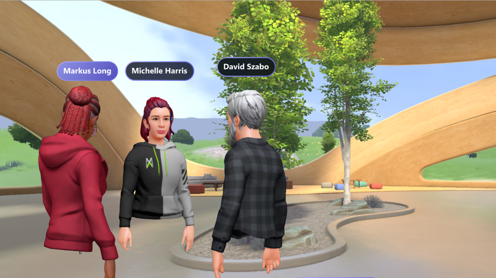

# Microsoft Mesh overview

Microsoft Mesh is a platform that powers shared immersive experiences, offering remote and hybrid workers a more natural way to connect with a sense of co-presence, and reduce the financial burden and environmental impact of travel and facilities. We are integrating avatars and immersive experiences into Microsoft Teams so employees can easily connect where work happens. And with the Mesh platform, creators can start to build employee experiences that bring people together for new hire onboarding, training, team building, and more. 

## Experience Microsoft Teams like never before

Mesh powers immersive experiences that we are integrating into Microsoft Teams, helping employees form personal connections where work happens. 

Avatars for Microsoft Teams enables you to build connections in meetings without turning your video on. Include more people in the conversation — whether they need a break due to video fatigue or just feel more comfortable with their video off. Avatars add a new layer of choice to your meetings, enhancing your team meetings for engagement and fun. 

Take your digital presence a step further with Immersive spaces for Teams. Add an immersive experience to a Teams meeting and transform your meetings with a sense of natural co-presence and togetherness. Connecting with others in immersive spaces mimics many elements of an in-person interaction – like the ability to walk over to someone you want to catch up with, or to have multiple conversations at the same time without talking over each other. Immersive spaces for Teams can be accessed through PC or VR headsets.

## Build custom experiences tailored to your organization’s needs

Mesh enables you to facilitate immersive connections beyond Teams by building custom experiences just for your organization. With advanced event management capabilities, you can orchestrate experiences in real-time by facilitating presentations, transporting users within the environment, and triggering content and animations. Create employee training, internal onboarding, guided tours and more.

When building custom experiences, Mesh provides rich functionality out-of-the-box like synchronizing the experience across users on PCs and VR headsets. It provides core capabilities like avatars to represent participants, spatial audio so participants can experience sound as they would in an in-person setting, and enables interaction with objects and the environment. And because Mesh is built on Microsoft 365, identity management and enterprise-grade privacy and security are built-in. While Mesh does a lot of the heavy lifting required to deliver shared immersive experiences, there are still many ways to add differentiated value, content, interactivity, and magic. 

* Use Unity to create new 3D environments or port existing ones into your space. 
* Use cloud scripting to add interactivity by inserting logic, integrating with live backend business data, connecting triggers to actions, infusing AI, and more – all with the full power of C# and .NET Core.
* Enrich the user experience by adding interactive web content such as videos and webapps to your environment.
* Use physics tools in Mesh to assign properties to objects in your space using gravity or buoyancy. Design how objects behave with each other and when users interact with them. Create a realistic experience or enable more fantastical interactions for games, challenges, and endless creativity.
* Diagnose potential issues and bring more polish to the experience with performance tools in Mesh.

At this time, you’ll need to be a part of Mesh Technical Adoption Program (Mesh TAP) in order to build custom experiences with Mesh private preview.

Real time ideation, iteration and co-creation with Mesh will boost innovation, speed decision-making and lower costs in your organization.

## Next steps with Mesh

   > [!div class="nextstepaction"]
   > [Get started Avatars for Teams](http://support.microsoft.com/topic/5384e7b7-30c7-4bcb-8065-0c9e830cc8ad)

   > [!div class="nextstepaction"]
   > [Register your interest in Mesh TAP](https://aka.ms/JoinMeshTAP)

   > [!div class="nextstepaction"]
   > [Prepare your organization for Immersive spaces (coming soon)](/microsoftteams/public-preview-doc-updates)

