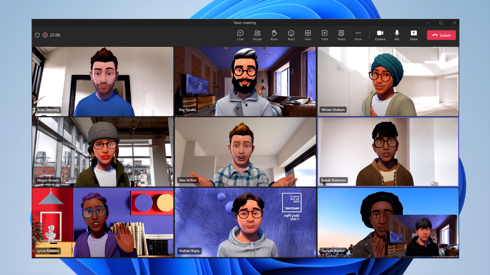

# Microsoft Mesh for Teams overview

Welcome to the Microsoft Mesh Preview. Mesh enables people to connect with a holographic presence, share across space, and collaborate from anywhere in the world. By bringing [Mesh-enabled mixed reality experiences](get-started.md) to your organization, you can enhance virtual meetings, conduct virtual design sessions, help others remotely, and host immersive virtual meet-ups to boost productivity.  

Avatars for Microsoft Teams enables you to build connections in meetings, without turning your video on. Include more people in the conversation— whether they need a break due to video fatigue or just feel more comfortable with their video off. Add a new layer of choice to your meetings. 

* **Choose how you’re represented** – Select from hundreds of combinations to customize an avatar that represents your physical attributes, wardrobe, accessories, and more. Choose how you express yourself with reactions. Save up to three avatars for different meeting types— such as casual, professional, or day-to-day. 

* **Build connections your way** – In addition to joining a meeting with your camera on and off, you can also join with an avatar. Combat video fatigue and include more people in the conversation, even those who are less comfortable with their video on. Avatars for Microsoft Teams gives you that much-needed camera break, while still allowing you to collaborate effectively. 

* **Stay in Teams** - Available within the Microsoft Teams experience. Once your avatar is created, it is just a few clicks away.  

&nbsp;  

> [!VIDEO https://channel9.msdn.com/Shows/Mixed-Reality/Microsoft-Mesh-hands-on-demo/player]

&nbsp;  

## Scenarios

### **Virtual collaboration**

Colleagues working time zones apart can collaborate as physically present in the same room. Mesh integrates with Microsoft 365, so connections, calendars, content, and workflows naturally transition to their Mixed Reality world. These shared experiences help deepen understanding, increase employee engagement and improve productivity.

### **Spatially aware design reviews**

Mesh enhances 3D design reviews by enabling users to join anywhere using any device. Whether physically present or holoported, colleagues can see and annotate 3D models in real time. All content persists between design sessions so teams can quickly start where they left off. This shared understanding ignites ideas, sparks creativity, and forms powerful bonds.

### **Help others remotely**

When employees need help, there is nothing like working with an expert in providing guidance and offering new perspectives. Mesh enables remote experts to be present wherever they are needed. They can overlay contextual data and help share insights quickly and effectively, resolving issues faster.

### **Train and learn together**

Training, especially on complex topics such as surgery, equipment maintenance, and traffic control, is hard without being in the same room with the instructor and looking at the same set of objects from multiple perspectives. With Mesh, employees can learn together from anywhere thanks to holoportation, holographic sharing, and visualization. Mesh helps improve the efficacy of virtual training while reducing travel and logistics costs.

### **Host virtual meet-ups**

Foster a deeper sense of connection and community by hosting virtual meet-ups in Mesh-powered mixed reality experiences. Form powerful bonds with others by letting your personality shine through as technology fades away.

## Next steps

Get started with the Microsoft Mesh for Teams: 

   > [!div class="nextstepaction"]
   > [Get Started with the Microsoft Mesh Preview](get-started.md)
