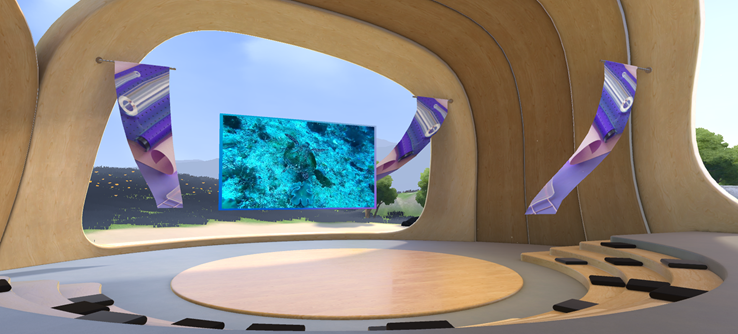

# Join an Event

## From the Mesh App on PC

In the Mesh App on PC or Quest, you can attend social gatherings, conferences, and all-hands events all within a wide selection of Environments. In these events, you can view content, interact with physical objects, and meet or network with your colleagues.

Follow the steps below to see a list of events and join an event.

1. Open the Mesh App and view the Mesh Dashboard.

    

2. In the horizontal menu bar at the top, select **Events**. This shows
    you a list of events you can join.

    Hover the cursor over the Event. You can either click on the event to **View event details** or click the **Join** button.

    

3. A **Pre-join** dialog box will appear. You can now select your audio
    device from the **Pre-join** dialog.

    

    and the **Devices** dialog box appears, where you can test your audio devices:

    

    >[!Note] 
    >In the Mesh app on PC, the Windows default speaker will always be used by Mesh. You can change the speaker settings in the Windows **Settings** -\> **System** -\> **Sound settings** dialog box.

4. Before you join an event, you can also select or customize your avatars from the pre-join dialog.

    

    For more information, see [Personalize your avatar](avatars.md).

## Using the Teams Hub on Quest 2

If you're running the Mesh app on Quest, you can use the **Dashboard**
shown below to find and join your Teams events.

1. Open the Mesh app on Quest 2.

2. Log in with your corporate email account.

3. Select the **Dashboard** by clicking on the systems bubble on the lower left of your view.

    

4. Click on any of the events to **View event details**, or select **Join**.

Go through the Mesh pre-join screen to setup/select/customize your avatar and select **Join** when ready.

## Enjoy your event

You can now view content, communicate with other users, listen to guests speaking, emote, and take selfies.

You can interact with any games, puzzles, or interactive elements in the event environment.

## Next steps

   > [!div class="nextstepaction"]
   > [Mesh user controls](mesh-user-controls.md#mesh-controls-overview)