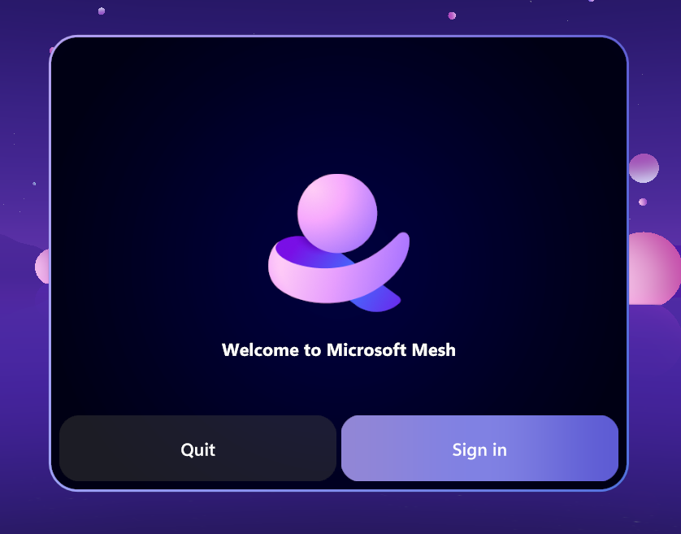
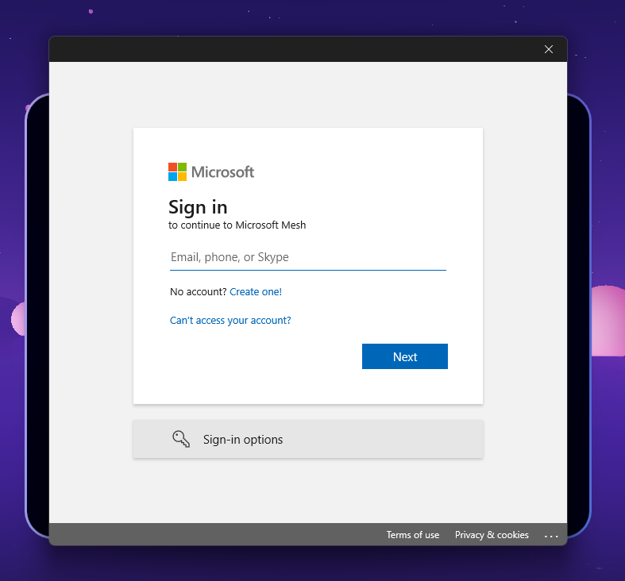
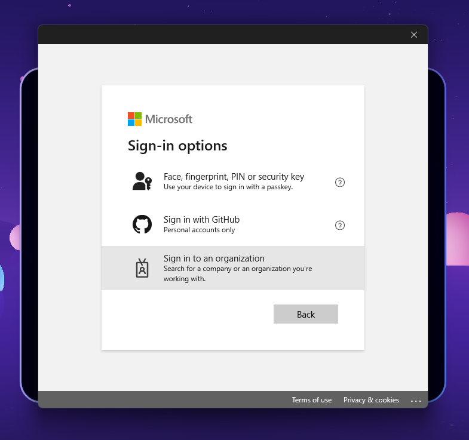
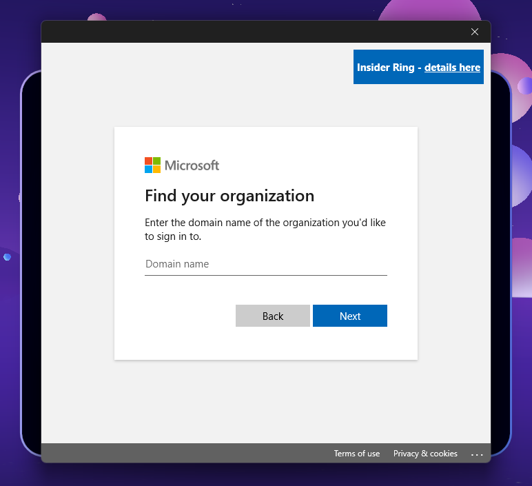
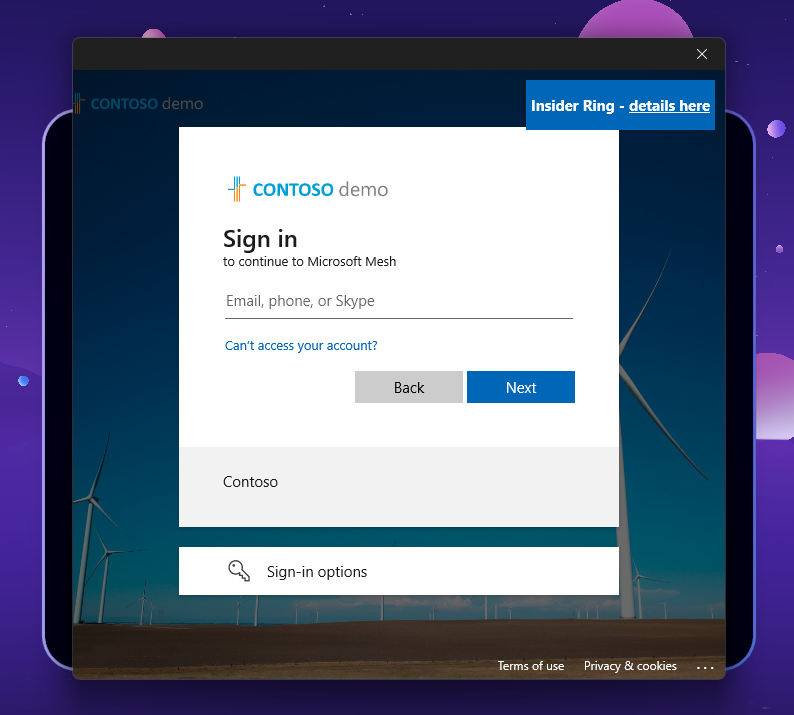

# Join an Event

The three entrypoints that you can use to join a Mesh event are:

1. **Mesh app for Windows** (**Windows PC**)
1. **Mesh app for Meta Quest VR device** (**VR**)
1. **Mesh app in Teams** (**Windows PC** or **Mac**)

You can open these apps to find your event or use the meeting invite link for the Mesh event in your Outlook or Microsoft Teams calendar.

Need to get Mesh for your device(s)?

> [!div class="nextstepaction"]
> [Get Mesh](../download-mesh-app-tools.md)

## [Windows](#tab/Windows)

## Join using Microsoft Outlook and Teams

You can easily find Mesh events right within your daily Outlook and Teams calendars without needing to go to another place to see and join the events.

> [!NOTE]
> For Mesh TAP participants, we are rolling out the option to choose how you'd like to open Mesh: Use the Mesh app in Teams or the Mesh app for Windows.

### Join using the Mesh app for Windows

In the Mesh app on PC or Quest, you can attend social gatherings, conferences, and all-hands events all within a wide selection of Environments. In these events, you can view content, interact with physical objects, and meet or network with your colleagues.

Follow the steps below to see a list of events and join an event.

1. Open the Mesh app and view the Mesh Dashboard.

    
   
1. In the horizontal menu bar at the top, select **Events**. This shows
you a list of events you can join.

    Hover the cursor over the Event. You can either click on the event to **View event details** or click the **Join** button.

    
   
       > [!TIP]
    > Did you know you can rejoin past events? Revisit your favorite events or use a Mesh event as a drop-in space!

1. A **Pre-join** dialog box will appear before you join an event. You can select or customize your avatars from the pre-join dialog.

    
   
       For more information, see [Personalize your avatar](avatars.md).

1. You can also select your audio devices from the **Pre-join** dialog.

    
   
       and the **Devices** dialog box appears, where you can test your audio devices:

    
   
## [Quest](#tab/Quest)

### Join using Microsoft Mesh on Meta Quest devices

If you're running the Mesh app on Quest, you can use the **Dashboard** shown below to find and join your Teams events.

1. If you don't have the Microsoft Mesh app on your device, [download Microsoft Mesh on Meta Quest | Meta Store](https://aka.ms/MeshDownloadQuest).

1. Open the Mesh app on your Meta Quest VR device or search for Mesh and download the app from the Quest store.

1. Log in with your corporate email account.

1. Select the **Dashboard** by clicking on the systems bubble on the lower left of your view.

    
   
1. Click on any of the events to **View event details**, or select **Join**.

> [!TIP]
> Did you know you can rejoin past events? Revisit your favorite events or use a Mesh event as a drop-in space!

## [Teams](#tab/Teams)

### Join using the Mesh app in Teams (Windows or Mac)

> [!IMPORTANT]
> We're excited to introduce the Mesh app in Microsoft Teams, bringing Mesh closer to where you do your day to day work. Currently, the Mesh app in Teams only available to organizations in [Mesh TAP](../develop/mesh-tap-participants.md).

To join a Mesh event using the Mesh app in Teams:

1. Open Microsoft Teams.
1. In the left nav, select the **...** more apps button to search for Microsoft Mesh

    :::image type="content" source="../media/welcome-to-mesh/Open-mesh-app-in-teams-2.png" alt-text="Screenshot of Microsoft Teams showing how to search for the Mesh app in Teams.":::

1. Search for **Mesh** and select the app to open it.
1. Mesh will open in a separate window that can be moved to your preferred area or monitor.

    :::image type="content" source="media/Mesh-app-in-teams-open-in-Microsoft-teams.png" alt-text="Screenshot of Mesh app in Teams.":::

> [!TIP]
> Did you know you can rejoin past events? Use the Mesh event link to revisit your favorite events or use a Mesh event as a drop-in space.

---

## Join as a Guest

> [!IMPORTANT]
> Currently, guest access is only supported for Mesh events on Windows (PC). 
> To ensure a successful experience when the event starts, we recommend you follow these steps to trigger any required setup steps that involve account setup, including but not limited to Multi-Factor Authentication (MFA).
If you've been added to a different organization as a Guest, you'll need to follow these steps to join a Mesh event hosted by that organization:

### Before the event

1. You will receive an invitation to join the organization (example subject line: "[User name] invited you to access applications within their organization"). Take a moment to Accept the invite and follow all required account setup steps. This is very important to ensure a smooth experience for the following steps.

1. Get the [Mesh app for Windows](/mesh/user-guide/getting-started)

1. Once the app is open, click **Sign in**  

1. Navigate to **Use a different account**, then select **Work or school account**

1. You'll see the window states "Sign in to continue to Microsoft Mesh". Select **Sign-in options**.   

1. Select **Sign in to an organization**  

1. Add the **Domain name** of the organization you'd like to sign in to  

   > [!TIP]
   > Example: If someone@Microsoft.com is added to the Contoso Electronics organization, that individual will specify the domain of the company whose resources they're accessing as a guest during sign in - in this case it would be ContosoElectronics.com.
   > If you can't find the organization's domain, ask the Mesh event organizer or check your email inbox for the invitation to access applications within the organization. Within the invitation email, you'll notice the Domain name is listed. 
1. The sign in page will now specify the name of the organization. Enter your email and password to sign in to the organization.  

   > [!WARNING]
   > 1. You may be asked to enter your email and password more than once to maximize security. 
   > 1. The first time you sign in to Mesh as a guest in another organization, you'll need to **Accept** permissions requested by the organization and there may be More information requested. 
   > 1. If you receive an error stating "You cannot access this right now", check to ensure you've provided all requested information in step 1.
1. Once you've added the domain, you'll see a Sign in page similar to Step 4. However, now that you've specified the domain name of the organization you're joining, you can sign in using your email address.

Now that you're successfully signed in, you can easily repeat Steps 3 through 9 when it's time to join an event. 

**When it's time to join the event**

1. Sign in to the organization as a Guest using Steps 3-9 above. 

1. Upon entering Mesh, you'll see a box that asks for a **URL** for the specific Mesh event. This URL must be provided by the event organizer, so reach out to them if you don't have it. Organizers can find the Mesh event link in the **Join on your computer** section of the Outlook invite, titled "Click here to join in Mesh". 

1. Enter the URL for the event you wish to join. 

   > [!WARNING]
   > You may see an error stating "Oops, check the event's schedule" if someone from the host organization hasn't joined yet. If this occurs, attempt to re-join once you're certain a host or attendee from the organization hosting the event has joined. 
1. Enjoy your event! 

Limitations: 

- Organizers must share event links with Guests 

- Guests can only be Attendees, not Organizers

- Guests cannot schedule or customize events 

- Guest users may need to sign in twice 

- Guests won't see Mesh events in their calendar 

- Guest access not supported for Mesh in Teams or Quest 

- Images and Video links must be properly permissioned for Guest

## Enjoy your event

You can now view content, communicate with other users, listen to guests speaking, use emojis or dance, and take selfies.

Try interacting with any games or interactive elements in the event environment and enjoy!

## Next steps

> [!div class="nextstepaction"]
   > [Personalize your avatars](avatars.md)

> [!div class="nextstepaction"]
   > [Mesh user controls](mesh-user-controls.md#mesh-controls-overview)

> [!div class="nextstepaction"]
   > [Create an event in Mesh on the web](../events-guide/create-event-mesh-portal.md)
