# Social games and activities

Play built-in social games and interactive activities for team bonding in Mesh immersive spaces. We offer several sample environments that come with built-in games and activities. 

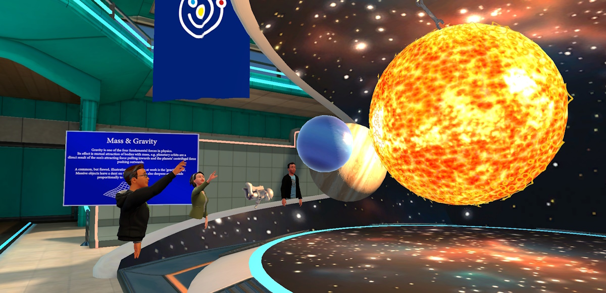

Currently the default environments that come with Immersive spaces in Mesh do not offer social games and activities. You will need one of the following to try out some of the activities:

- Join the Lake house environment in the immersive space in Teams from a Teams meeting.  For more information, see the [Social games and activities](https://support.microsoft.com/office/use-in-meeting-controls-for-immersive-spaces-in-microsoft-teams-ccf689d0-b47e-4e11-9eff-2ca0ce87f422#bkmk_social_games) section in the Immersive spaces in Teams documentation.

- Upload and deploy a sample environment from Mesh that has interactive games built-in.  See the [Samples overview](/mesh/develop/getting-started/samples/samples-overview) for a list of Mesh samples.

    >[!Note]
    >This option assumes that you have gone through the steps outlined in the [Mesh Development Overview](/mesh/develop/development-overview) to build and deploy Mesh sample environments.

Some social games and activities from the Mesh sample environments are covered in detail here.

## The Toybox sample

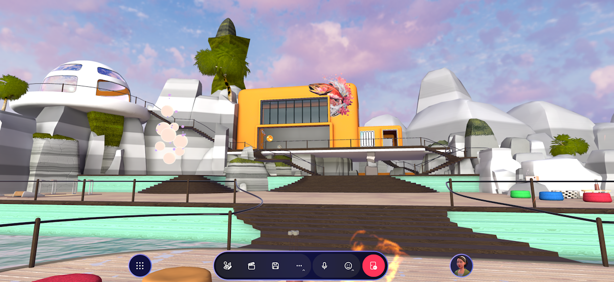

The Toybox sample environment comes with a number of activities to drive social engagement across Mesh experiences:

* **Fire Pit & Roasting Marshmallows:** socialize and recreate the experience of gathering around the campfire. Here's what to do:

    * Left click on the marshmallow stick with your mouse to pick it up.

    * To roast the marshmallow, simply walk up to the firepit so the marshmallow is over the fire.

    * Press the Spacebar on your keyboard to drop the marshmallow.

* **Radio & Boombox:** click on the radio button to turn the music on or off.

    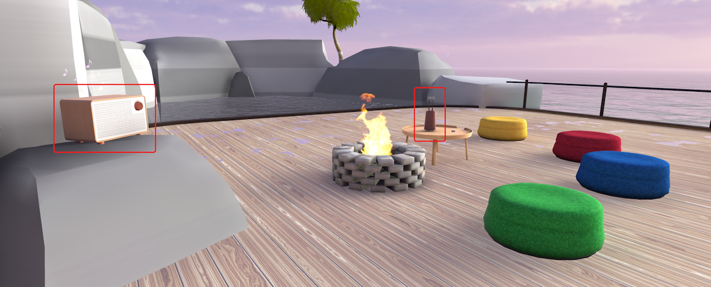

* **Bean Bag Toss:** this is a throwing game. You win by getting the most bags into the hole. Here's what to do:

    * Left mouse click on a bean bag to pick it up with your hand.

    * Once you click on a bean bag, you'll go into aim mode:

        * Move the mouse cursor around to aim where you want to throw.

        * Press the Spacebar on your keyboard to drop the bean bag.

    * Left mouse click to throw the bean bag.

* **Sound Orbs:** select a sphere to play a musical sound.

    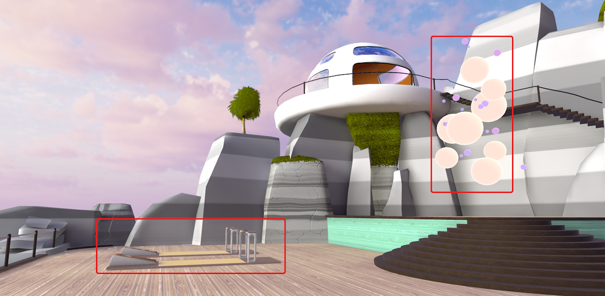

* **Ice Breaker:** select the spheres with a friend for conversation starters. An example would be: “What is your favorite outdoor activity?”

    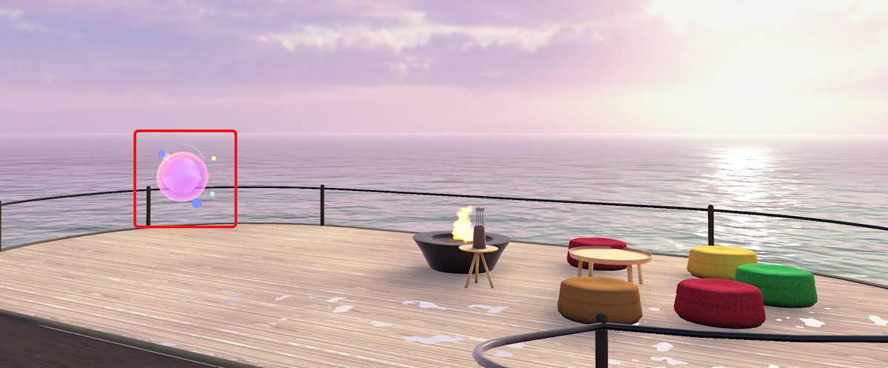

* **Astronaut:** try selecting the astronaut with your left mouse button to see what happens!

    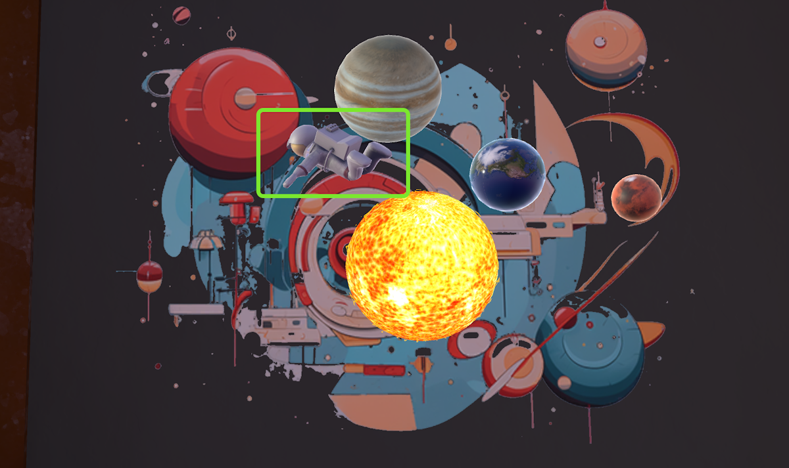

## The Science Building

The *ScienceBuilding* project provides many fun-filled and interactive exhibits for you to explore Mesh physics games.

In the gallery, there're exhibits such as **Magnetism**, **Bowling**, **Air Hockey**, **Balance Scales**, **Black Holes** and the **Marble Race**.

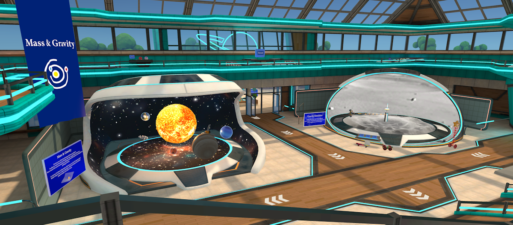

Some activities include:

* **The Rambunctious Machine**: challenge yourself by placing the interactive elements to build a path for the ball to go from the left to the buckets on the right!

    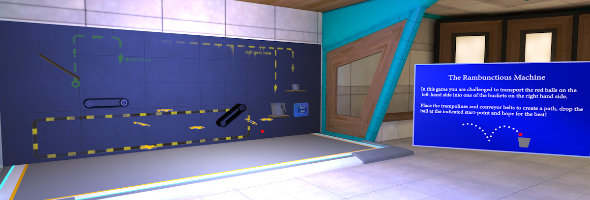

* **Wave and Frequency**: connected physics bodies moving in a variety of synchronized ways. Click on the apparatus to see how waves are formed!

    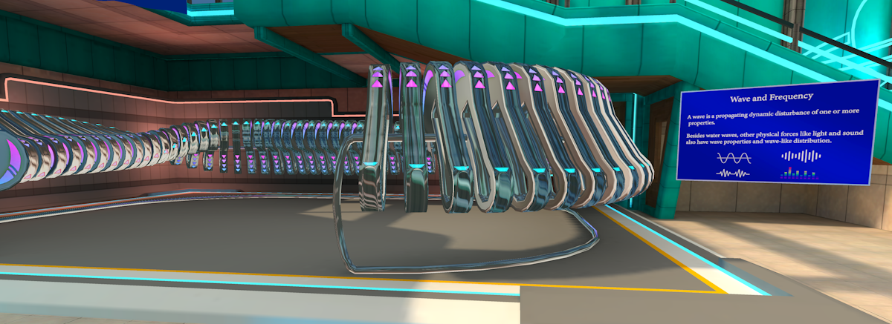

* **Gravity Simulator**: select your environment such as the **Moon**, **Earth**, or **Space** to visually experience gravitational pull in that specific environment.

    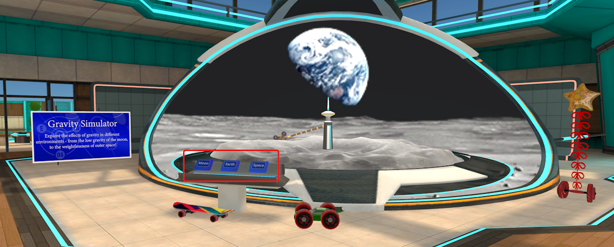

* **Mass and Gravity**: select a planet or other objects orbiting around the Sun to see how they move.

    

* **Buoyancy and Balance**: try to load a ship with cargo to see how the weight affects its balance in water, or see how ships can float on waves.

    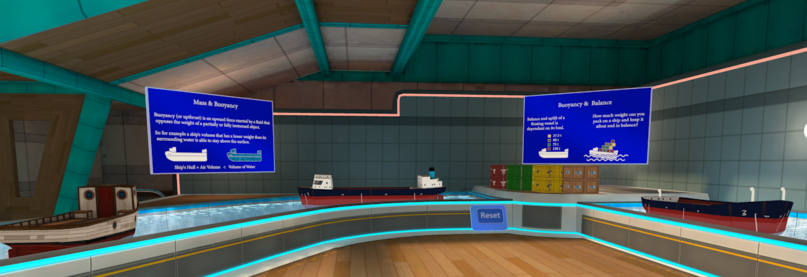

* **Gone Fishin'!**: catch fish, ships or a penguin with a magnetic fishing rod. 

    * Select the fishing rod and move over to the object you want to catch
    
    * Release the mouse button to drop it into the pond 
    
    * Select the fish rod again to throw the object

    You can also pick up any object in the pond by selecting it with your mouse.

    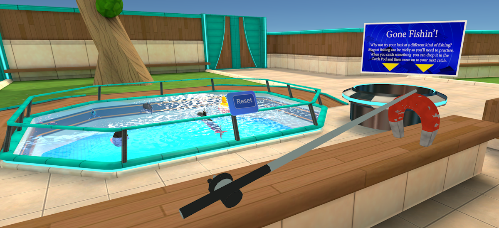

>[!Note]
>What we have shown here is just a subset of what is possible for interactive games in Mesh.  Check with your Mesh environment design and development team for the latest in social games and activities!

## Next steps

   > [!div class="nextstepaction"]
   > [Create an event](../events-guide/create-event-mesh-portal.md)